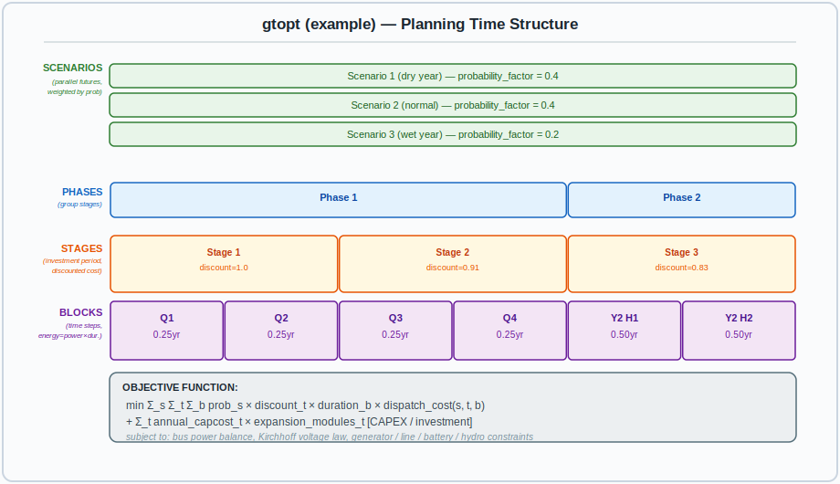
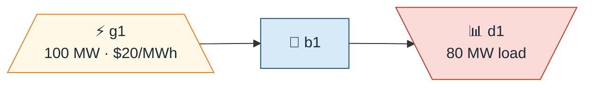
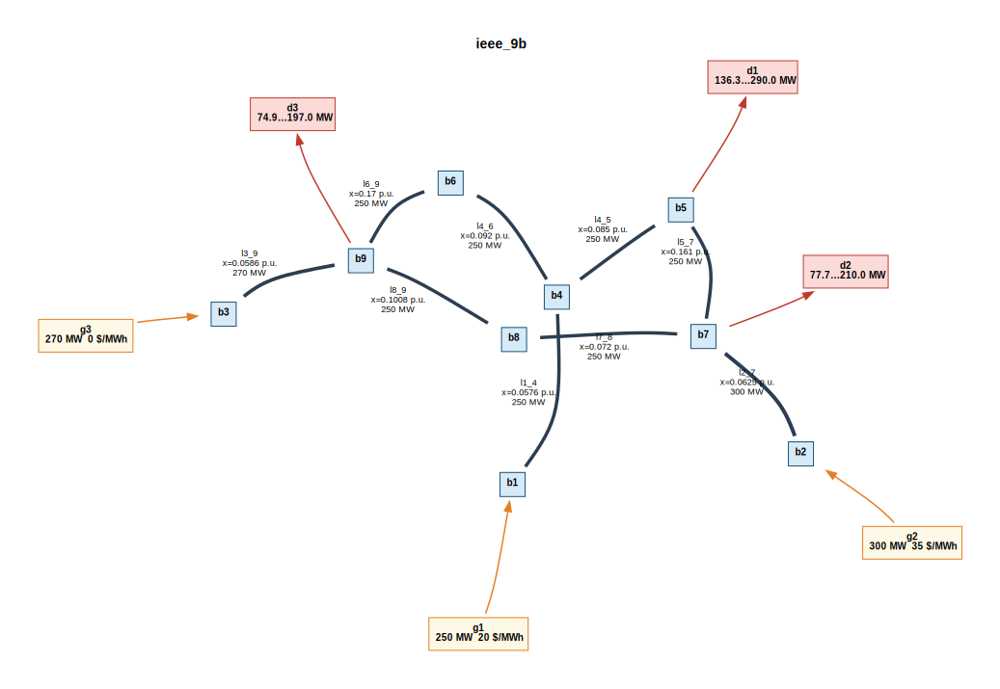
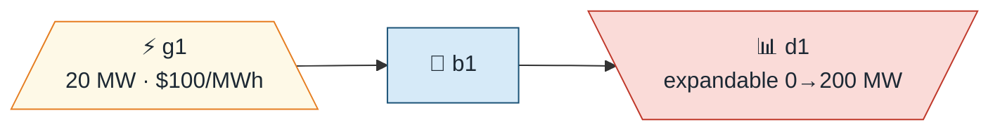
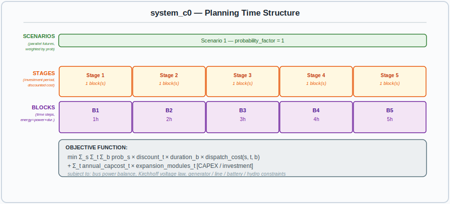
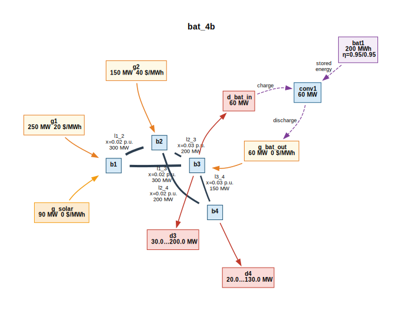

# gtopt Planning Guide

A step-by-step guide to building, running, and understanding gtopt optimization
cases. This guide walks through progressively more complex examples: from a
simple single-bus dispatch to a multi-bus DC power-flow case with batteries and
external time-series data.

---

## Table of Contents

1. [Concepts](#1-concepts)
   - [Time structure: Blocks, Stages, Scenarios](#11-time-structure-blocks-stages-scenarios)
   - [Phases and Scenes](#12-phases-and-scenes)
   - [System elements](#13-system-elements)
2. [Anatomy of a gtopt JSON file](#2-anatomy-of-a-gtopt-json-file)
3. [Example 1 – Single-bus dispatch (one block)](#3-example-1--single-bus-dispatch-one-block)
4. [Example 2 – Multi-bus DC power flow (IEEE 9-bus)](#4-example-2--multi-bus-dc-power-flow-ieee-9-bus)
5. [Example 3 – Multi-stage capacity expansion](#5-example-3--multi-stage-capacity-expansion)
6. [Example 4 – Battery storage (4-bus, 4 blocks)](#6-example-4--battery-storage-4-bus-4-blocks)
7. [Working with time-series schedules](#7-working-with-time-series-schedules)
   - [Inline schedules in JSON](#71-inline-schedules-in-json)
   - [External CSV files](#72-external-csv-files)
   - [External Parquet files](#73-external-parquet-files)
   - [Directory layout and file-field naming convention](#74-directory-layout-and-file-field-naming-convention)
8. [Complete JSON element reference](#8-complete-json-element-reference)
   - [Options](#81-options)
   - [Simulation (time structure)](#82-simulation-time-structure)
   - [System – Electrical network](#83-system--electrical-network)
   - [System – Profiles](#84-system--profiles)
   - [System – Energy storage](#85-system--energy-storage)
   - [System – Reserves](#86-system--reserves)
   - [System – Hydro cascade](#87-system--hydro-cascade)
9. [Field reference and auto-generated docs](#9-field-reference-and-auto-generated-docs)
10. [Output files](#10-output-files)

---

## 1. Concepts

### 1.1 Time structure: Blocks, Stages, Scenarios

The **planning data model** defines how time and uncertainty are represented:



> 💾 Regenerate: `python3 scripts/gtopt_diagram.py --diagram-type planning -o docs/diagrams/planning_structure.svg`

| Element | Role |
|---------|------|
| **Block** | Smallest time unit. `energy [MWh] = power [MW] × duration [h]`. |
| **Stage** | Investment period. Capacity built in a stage is available in all later stages. Costs are multiplied by `discount_factor` for present-value accounting. |
| **Scenario** | One realisation of uncertain inputs (e.g. dry/wet hydrology). All scenarios are solved simultaneously; their costs are weighted by `probability_factor`. |
| **Phase** | Groups consecutive stages into a higher-level period (e.g. seasons, construction vs. operation). Default: single phase covering all stages. See [Section 1.2](#12-phases-and-scenes). |
| **Scene** | Combines a subset of scenarios for LP solving. Default: single scene covering all scenarios. See [Section 1.2](#12-phases-and-scenes). |

A single-snapshot operational study uses **one block, one stage, one scenario**
(the defaults if you omit `simulation` entirely):

```json
{
  "simulation": {
    "block_array":    [{"uid": 1, "duration": 1}],
    "stage_array":    [{"uid": 1, "first_block": 0, "count_block": 1}],
    "scenario_array": [{"uid": 1, "probability_factor": 1}]
  }
}
```

A 24-hour operational study uses **24 blocks, one stage, one scenario**:

```json
{
  "simulation": {
    "block_array": [
      {"uid":  1, "duration": 1},
      {"uid":  2, "duration": 1},
      ...
      {"uid": 24, "duration": 1}
    ],
    "stage_array":    [{"uid": 1, "first_block": 0, "count_block": 24}],
    "scenario_array": [{"uid": 1, "probability_factor": 1}]
  }
}
```

A 5-year investment study with annual stages uses **five 1-block stages** (or
more blocks per stage for seasonal detail):

```json
{
  "simulation": {
    "block_array": [
      {"uid": 1, "duration": 8760},
      {"uid": 2, "duration": 8760},
      {"uid": 3, "duration": 8760},
      {"uid": 4, "duration": 8760},
      {"uid": 5, "duration": 8760}
    ],
    "stage_array": [
      {"uid": 1, "first_block": 0, "count_block": 1, "discount_factor": 1.0},
      {"uid": 2, "first_block": 1, "count_block": 1, "discount_factor": 0.909},
      {"uid": 3, "first_block": 2, "count_block": 1, "discount_factor": 0.826},
      {"uid": 4, "first_block": 3, "count_block": 1, "discount_factor": 0.751},
      {"uid": 5, "first_block": 4, "count_block": 1, "discount_factor": 0.683}
    ],
    "scenario_array": [{"uid": 1, "probability_factor": 1}]
  }
}
```

> **Tip**: set `annual_discount_rate` in `options` and let gtopt compute
> discount factors automatically instead of providing them explicitly.

### 1.2 Phases and Scenes

#### Phase – Grouping stages into higher-level periods

A **Phase** groups consecutive **stages** into a higher-level planning period.
Common use cases:

| Use case | Phases | Stages per phase |
|----------|--------|-----------------|
| **Seasonal analysis** | 4 phases (summer, autumn, winter, spring) | 3 monthly stages each |
| **Construction vs. operation** | 2 phases (build, operate) | Variable |
| **Single-period study** | 1 phase (default) | All stages |

When no `phase_array` is provided in the JSON, gtopt automatically creates a
single default phase that covers all stages.

**JSON example – 4 seasonal phases (12 monthly stages)**:

```json
{
  "simulation": {
    "phase_array": [
      {"uid": 1, "name": "summer",  "first_stage": 0, "count_stage": 3},
      {"uid": 2, "name": "autumn",  "first_stage": 3, "count_stage": 3},
      {"uid": 3, "name": "winter",  "first_stage": 6, "count_stage": 3},
      {"uid": 4, "name": "spring",  "first_stage": 9, "count_stage": 3}
    ],
    "stage_array": [
      {"uid": 1,  "first_block": 0,  "count_block": 3},
      {"uid": 2,  "first_block": 3,  "count_block": 3},
      {"uid": 3,  "first_block": 6,  "count_block": 3},
      {"uid": 4,  "first_block": 9,  "count_block": 3},
      {"uid": 5,  "first_block": 12, "count_block": 3},
      {"uid": 6,  "first_block": 15, "count_block": 3},
      {"uid": 7,  "first_block": 18, "count_block": 3},
      {"uid": 8,  "first_block": 21, "count_block": 3},
      {"uid": 9,  "first_block": 24, "count_block": 3},
      {"uid": 10, "first_block": 27, "count_block": 3},
      {"uid": 11, "first_block": 30, "count_block": 3},
      {"uid": 12, "first_block": 33, "count_block": 3}
    ],
    "block_array": [
      {"uid": 1,  "duration": 217, "name": "night"},
      {"uid": 2,  "duration": 372, "name": "solar"},
      {"uid": 3,  "duration": 155, "name": "evening"}
    ]
  }
}
```

**Phase fields**:

| Field | Type | Required | Description |
|-------|------|----------|-------------|
| `uid` | integer | **Yes** | Unique identifier |
| `name` | string | No | Human-readable label (e.g. `"summer"`) |
| `active` | boolean | No | Activation status (default: `true`) |
| `first_stage` | integer | No | 0-based index of the first stage (default: `0`) |
| `count_stage` | integer | No | Number of stages (default: all remaining) |

#### Scene – Cross-product of scenarios and phases

A **Scene** combines a set of **scenarios** with a **phase**.  In the LP
formulation, each scene defines which scenarios are solved together within
which phase.  This is an advanced feature used for complex multi-scenario,
multi-phase studies.

For most cases the default single scene (covering all scenarios across one
phase) is sufficient.  You only need explicit `scene_array` when combining
multiple scenarios with multiple phases to control which scenario groups
apply to which phase.

**JSON example – default (implicit)**:

```json
{
  "simulation": {
    "scene_array": [{"uid": 1, "first_scenario": 0, "count_scenario": 1}]
  }
}
```

**Scene fields**:

| Field | Type | Required | Description |
|-------|------|----------|-------------|
| `uid` | integer | **Yes** | Unique identifier |
| `name` | string | No | Human-readable label |
| `active` | boolean | No | Activation status (default: `true`) |
| `first_scenario` | integer | No | 0-based index of the first scenario (default: `0`) |
| `count_scenario` | integer | No | Number of scenarios (default: all remaining) |

#### Time hierarchy diagram

The complete time hierarchy in gtopt is:

```
Planning
 └─ Scene (cross-product of scenarios × phases)
     ├─ Scenario (probability-weighted future realization)
     └─ Phase (higher-level grouping)
         └─ Stage (investment period, discount factor)
             └─ Block (smallest time unit, duration in hours)
```

For a typical seasonal study with 2 scenarios (dry/wet hydrology):

```
Scene 1 ─── Scenario: "dry year" (prob=0.3)
         └─ Phase: "summer" → Stages 1-3 (Jan, Feb, Mar)
                              Each stage: 3 blocks (night, solar, evening)
Scene 2 ─── Scenario: "wet year" (prob=0.7)
         └─ Phase: "summer" → Stages 1-3 (Jan, Feb, Mar)
                              Each stage: 3 blocks (night, solar, evening)
```

### 1.3 System elements

| Category | Elements | Description |
|----------|---------|-------------|
| Electrical network | Bus, Generator, Demand, Line | Core grid model |
| Time-varying profiles | GeneratorProfile, DemandProfile | Capacity-factor / load-shape scaling |
| Energy storage | Battery, Converter | BESS modelling |
| Reserve | ReserveZone, ReserveProvision | Spinning-reserve requirements |
| Hydro cascade | Junction, Waterway, Flow, Reservoir, Filtration, Turbine | Hydrothermal systems |

---

## 2. Anatomy of a gtopt JSON file

A gtopt case is defined by **one or more JSON files** passed on the command
line. Multiple files are merged in order, so you can split options, simulation,
and system across files.

```
gtopt base_options.json simulation.json system.json
```

The top-level structure is always:

```json
{
  "options":    { ... },
  "simulation": { ... },
  "system":     { ... }
}
```

All three sections are **optional** — omitted sections use defaults.

### Options (commonly used fields)

| Field | Units | Description |
|-------|-------|-------------|
| `demand_fail_cost` | $/MWh | Penalty for unserved load (value of lost load) |
| `use_kirchhoff` | — | Enable DC power-flow constraints (`true`/`false`) |
| `use_single_bus` | — | Collapse network to copper plate (`true`/`false`) |
| `scale_objective` | — | Divide objective by this value (improves solver numerics) |
| `annual_discount_rate` | p.u./year | Compute stage discount factors automatically |
| `input_directory` | — | Root directory for external time-series files |
| `input_format` | — | `"parquet"` (default) or `"csv"` |
| `output_directory` | — | Directory for result files (default: `"output"`) |
| `output_format` | — | `"parquet"` (default) or `"csv"` |

---

## 3. Example 1 – Single-bus dispatch (one block)

A minimal case: one bus, one cheap generator, one load, one hour.

### Network diagram



### JSON

```json
{
  "options": {
    "use_single_bus": true,
    "demand_fail_cost": 500,
    "scale_objective": 1000,
    "output_format": "csv"
  },
  "simulation": {
    "block_array":    [{"uid": 1, "duration": 1}],
    "stage_array":    [{"uid": 1, "first_block": 0, "count_block": 1}],
    "scenario_array": [{"uid": 1, "probability_factor": 1}]
  },
  "system": {
    "name": "example1",
    "bus_array": [
      {"uid": 1, "name": "b1"}
    ],
    "generator_array": [
      {"uid": 1, "name": "g1", "bus": "b1", "pmax": 100, "gcost": 20, "capacity": 100}
    ],
    "demand_array": [
      {"uid": 1, "name": "d1", "bus": "b1", "lmax": 80}
    ]
  }
}
```

### Expected result

- g1 dispatches 80 MW to serve d1 exactly.
- Objective = 80 MW × 1 h × $20/MWh / 1000 = **$1.60** (scaled).
- `output/solution.csv`: `status=0` (optimal).
- `output/Generator/generation_sol.csv`: `uid:1 = 80`.

---

## 4. Example 2 – Multi-bus DC power flow (IEEE 9-bus)

The classic Anderson–Fouad 9-bus benchmark. Three generators, three loads, nine
transmission lines. DC power flow (Kirchhoff's voltage law) is enabled.

### Network diagram



> 💾 Regenerate: `python3 scripts/gtopt_diagram.py cases/ieee_9b/ieee_9b.json --subsystem electrical -o docs/diagrams/ieee9b_electrical.svg`

### Run the bundled case

```bash
cd cases/ieee_9b_ori
gtopt ieee_9b_ori.json
cat output/solution.csv          # status=0, obj_value=5.0
cat output/Generator/generation_sol.csv
```

Expected: g1 dispatches ~250 MW (cheapest at $20/MWh), g3 serves the rest,
g2 (most expensive at $35/MWh) is at or near minimum.

### Key JSON excerpt

```json
{
  "options": {
    "use_single_bus": false,
    "use_kirchhoff": true,
    "demand_fail_cost": 1000,
    "scale_objective": 1000
  },
  "system": {
    "line_array": [
      {
        "uid": 1, "name": "l1_4",
        "bus_a": "b1", "bus_b": "b4",
        "reactance": 0.0576,
        "tmax_ab": 250, "tmax_ba": 250
      }
    ]
  }
}
```

> **Note on reactance units**: line reactance values in the bundled IEEE cases
> are in **per-unit (p.u.)** on a common system base (typically 100 MVA).
> When `use_kirchhoff = true`, gtopt uses the p.u. reactance to compute the
> voltage-angle difference: `flow [MW] = (θ_a − θ_b) / reactance [p.u.]`.

---

## 5. Example 3 – Multi-stage capacity expansion

The `cases/c0/` case demonstrates **demand-side capacity expansion** over five
years. The demand `d1` starts at zero installed capacity and the solver decides
how many 20 MW modules to build each year.

### Network diagram



### Planning time structure



> 💾 Regenerate: `python3 scripts/gtopt_diagram.py cases/c0/system_c0.json --diagram-type planning -o docs/diagrams/c0_planning.svg`

### Time structure

Five stages × one block each, annual durations (1/2/3/4/5 h in the simplified
case; full annual = 8 760 h in production cases).

```json
"stage_array": [
  {"uid": 1, "first_block": 0, "count_block": 1},
  {"uid": 2, "first_block": 1, "count_block": 1},
  {"uid": 3, "first_block": 2, "count_block": 1},
  {"uid": 4, "first_block": 3, "count_block": 1},
  {"uid": 5, "first_block": 4, "count_block": 1}
]
```

### Expandable demand definition

```json
{
  "uid": 1, "name": "d1", "bus": "b1",
  "lmax": "lmax",
  "capacity": 0,
  "expcap": 20,
  "expmod": 10,
  "annual_capcost": 8760
}
```

- `capacity = 0`: no initial capacity
- `expcap = 20 MW`: each module adds 20 MW
- `expmod = 10`: solver may build at most 10 modules
- `annual_capcost = 8760 $/MW-year`: annualised investment cost
- `lmax = "lmax"`: refers to `system_c0/Demand/lmax.parquet`

### Run

```bash
cd cases/c0
gtopt system_c0.json
cat output/Demand/capacost_sol.csv   # expansion cost per stage
```

---

## 6. Example 4 – Battery storage (4-bus, 4 blocks)

The `cases/bat_4b/` case adds a battery energy storage system (BESS) to a
4-bus network. The battery charges at low-cost periods and discharges during
high-demand periods.

### Network diagram



> 💾 Regenerate: `python3 scripts/gtopt_diagram.py cases/bat_4b/bat_4b.json --subsystem electrical -o docs/diagrams/bat4b_electrical.svg`

**Battery** (`bat1`) uses the **unified definition**: the `bus` field
connects it to b3 and `pmax_charge`/`pmax_discharge` set the charge/discharge
power rating.  The system auto-generates the discharge generator, charge
demand, and converter at LP construction time.

### Battery definition (unified)

```json
"battery_array": [
  {
    "uid": 1, "name": "bat1",
    "bus": "b3",
    "input_efficiency":  0.95,
    "output_efficiency": 0.95,
    "emin": 0, "emax": 200,
    "eini": 0,
    "pmax_charge": 60,
    "pmax_discharge": 60,
    "gcost": 0,
    "capacity": 200
  }
]
```

> **Note:** No `converter_array`, `g_bat_out` generator, or `d_bat_in`
> demand is needed — all three are auto-generated by `expand_batteries()`.

The BESS charges when solar is cheap (block 3) and discharges during the
high-demand block 4 (200 MW load).

### Run

```bash
cd cases/bat_4b
gtopt bat_4b.json
cat output/Generator/generation_sol.csv
cat output/Battery/storage_sol.csv
```

---

## 7. Working with time-series schedules

Many fields — `pmax`, `lmax`, `gcost`, `profile`, `discharge` — can hold:

| Value type | Meaning |
|------------|---------|
| `100` (scalar) | Constant value in every block |
| `[[80, 90, 100]]` (inline array) | Per-`[stage][block]` values |
| `[[[70, 80, 90], [60, 70, 80]]]` | Per-`[scenario][stage][block]` values |
| `"lmax"` (string) | Filename in `input_directory/<ClassName>/` |

### 7.1 Inline schedules in JSON

The array dimensions depend on the field type:

| C++ type | Dimensions | Example |
|----------|-----------|---------|
| `OptTRealFieldSched` | `[stage]` or scalar | `[100, 90, 80, 70, 60]` |
| `OptTBRealFieldSched` | `[stage][block]` or scalar | `[[100, 95], [90, 85]]` |
| `STBRealFieldSched` | `[scenario][stage][block]` | `[[[1.0, 0.8, 0.5]]]` |

**Example**: 24-hour solar generation profile for a generator with 270 MW capacity:

```json
{
  "uid": 1, "name": "gp_solar",
  "generator": "g_solar",
  "profile": [[[0, 0, 0, 0, 0, 0.05,
                0.2, 0.45, 0.7, 0.88, 0.97, 1.0,
                0.98, 0.95, 0.88, 0.72, 0.5, 0.25,
                0.08, 0.01, 0, 0, 0, 0]]]
}
```

> Inline arrays are fine for tens of blocks. For hundreds or thousands of
> time steps, use external files.

### 7.2 External CSV files

A CSV schedule file uses these columns:

| Column | Description |
|--------|-------------|
| `scenario` | Scenario UID |
| `stage` | Stage UID |
| `block` | Block UID |
| `uid:<N>` | Value for element with UID N |

Multiple elements can appear as additional `uid:<N>` columns in the same file.

**Example**: `input/Demand/lmax.csv` with per-block demand for `d1` (uid=1)
and `d2` (uid=2):

```csv
"scenario","stage","block","uid:1","uid:2"
1,1,1,125.0,100.0
1,1,2,130.0,105.0
1,1,3,120.0,95.0
```

Rows with missing (scenario, stage, block) combinations inherit the last value
or zero depending on context.

**Using a CSV schedule from JSON**:

```json
{
  "uid": 1, "name": "d1", "bus": "b5",
  "lmax": "lmax"
}
```

When `lmax = "lmax"`, gtopt reads
`<input_directory>/Demand/lmax.csv` (or `lmax.parquet`) and uses the
`uid:1` column for this demand.

**Convert existing CSV files to Parquet**:

```bash
# Using the bundled utility
cvs2parquet input/Demand/lmax.csv input/Demand/lmax.parquet
```

### 7.3 External Parquet files

Parquet is the preferred format (faster reading, smaller files, typed columns).
The schema is identical to CSV: columns `scenario`, `stage`, `block`, and
`uid:<N>` for each element.

**Create a Parquet file with Python**:

```python
import pandas as pd
import pyarrow as pa
import pyarrow.parquet as pq

# 24-hour demand profile for uid=1 and uid=2
records = [
    {"scenario": 1, "stage": 1, "block": b,
     "uid:1": 125.0 + 20 * (1 if 8 <= b <= 20 else 0),
     "uid:2":  80.0 + 15 * (1 if 7 <= b <= 21 else 0)}
    for b in range(1, 25)
]
df = pd.DataFrame(records)

# Cast index columns to int32, values to float64
for col in ("scenario", "stage", "block"):
    df[col] = df[col].astype("int32")

table = pa.Table.from_pandas(df)
pq.write_table(table, "input/Demand/lmax.parquet")
```

**Read a Parquet file with Python** (for validation):

```python
import pyarrow.parquet as pq
table = pq.read_table("input/Demand/lmax.parquet")
print(table.to_pandas().head())
```

**Use `cvs2parquet` for existing CSV files**:

```bash
# Single file
cvs2parquet input/Demand/lmax.csv input/Demand/lmax.parquet

# Batch conversion with optional schema enforcement
cvs2parquet --schema input/Generator/pmax.csv input/Generator/pmax.parquet
```

### 7.4 Directory layout and file-field naming convention

When a JSON field value is a **string** it is treated as a filename (without
extension).  The file is looked up in:

```
<input_directory>/<ClassName>/<field_name>.<format>
```

where:
- `<ClassName>` is the element's class name (e.g. `Generator`, `Demand`,
  `Battery`, `GeneratorProfile`)
- `<field_name>` is the string value from JSON (e.g. `"lmax"`, `"pmax"`,
  `"profile"`)
- `<format>` is `parquet` or `csv` depending on `input_format` option

**Full directory example**:

```
my_case/
├── my_case.json              # Main planning file
└── input/                    # input_directory = "input"
    ├── Demand/
    │   └── lmax.parquet      # lmax schedule for all demands
    ├── Generator/
    │   ├── pmax.parquet      # pmax schedule for all generators
    │   └── gcost.parquet     # time-varying generation cost
    ├── GeneratorProfile/
    │   └── profile.parquet   # capacity-factor profiles
    ├── Battery/
    │   ├── emin.parquet      # minimum SoC schedule
    │   └── emax.parquet      # maximum SoC schedule
    └── Reservoir/
        └── emax.parquet      # seasonal reservoir limits
```

**JSON linking a demand to an external file**:

```json
{
  "uid": 1, "name": "d1", "bus": "b5",
  "lmax": "lmax"
}
```

This tells gtopt: read `input/Demand/lmax.parquet`, column `uid:1`.

**JSON linking a generator to multiple external fields**:

```json
{
  "uid": 2, "name": "g_wind", "bus": "b3",
  "capacity": 500,
  "pmax": "pmax",
  "gcost": "gcost"
}
```

- `pmax` → column `uid:2` in `input/Generator/pmax.parquet`
- `gcost` → column `uid:2` in `input/Generator/gcost.parquet`

**Profile files** use the `GeneratorProfile` class name:

```json
{
  "uid": 1, "name": "wind_profile",
  "generator": "g_wind",
  "profile": "profile"
}
```

→ `input/GeneratorProfile/profile.parquet`, column `uid:1`.

> **Tip**: When `input_format = "parquet"`, gtopt first looks for the
> `.parquet` file.  If it is absent it falls back to the `.csv` file.

---

## 8. Complete JSON element reference

> **Full reference**: See **[INPUT_DATA.md](INPUT_DATA.md)** for the complete
> field-by-field documentation of every JSON element. This section provides a
> concise summary of the most commonly used fields.

Values can be specified as:

| JSON representation | Description |
|---------------------|-------------|
| `100` (number) | Constant scalar in every block/stage |
| `[80, 90]` | Per-stage values |
| `[[80, 90], [70, 85]]` | Per-stage, per-block values |
| `"filename"` (string) | External Parquet/CSV file in `input_directory/<Class>/` |

In summary tables below, ✱ marks required fields.

### 8.1 Options (key fields)

| Field | Default | Description |
|-------|---------|-------------|
| `demand_fail_cost` | — | Penalty $/MWh for unserved load (value of lost load) |
| `reserve_fail_cost` | — | Penalty $/MWh for unserved spinning reserve |
| `use_kirchhoff` | `true` | Enable DC power-flow constraints |
| `use_single_bus` | `false` | Copper-plate mode (no network constraints) |
| `scale_objective` | `1000` | Divide objective coefficients (improves solver numerics) |
| `annual_discount_rate` | — | Yearly rate for automatic stage discount factor computation |
| `input_directory` | `"input"` | Root directory for external schedule files |
| `input_format` | `"parquet"` | Preferred input format (`"parquet"` or `"csv"`) |
| `output_directory` | `"output"` | Root directory for result files |
| `output_format` | `"parquet"` | Output file format (`"parquet"` or `"csv"`) |
| `output_compression` | `"gzip"` | Parquet compression codec |

### 8.2 Simulation (time structure)

| Element | Key fields | Description |
|---------|-----------|-------------|
| **Block** | `uid`✱, `duration`✱ (h) | Smallest time unit; `energy = power × duration` |
| **Stage** | `uid`✱, `first_block`, `count_block`, `discount_factor` | Investment period grouping consecutive blocks |
| **Scenario** | `uid`✱, `probability_factor` | One realisation of uncertain inputs |
| **Phase** | `uid`✱, `first_stage`, `count_stage` | Groups consecutive stages (advanced) |
| **Scene** | `uid`✱, `first_scenario`, `count_scenario` | Cross-products scenarios with phases |

### 8.3 System – Electrical network

| Element | Key fields | Description |
|---------|-----------|-------------|
| **Bus** | `uid`✱, `name`✱, `voltage` (kV), `reference_theta` | Electrical node |
| **Generator** | `uid`✱, `name`✱, `bus`✱, `pmax`, `gcost` ($/MWh), `capacity`, `expcap`, `expmod`, `annual_capcost` | Generation unit |
| **Demand** | `uid`✱, `name`✱, `bus`✱, `lmax`, `capacity`, `expcap`, `expmod`, `annual_capcost` | Electrical load |
| **Line** | `uid`✱, `name`✱, `bus_a`✱, `bus_b`✱, `reactance`, `tmax_ab`, `tmax_ba`, `expcap`, `expmod` | Transmission branch |

### 8.4 System – Profiles

| Element | Key fields | Description |
|---------|-----------|-------------|
| **GeneratorProfile** | `uid`✱, `name`✱, `generator`✱, `profile`✱ (p.u.) | Time-varying capacity factor (solar/wind) |
| **DemandProfile** | `uid`✱, `name`✱, `demand`✱, `profile`✱ (p.u.) | Time-varying load scaling |

### 8.5 System – Energy storage

**Battery** (unified recommended): set `bus` to auto-generate discharge Generator,
charge Demand, and Converter automatically.

| Field | Description |
|-------|-------------|
| `uid`✱, `name`✱, `bus` | Identity and bus connection (enables unified definition) |
| `input_efficiency`, `output_efficiency` | Charge/discharge efficiencies (p.u.) |
| `emin`, `emax` (MWh) | State-of-charge bounds |
| `pmax_charge`, `pmax_discharge` (MW) | Power rating (unified definition) |
| `capacity`, `expcap`, `expmod`, `annual_capcost` | Expansion fields |

**Converter** (traditional definition only): links `battery`, `generator`, `demand`.

### 8.6 System – Reserves

| Element | Key fields | Description |
|---------|-----------|-------------|
| **ReserveZone** | `uid`✱, `name`✱, `urreq`, `drreq` (MW) | Spinning-reserve requirement |
| **ReserveProvision** | `uid`✱, `name`✱, `generator`✱, `reserve_zones`✱, `urmax`, `drmax` | Links generator to reserve zone |

### 8.7 System – Hydro cascade

| Element | Key fields | Description |
|---------|-----------|-------------|
| **Junction** | `uid`✱, `name`✱, `drain` | Hydraulic node |
| **Waterway** | `uid`✱, `name`✱, `junction_a`✱, `junction_b`✱, `fmin`, `fmax` (m³/s) | Water channel |
| **Flow** | `uid`✱, `name`✱, `junction`✱, `discharge`✱ (m³/s) | Exogenous inflow/outflow |
| **Reservoir** | `uid`✱, `name`✱, `junction`✱, `emin`, `emax` (dam³), `eini`, `efin` | Water storage |
| **Filtration** | `uid`✱, `name`✱, `waterway`✱, `reservoir`✱, `slope`, `constant` | Seepage model |
| **Turbine** | `uid`✱, `name`✱, `waterway`✱, `generator`✱, `conversion_rate` | Hydro turbine |

> See **[INPUT_DATA.md](INPUT_DATA.md)** for full field descriptions, units, and all optional fields.

---

## 9. Field reference and auto-generated docs

The `scripts/gtopt_field_extractor.py` utility parses the C++ header files and
generates documentation tables directly from the source code. This ensures the
documentation stays in sync with the implementation.

### Generate a Markdown field reference

```bash
# All elements (printed to stdout)
python3 scripts/gtopt_field_extractor.py

# Specific elements
python3 scripts/gtopt_field_extractor.py --elements Generator Demand Line Battery

# Write to a file
python3 scripts/gtopt_field_extractor.py --output docs/field_reference.md
```

### Generate an HTML field reference

```bash
python3 scripts/gtopt_field_extractor.py --format html --output docs/field_reference.html
```

The generated HTML includes:
- A hyperlinked table of contents
- Per-element tables with Field / C++ Type / JSON Type / Units / Required / Description
- Internal anchor links (e.g. `#generator`, `#battery`)

### Example output (Generator)

| Field | C++ Type | JSON Type | Units | Required | Description |
|-------|----------|-----------|-------|----------|-------------|
| `uid` | `Uid` | integer | — | **Yes** | Unique identifier |
| `name` | `Name` | string | — | **Yes** | Generator name |
| `bus` | `SingleId` | integer\|string | — | **Yes** | Bus ID where the generator is connected |
| `pmin` | `OptTBRealFieldSched` | number\|array\|string | `MW` | No | Minimum active power output |
| `pmax` | `OptTBRealFieldSched` | number\|array\|string | `MW` | No | Maximum active power output |
| `gcost` | `OptTRealFieldSched` | number\|array\|string | `$/MWh` | No | Variable generation cost |
| `capacity` | `OptTRealFieldSched` | number\|array\|string | `MW` | No | Installed generation capacity |
| `expcap` | `OptTRealFieldSched` | number\|array\|string | `MW` | No | Capacity added per expansion module |
| `expmod` | `OptTRealFieldSched` | number\|array\|string | — | No | Maximum number of expansion modules |
| `annual_capcost` | `OptTRealFieldSched` | number\|array\|string | `$/MW-year` | No | Annualized investment cost |

---

## 10. Output files

After a successful run, gtopt writes result files in `output_directory`
(default: `output/`) using the same tabular format as input files.

```
output/
├── solution.csv                    # Objective, status, iterations
├── Bus/
│   ├── balance_dual.csv            # LMP (Locational Marginal Price) [$/MWh]
│   └── theta_sol.csv               # Voltage angle θ [rad]
├── Generator/
│   ├── generation_sol.csv          # Dispatch [MW]
│   └── generation_cost.csv         # Dispatch cost contribution [$/h]
├── Demand/
│   ├── load_sol.csv                # Served load [MW]
│   ├── fail_sol.csv                # Unserved demand [MW]
│   ├── fail_cost.csv               # Curtailment cost [$/h]
│   └── capacity_dual.csv           # Shadow price of capacity constraint [$/MW]
├── Line/
│   ├── flowp_sol.csv               # Active power flow [MW]
│   └── theta_dual.csv              # Dual of Kirchhoff constraint
├── Battery/
│   └── storage_sol.csv             # State of charge [MWh]
└── Reservoir/
    └── volume_sol.csv              # Reservoir volume [dam³]
```

### solution.csv

| Column | Description |
|--------|-------------|
| `obj_value` | Scaled total cost (divide by `scale_objective` for $/h) |
| `kappa` | Solver iterations |
| `status` | 0 = optimal; 1 = infeasible; 2 = unbounded; 5 = not solved |

### Interpreting results

```bash
# Check status
grep status output/solution.csv

# Locational Marginal Prices
cat output/Bus/balance_dual.csv

# Verify no load shedding
grep -v "^scenario" output/Demand/fail_sol.csv | awk -F, '{print $NF}' | sort -n | tail -5
```

---

## Quick-start checklist

1. ☐ Define `options` (at minimum: `demand_fail_cost`, `output_format`)
2. ☐ Define `simulation` (blocks, stages, scenarios)
3. ☐ Define `system` (buses, generators, demands)
4. ☐ Set `input_directory` and create input files if using external schedules
5. ☐ Run: `gtopt my_case.json`
6. ☐ Check `output/solution.csv` for `status=0`
7. ☐ Inspect `output/Generator/generation_sol.csv` and
   `output/Demand/fail_sol.csv`

---

## See also

- **[Mathematical Formulation](docs/formulation/MATHEMATICAL_FORMULATION.md)**
  — Full LP/MIP optimization formulation with LaTeX notation, JSON-to-symbol
  mapping, and academic references
- **[INPUT_DATA.md](INPUT_DATA.md)** — Complete field reference for all JSON
  elements
- **[USAGE.md](USAGE.md)** — Command-line options and advanced usage
- **[SCRIPTS.md](SCRIPTS.md)** — `plp2gtopt`, `igtopt`, `cvs2parquet`
  conversion utilities
- **[BUILDING.md](BUILDING.md)** — Build and installation instructions
- **[DIAGRAM_TOOL.md](DIAGRAM_TOOL.md)** — `gtopt-diagram` network and
  planning diagram tool: aggregation, voltage reduction, large-case workflows
- `scripts/gtopt_field_extractor.py` — Auto-generate field-reference tables
  from C++ headers
