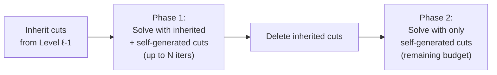
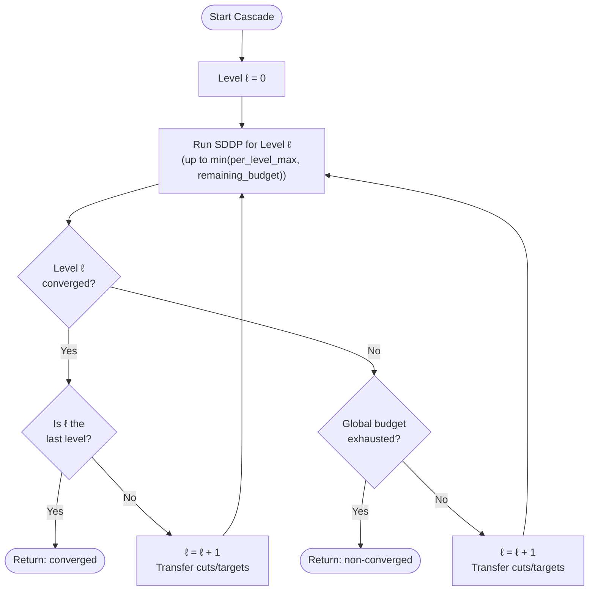

# Cascade Solver -- Multi-Level Hybrid SDDP in gtopt

## 1. Introduction

The **Cascade solver** (`method = "cascade"`) orchestrates multiple
SDDP/Benders decomposition levels, each with its own LP formulation and
solver configuration.  The key idea is to start with a simplified model
(e.g. uninodal/transport network) that converges quickly, then
progressively refine towards the full network model, warm-starting each
subsequent level with information from the previous one.

Each level internally runs an `SDDPMethod` instance (the same solver
documented in [SDDP_SOLVER.md](SDDP_SOLVER.md)).  The cascade solver
adds an outer loop that manages LP construction, solver lifecycle, and
information transfer between levels.

### When to use the Cascade Solver

| Criterion | Plain SDDP | Cascade |
|-----------|-----------|---------|
| Network complexity | Single formulation | Graduated: uninodal -> transport -> full |
| Convergence speed | One level, all iterations | Faster via warm-start from simpler models |
| LP rebuild cost | One LP | Multiple LPs (amortized by fewer iterations) |
| Configuration effort | Minimal | Per-level settings required |

The cascade solver is most beneficial when:

- The full network model (Kirchhoff + line losses) takes many Benders
  iterations to converge.
- A simplified model (single bus) converges quickly and provides a good
  starting point for the full model.
- The problem has many phases, increasing the number of state variable
  links and thus the iterations needed for cut convergence.

### Architecture Overview

```mermaid
flowchart TD
    subgraph cascade["Cascade Solver"]
        direction TB
        L0["Level 0: Simplified LP<br/>(e.g. single-bus Benders)"]
        L1["Level 1: Full Network LP<br/>(e.g. Kirchhoff + losses)"]
        L2["Level 2: Refined<br/>(reuse LP, inherit cuts)"]

        L0 -->|"state targets"| L1
        L1 -->|"Benders cuts"| L2
    end

    subgraph level["Each Level (SDDP)"]
        direction LR
        FW["Forward Pass<br/>(solve phases sequentially)"]
        BW["Backward Pass<br/>(generate Benders cuts)"]
        FW --> BW
        BW -->|"repeat until<br/>gap < ε"| FW
    end

    cascade --> level
```



---

## 2. Key Concepts

### 2.1 Levels

A cascade consists of an ordered sequence of **levels**, each defined in
the `cascade_options.level_array` array.  Each level specifies:

- **LP formulation** (`model_options`): network topology, Kirchhoff
  constraints, line losses, scaling.
- **Solver parameters** (`sddp_options`): iteration limits, apertures,
  convergence tolerance.
- **Transition rules** (`transition`): how to receive information from
  the previous level (cuts, targets).

### 2.2 LP Rebuild vs Reuse

When a level's `model_options` is **present**, a new `PlanningLP` is
built from scratch with the specified formulation.  When `model_options`
is **absent**, the previous level's LP and solver state are reused.
This distinction is important:

- **Rebuild** (model_options present): useful when the network topology
  changes (e.g. single bus -> multi-bus with Kirchhoff).  Column
  indices change, so cuts must be transferred via named resolution.
- **Reuse** (model_options absent): useful when only solver parameters
  change (e.g. enabling apertures for SDDP after a Benders warm-start).
  The solver state (cuts, basis) is preserved, avoiding rebuild cost.

### 2.3 Training Iterations and Simulation Pass

Each level runs up to N training iterations (forward + backward passes)
followed by 1 final simulation pass (forward-only).  The training
iterations generate Benders cuts and improve the lower bound; the
simulation pass evaluates the policy without adding cuts.

The `SDDPMethod` returns N+1 results: N training iterations + 1
simulation pass.  Only the N training iterations count towards the
global iteration budget.

### 2.4 Named Transfer

Cuts and target constraints use LP **column names** (e.g.
`Reservoir1_efin`) for cross-LP resolution.  When a level rebuilds the
LP with a different formulation, the column indices may change (e.g.
single-bus LP has no theta columns, but multi-bus LP does).  Named
transfer resolves the correct column index in the target LP by matching
column names, not indices.

This requires LP names to be enabled (`use_lp_names >= 1`).  The
cascade solver automatically enables LP names when building new LPs
for a level.

---

## 3. Transfer Mechanisms

The cascade solver supports two transfer mechanisms between levels:
**cut inheritance** and **target inheritance**.  Both are controlled
via the `transition` sub-object on each level (except level 0, which
has no predecessor).

### 3.1 Cut Inheritance

When `inherit_optimality_cuts` and/or `inherit_feasibility_cuts` are
set to `true`, the solver serializes all stored cuts from the previous
level into a temporary CSV file using column names, then loads them
into the new LP via name-based column resolution.

The transfer process:

1. After the previous level converges, `update_stored_cut_duals()` is
   called to capture the current dual values for each stored cut.
2. The stored cuts are serialized via `save_cuts_csv()`, which writes
   each cut with its column names (not indices).
3. At the next level, after the solver is initialized (so alpha
   variables exist), `load_cuts_csv()` reads the CSV and resolves
   column names to the new LP's column indices.
4. Cuts whose names do not resolve (e.g. a theta column that does not
   exist in a single-bus LP) are skipped.

**Dual threshold filtering**: the `optimality_dual_threshold` field
filters out inactive cuts.  Cuts with `|dual| < threshold` are skipped
during transfer.  This reduces noise from cuts that are no longer
binding.

**Example: 6-phase system with cut inheritance**

```
Level 0 [training]:   up to 15 iters, converges with N cuts
Level 1 [with_cuts]:  inherits N cuts -> converges in fewer iters
```

The 6-phase test case (`"Cascade 2-level with cut inheritance only
(6-phase)"`) demonstrates that level 1 converges in strictly fewer
iterations than level 0, and both levels reach the same optimal value.

### 3.2 Target Inheritance

When `inherit_targets` is set to `true`, the solver extracts state
variable values (reservoir volumes, battery SoC) from the previous
level's forward-pass solution and adds **elastic penalty constraints**
to the new LP.

For each state variable with value $v_{\text{prev}}$:

$$v_{\text{prev}} - \text{atol} \le v + s^- - s^+ \le v_{\text{prev}} + \text{atol}$$

where:

- $\text{atol} = \max(\text{rtol} \cdot |v_{\text{prev}}|, \text{min\_atol})$
- $s^+$ and $s^-$ are elastic slack variables with cost
  `target_penalty` per unit

The target constraints guide the optimizer towards the previous level's
solution trajectory without creating hard infeasibility.  The penalty
cost ensures violations are penalized but allowed.

**Target collection**: for each (scene, phase) pair, the solver
iterates over all outgoing state variable links, reads the forward-pass
column solution, and records the column name and target value.  Only
columns with LP names are collected; unnamed columns are skipped with
a debug log.

**Target injection**: for each collected target, the solver looks up
the column name in the new LP's column-name map.  If found, it adds
two slack columns (`tgt_sup_<name>`, `tgt_sdn_<name>`) and one
constraint row (`cascade_target_<name>`).  Unresolved names are
skipped.

**Example: 6-phase system with target inheritance**

```
Level 0 [training]:      up to 15 iters, converges
Level 1 [with_targets]:  elastic targets guide forward pass,
                         converges in <= level 0 iters
```

The 6-phase test case (`"Cascade 2-level with target inheritance only
(6-phase)"`) confirms that level 1 converges in at most as many
iterations as level 0, reaching the same optimal value.

### 3.3 Combined Transfer (Cuts + Targets)

A 3-level cascade can combine both mechanisms:

```
Level 0 [benders]:  uninodal, fast convergence, rough solution
Level 1 [guided]:   full network + targets from level 0
Level 2 [refined]:  same LP as level 1, inherits cuts -> faster
```

The test case `"Cascade 3-level with targets then cuts (6-phase)"` uses
this pattern:

- Level 0 runs uninodal Benders (`use_single_bus=true`) for fast
  convergence.
- Level 1 builds a full network LP (`use_kirchhoff=true`) and inherits
  targets from level 0 to guide the forward pass.
- Level 2 reuses level 1's LP (no `model_options`) and inherits
  optimality + feasibility cuts, converging faster than level 1.

The test verifies that all three levels reach the same optimal value,
and that level 2 converges in fewer iterations than level 1.

---

## 4. Configuration Reference

### 4.1 JSON Schema Overview

Cascade options are set in their own `cascade_options` sub-object
within the top-level `options` object:

```json
{
  "options": {
    "method": "cascade",
    "sddp_options": { ... },
    "cascade_options": {
      "model_options": { ... },
      "sddp_options": { ... },
      "level_array": [ ... ]
    }
  }
}
```

The option resolution chain is:

1. **Base `sddp_options`** (top-level) -- provides defaults for all
   SDDP parameters (convergence_tol, elastic_penalty, etc.)
2. **`cascade_options.sddp_options`** -- overrides base for cascade
   levels; `max_iterations` here is the global iteration budget
3. **Per-level `sddp_options`** -- overrides cascade global for a
   specific level

### 4.2 CascadeOptions Fields

| Field | Type | Default | Description |
|-------|------|---------|-------------|
| `model_options` | ModelOptions | (none) | Global model defaults for all levels |
| `sddp_options` | SddpOptions | (none) | Global SDDP defaults; `max_iterations` = global budget |
| `level_array` | array | `[]` | Array of CascadeLevel objects |

When `level_array` is empty, a single default level is created that
passes through all options, making the cascade solver equivalent to a
plain SDDP solver.

### 4.3 CascadeLevel Fields

| Field | Type | Default | Description |
|-------|------|---------|-------------|
| `uid` | int | (auto) | Unique level identifier |
| `name` | string | `"level_N"` | Human-readable name (for logging) |
| `model_options` | ModelOptions | (absent) | LP formulation overrides; absent = reuse previous LP |
| `sddp_options` | CascadeLevelSolver | (absent) | Per-level solver parameters |
| `transition` | CascadeTransition | (absent) | Transfer rules from previous level |

### 4.4 CascadeLevelSolver Fields

| Field | Type | Default | Description |
|-------|------|---------|-------------|
| `max_iterations` | int | from global | Max training iterations for this level |
| `min_iterations` | int | from global | Min iterations before convergence |
| `apertures` | array of UIDs | from global | Aperture UIDs; `[]` = pure Benders, absent = inherit |
| `convergence_tol` | real | from global | Relative gap tolerance |

### 4.5 CascadeTransition Fields

| Field | Type | Default | Description |
|-------|------|---------|-------------|
| `inherit_optimality_cuts` | int | `0` | `0` = do not inherit; `-1` = inherit and keep forever; `N > 0` = inherit, then forget after N training iterations |
| `inherit_feasibility_cuts` | int | `0` | Same semantics as `inherit_optimality_cuts` |
| `inherit_targets` | int | `0` | `0` = no targets; `-1` = inherit forever; `N > 0` = inherit with forgetting |
| `target_rtol` | real | 0.05 | Relative tolerance for target band (5% of abs(v)) |
| `target_min_atol` | real | 1.0 | Minimum absolute tolerance for target band |
| `target_penalty` | real | 500 | Elastic penalty per unit target violation |
| `optimality_dual_threshold` | real | 0.0 | Min abs(dual) for cut transfer (0 = all) |

#### Cut Forgetting Semantics

When `inherit_optimality_cuts` or `inherit_feasibility_cuts` is a positive
integer N, the solver runs in two phases:

1. **Phase 1** (up to N iterations): solve with inherited cuts plus
   self-generated cuts.  The per-level iteration cap is temporarily set
   to `min(N, remaining_budget)`.
2. **Phase 2** (remaining budget): delete all inherited cuts from the LP,
   then re-solve using only self-generated cuts.

This prevents over-reliance on potentially inaccurate cuts from a
simplified LP while still benefiting from the warm-start.



### 4.6 ModelOptions Fields

| Field | Type | Default | Description |
|-------|------|---------|-------------|
| `use_single_bus` | bool | `false` | Collapse network to a single bus (copper-plate) |
| `use_kirchhoff` | bool | `true` | Enable DC Kirchhoff voltage-law constraints |
| `use_line_losses` | bool | `false` | Model resistive line losses |
| `kirchhoff_threshold` | real | 0.0 | Min bus voltage [kV] for Kirchhoff |
| `loss_segments` | int | 1 | Piecewise-linear segments for quadratic losses |
| `scale_objective` | real | 1000 | Divisor for objective coefficients |
| `scale_theta` | real | 1.0 | Scaling for voltage-angle variables |
| `demand_fail_cost` | real | 1000 | Penalty for unserved demand [$/MWh] |
| `reserve_fail_cost` | real | 1000 | Penalty for unserved reserve [$/MWh] |
| `annual_discount_rate` | real | 0.0 | Discount rate for multi-stage CAPEX |

See also [INPUT_DATA.md](../INPUT_DATA.md) for the full JSON input
specification.

---

## 5. Examples

### 5.1 Cut Inheritance (2-Level)

Two levels on the same full-network LP.  Level 0 trains cuts from
scratch; level 1 inherits those cuts and converges faster.

```json
{
  "options": {
    "method": "cascade",
    "sddp_options": {
      "max_iterations": 30,
      "convergence_tol": 0.01
    },
    "cascade_options": {
      "level_array": [
        {
          "name": "training",
          "model_options": {
            "use_single_bus": false,
            "use_kirchhoff": true
          },
          "sddp_options": {
            "max_iterations": 15,
            "apertures": []
          }
        },
        {
          "name": "with_cuts",
          "model_options": {
            "use_single_bus": false,
            "use_kirchhoff": true
          },
          "sddp_options": {
            "max_iterations": 20,
            "apertures": []
          },
          "transition": {
            "inherit_optimality_cuts": true,
            "inherit_feasibility_cuts": true
          }
        }
      ]
    }
  }
}
```

**What happens:**

- Level 0 runs up to 15 Benders iterations on the full network,
  generating cuts until convergence.
- Level 1 builds a fresh LP (same formulation) and loads all cuts
  from level 0 via named CSV transfer.  It converges in fewer
  iterations because the inherited cuts provide a warm-started
  lower bound approximation.
- Both levels reach the same optimal value.

### 5.2 Target Inheritance (2-Level)

Level 0 solves a simplified model; level 1 uses the state variable
trajectory as elastic targets.

```json
{
  "options": {
    "method": "cascade",
    "sddp_options": {
      "max_iterations": 30,
      "convergence_tol": 0.01
    },
    "cascade_options": {
      "level_array": [
        {
          "name": "training",
          "model_options": {
            "use_single_bus": false,
            "use_kirchhoff": true
          },
          "sddp_options": {
            "max_iterations": 15,
            "apertures": []
          }
        },
        {
          "name": "with_targets",
          "model_options": {
            "use_single_bus": false,
            "use_kirchhoff": true
          },
          "sddp_options": {
            "max_iterations": 20,
            "apertures": []
          },
          "transition": {
            "inherit_targets": true,
            "target_rtol": 0.05,
            "target_min_atol": 1.0,
            "target_penalty": 500
          }
        }
      ]
    }
  }
}
```

**What happens:**

- Level 0 converges and produces a solution trajectory (reservoir
  volumes, battery SoC at each phase boundary).
- Level 1 builds a fresh LP, adds elastic target constraints that
  penalize deviations from level 0's trajectory, and solves.  The
  targets guide the forward pass, producing trial values closer to
  the optimal and reducing the iterations needed for cut convergence.

### 5.3 Combined 3-Level (Targets + Cuts)

A full cascade from uninodal Benders through full network with targets
to refined convergence with inherited cuts.

```json
{
  "options": {
    "method": "cascade",
    "sddp_options": {
      "max_iterations": 30,
      "convergence_tol": 0.01
    },
    "cascade_options": {
      "level_array": [
        {
          "name": "benders",
          "model_options": {
            "use_single_bus": true
          },
          "sddp_options": {
            "max_iterations": 15,
            "apertures": [],
            "convergence_tol": 0.01
          }
        },
        {
          "name": "guided",
          "model_options": {
            "use_single_bus": false,
            "use_kirchhoff": true
          },
          "sddp_options": {
            "max_iterations": 20,
            "apertures": [],
            "convergence_tol": 0.01
          },
          "transition": {
            "inherit_targets": true,
            "target_rtol": 0.05,
            "target_min_atol": 1.0,
            "target_penalty": 500
          }
        },
        {
          "name": "refined",
          "sddp_options": {
            "max_iterations": 20,
            "apertures": [],
            "convergence_tol": 0.01
          },
          "transition": {
            "inherit_optimality_cuts": true,
            "inherit_feasibility_cuts": true
          }
        }
      ]
    }
  }
}
```

**What happens:**

1. **Level 0 (benders)**: uninodal Benders converges quickly, producing
   a rough solution trajectory and cuts for the simplified LP.
2. **Level 1 (guided)**: builds a full network LP (Kirchhoff enabled),
   inherits target constraints from level 0's state variable values.
   The targets guide the forward pass without inheriting cuts (since
   the LP structure changed, the uninodal cuts would not be useful).
3. **Level 2 (refined)**: reuses level 1's LP (no `model_options`),
   inherits all optimality + feasibility cuts from level 1.  Converges
   faster than level 1 because the cuts provide a warm-started lower
   bound.

Note that level 2 omits `model_options`, so it reuses level 1's LP
and solver state.  This avoids rebuilding the LP and preserves the
solver's internal basis.

### 5.4 LP Reuse (Benders -> SDDP)

A 2-level cascade where the second level reuses the LP but switches
from Benders to SDDP with apertures:

```json
{
  "options": {
    "method": "cascade",
    "sddp_options": {
      "max_iterations": 30,
      "convergence_tol": 0.01
    },
    "cascade_options": {
      "level_array": [
        {
          "name": "benders_warm_start",
          "model_options": {
            "use_single_bus": true,
            "use_kirchhoff": false
          },
          "sddp_options": {
            "max_iterations": 10,
            "apertures": []
          }
        },
        {
          "name": "sddp_with_apertures",
          "sddp_options": {
            "max_iterations": 20,
            "apertures": [1, 2, 3]
          },
          "transition": {
            "inherit_targets": true
          }
        }
      ]
    }
  }
}
```

Level 1 omits `model_options`, so it reuses level 0's LP.  The solver
state (cuts, basis) is preserved, and only the solver parameters
change (apertures enabled, higher iteration limit).

---

## 6. Simulation Mode

When a level uses `max_iterations = 0`, it runs only the simulation
pass (a single forward pass without cut generation).  This is useful
for policy evaluation with inherited cuts from a previous level:

```json
{
  "name": "evaluate_policy",
  "sddp_options": {
    "max_iterations": 0
  },
  "transition": {
    "inherit_optimality_cuts": true
  }
}
```

In this mode:

- No training iterations are executed.
- The forward pass uses inherited cuts for future cost approximation.
- Convergence status is inherited from the last training iteration
  of the previous level.
- No new cuts are generated or saved.

---

## 7. Implementation Notes

### 7.1 CascadePlanningMethod Class

The `CascadePlanningMethod` class (defined in `cascade_method.hpp`,
implemented in `cascade_method.cpp`) inherits from `PlanningMethod`
and implements the `solve()` interface.

Key members:

| Member | Description |
|--------|-------------|
| `m_base_opts_` | Base SDDPOptions from global configuration |
| `m_cascade_opts_` | CascadeOptions with level definitions |
| `m_all_results_` | Concatenated iteration results from all levels |
| `m_level_stats_` | Per-level statistics (after solve) |
| `m_owned_lps_` | Owned PlanningLPs built for levels with `model_options` |

### 7.2 LP Lifecycle

When a level specifies `model_options`, the solver clones the base
`Planning` data, applies the model option overrides, and constructs a
new `PlanningLP`.  The new LP is owned by the cascade solver via
`m_owned_lps_` (a vector of `unique_ptr<PlanningLP>`).

LP names are automatically enabled (`use_lp_names >= 1`) for all
cascade-built LPs, even if the user's configuration does not request
them.  This is required for named cut/target transfer.

### 7.3 Iteration Budget

The cascade solver supports two levels of iteration control:

- **Per-level budget**: `CascadeLevelSolver::max_iterations` limits
  training iterations within a single level.
- **Global budget**: `CascadeOptions::sddp_options::max_iterations`
  limits the total training iterations across all levels.

The effective per-level limit is
`min(per_level_max, remaining_global_budget)`.  When the global budget
is exhausted, the cascade stops regardless of which level is active.

### 7.4 Level Statistics

After solving, `level_stats()` returns a vector of
`CascadeLevelStats`, one per level:

| Field | Description |
|-------|-------------|
| `name` | Level name |
| `iterations` | Training iterations (excludes simulation pass) |
| `lower_bound` | Final lower bound |
| `upper_bound` | Final upper bound |
| `gap` | Final relative gap |
| `converged` | Whether convergence tolerance was met |
| `elapsed_s` | Wall-clock time for this level |
| `cuts_added` | Total cuts added across all iterations |

### 7.5 Convergence Behavior

- If a level converges at an intermediate position, the cascade
  **continues to the next level** (to refine with a better LP
  formulation).
- If the **final** level converges, the solver returns immediately.
- If the global iteration budget is exhausted, the solver stops and
  reports non-convergence.
- The overall convergence flag is taken from the last iteration
  result across all levels.

Each level inherits the full convergence machinery from the SDDP solver,
including the **stationary-gap secondary criterion** (see
[SDDP_SOLVER.md §4.5](SDDP_SOLVER.md#45-convergence-check)).  Per-level
`sddp_options` can set `stationary_tol` and `stationary_window` to
enable secondary convergence detection at that level — useful when
simplified models converge to a non-zero gap plateau.



### 7.6 Cut Save Policy

Intermediate levels suppress per-iteration cut saving
(`save_per_iteration = false`) to avoid writing partial cut files.
Only the last level uses the base `save_per_iteration` setting.

---

## 8. References

<a id="cref1"></a>
**[1]** R. Romero and A. Monticelli, "A hierarchical decomposition
approach for transmission network expansion planning,"
*IEE Proceedings --- Generation, Transmission and Distribution*,
vol. 141, no. 5, pp. 465--473, 1994.
DOI: [10.1049/ip-gtd:19941354](https://doi.org/10.1049/ip-gtd:19941354)

<a id="cref2"></a>
**[2]** A. M. Geoffrion, "Generalized Benders decomposition," *Journal
of Optimization Theory and Applications*, vol. 10, no. 4,
pp. 237--260, 1972.
DOI: [10.1007/BF00934810](https://doi.org/10.1007/BF00934810)

<a id="cref3"></a>
**[3]** S. Rebennack, "Combining sampling-based and scenario-based
nested Benders decomposition methods: application to stochastic dual
dynamic programming," *Mathematical Programming*, vol. 156,
pp. 343--389, 2016.
DOI: [10.1007/s10107-015-0884-3](https://doi.org/10.1007/s10107-015-0884-3)

<a id="cref4"></a>
**[4]** V. Zverovich, C. I. Fabian, E. F. D. Ellison, and G. Mitra,
"A computational study of a solver system for processing two-stage
stochastic LPs with enhanced Benders decomposition," *Mathematical
Programming Computation*, vol. 4, pp. 211--238, 2012.
DOI: [10.1007/s12532-012-0038-z](https://doi.org/10.1007/s12532-012-0038-z)

<a id="cref5"></a>
**[5]** J. R. Birge and F. Louveaux, *Introduction to Stochastic
Programming*, 2nd ed. New York: Springer, 2011.
DOI: [10.1007/978-1-4614-0237-4](https://doi.org/10.1007/978-1-4614-0237-4)

<a id="cref6"></a>
**[6]** M. V. F. Pereira and L. M. V. G. Pinto, "Multi-stage
stochastic optimization applied to energy planning," *Mathematical
Programming*, vol. 52, pp. 359--375, 1991.
DOI: [10.1007/BF01582895](https://doi.org/10.1007/BF01582895)

<a id="cref7"></a>
**[7]** O. Dowson and L. Kapelevich, "SDDP.jl: a Julia package for
stochastic dual dynamic programming," *INFORMS Journal on Computing*,
vol. 33, no. 1, pp. 27--33, 2021.
DOI: [10.1287/ijoc.2020.0987](https://doi.org/10.1287/ijoc.2020.0987)

<a id="cref8"></a>
**[8]** J. Forrest and R. Lougee-Heimer, "CBC User Guide," in
*Emerging Theory, Methods, and Applications*, INFORMS, pp. 257--277,
2005.
DOI: [10.1287/educ.1053.0020](https://doi.org/10.1287/educ.1053.0020)

<a id="cref9"></a>
**[9]** S. Lumbreras and A. Ramos, "The new challenges to transmission
expansion planning. Survey of recent practice and literature review,"
*Electric Power Systems Research*, vol. 134, pp. 19--29, 2016.
DOI: [10.1016/j.epsr.2015.10.013](https://doi.org/10.1016/j.epsr.2015.10.013)

<a id="cref10"></a>
**[10]** L. Buitrago Villada, M. Pereira-Bonvallet, M. Matus, et al.,
"FESOP: A framework for electricity system optimization and planning,"
*IEEE Kansas Power and Energy Conference (KPEC)*, 2022.
DOI: [10.1109/KPEC54747.2022.9814758](https://doi.org/10.1109/KPEC54747.2022.9814758)

---

## 9. See Also

- [SDDP_SOLVER.md](SDDP_SOLVER.md) -- base SDDP solver documentation,
  including convergence theory, cut types, elastic filter, and
  configuration reference
- [MONOLITHIC_SOLVER.md](MONOLITHIC_SOLVER.md) -- monolithic solver
  documentation
- [INPUT_DATA.md](../INPUT_DATA.md) -- JSON/Parquet input format
  specification (includes `cascade_options` reference)
- [MATHEMATICAL_FORMULATION.md](formulation/MATHEMATICAL_FORMULATION.md)
  -- full LP/MIP formulation
- [PLANNING_GUIDE.md](../PLANNING_GUIDE.md) -- worked examples and
  time structure concepts
