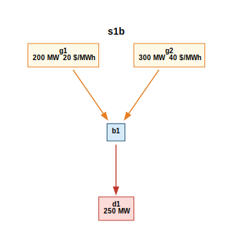
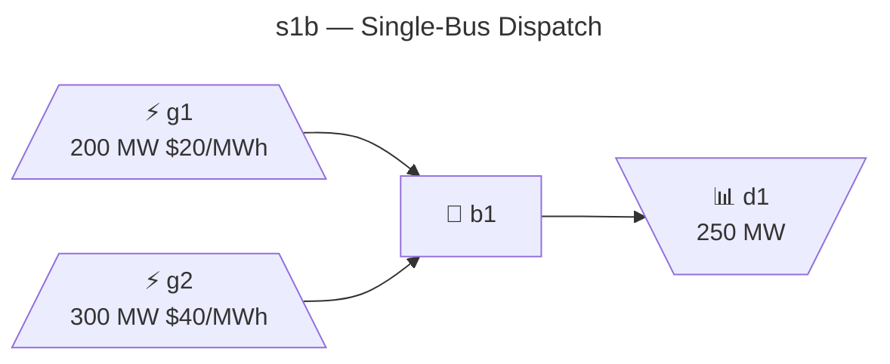
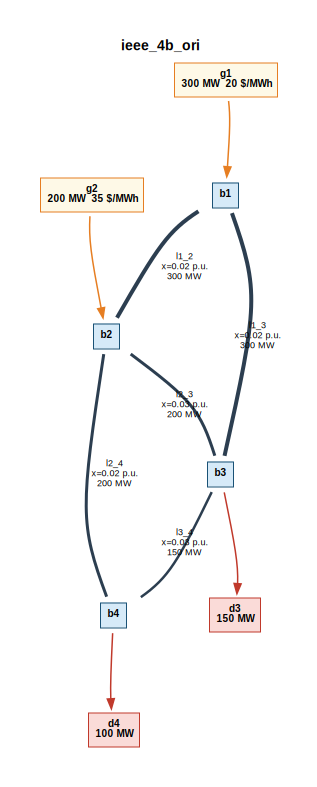
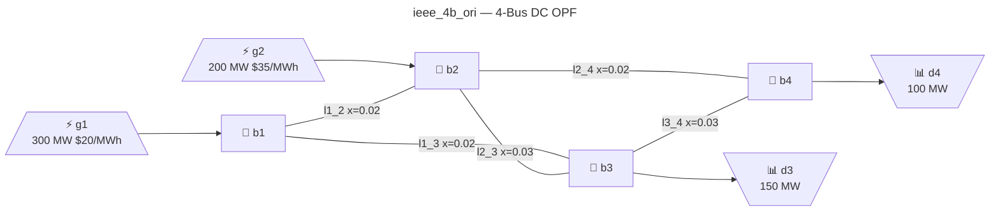
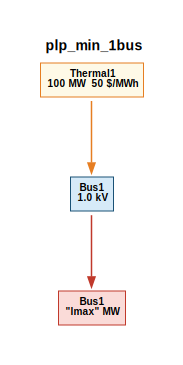
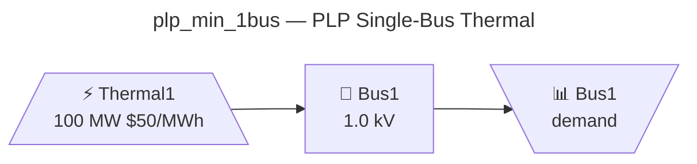

# Tool Comparison: gtopt vs PLP vs pandapower

This document provides a detailed comparison between **gtopt** and two widely
used power system tools: **PLP** (a hydrothermal scheduling tool used
extensively in Latin America) and **pandapower** (an open-source Python
framework for power system analysis). It covers element-by-element parameter
mapping, unit conventions, methodology differences, and guidance on when
results should be directly comparable.

> **Conversion tools**: The gtopt repository includes `plp2gtopt` (PLP →
> gtopt), `pp2gtopt` (pandapower → gtopt), and `gtopt_compare`
> (validation against pandapower DC OPF). See [SCRIPTS.md](../SCRIPTS.md)
> for installation and usage.

---

## Table of Contents

- [1. Overview](#1-overview)
- [2. Bus / Bar](#2-bus--bar)
- [3. Generator / Central](#3-generator--central)
- [4. Demand / Load](#4-demand--load)
- [5. Transmission Line](#5-transmission-line)
- [6. Battery / Energy Storage](#6-battery--energy-storage)
- [7. Hydro System](#7-hydro-system)
  - [7.1 Junction / Reservoir Node](#71-junction--reservoir-node)
  - [7.2 Reservoir / Embalse](#72-reservoir--embalse)
  - [7.3 Waterway / Water Channel](#73-waterway--water-channel)
  - [7.4 Turbine](#74-turbine)
  - [7.5 Flow / Inflow](#75-flow--inflow)
  - [7.6 Filtration](#76-filtration)
- [8. Transformer](#8-transformer)
- [9. Reserves](#9-reserves)
- [10. Time Structure](#10-time-structure)
- [11. Capacity Expansion](#11-capacity-expansion)
- [12. Methodology Comparison](#12-methodology-comparison)
  - [12.1 Objective Function](#121-objective-function)
  - [12.2 DC Power Flow](#122-dc-power-flow)
  - [12.3 Solver and Formulation](#123-solver-and-formulation)
  - [12.4 Stochastic Optimization](#124-stochastic-optimization)
- [13. Result Comparability](#13-result-comparability)
  - [13.1 Cases with 100% Comparable Results](#131-cases-with-100-comparable-results)
  - [13.2 Cases with Similar but not Identical Results](#132-cases-with-similar-but-not-identical-results)
  - [13.3 Cases with Structural Differences](#133-cases-with-structural-differences)
- [14. Unit Convention Summary](#14-unit-convention-summary)
- [15. Conversion Tools Reference](#15-conversion-tools-reference)
- [16. Worked Examples](#16-worked-examples)
  - [16.1 Single-Bus Dispatch: gtopt vs pandapower](#161-single-bus-dispatch-gtopt-vs-pandapower)
  - [16.2 4-Bus DC OPF: gtopt vs pandapower](#162-4-bus-dc-opf-gtopt-vs-pandapower)
  - [16.3 PLP Conversion Workflow: plp2gtopt → gtopt](#163-plp-conversion-workflow-plp2gtopt--gtopt)
- [See Also](#see-also)

---

## 1. Overview

| Feature | **gtopt** | **PLP** | **pandapower** |
|---------|-----------|---------|----------------|
| **Language** | C++26 | Fortran | Python |
| **Primary use** | Generation & Transmission Expansion Planning (GTEP) | Hydrothermal scheduling | Power flow, OPF, state estimation |
| **Optimization** | LP/MIP (COIN-OR CBC/CLP) | LP/SDDP | AC/DC OPF (PYPOWER) |
| **Time horizon** | Multi-stage, multi-scenario | Multi-stage, multi-scenario | Single snapshot |
| **Network model** | DC OPF (Kirchhoff) or transport | DC OPF (Kirchhoff) or transport | AC or DC power flow / OPF |
| **Hydro modeling** | Full cascade (junction/waterway/reservoir/turbine/flow/filtration) | Full cascade (embalse/serie/pasada, filtration) | Not natively supported |
| **Storage** | Battery with charge/discharge efficiency | ESS and Battery centrals | Storage element (limited OPF support) |
| **Expansion planning** | Built-in (CAPEX + OPEX) | Limited | Not supported |
| **Stochastic** | Multi-scenario, SDDP | SDDP (native) | Not supported |
| **I/O format** | JSON + Parquet/CSV | Binary `.dat` files | JSON, Excel, MATPOWER `.m` |
| **Converter tool** | — | `plp2gtopt` | `pp2gtopt` |

---

## 2. Bus / Bar

Buses represent electrical network nodes where generation, demand, and
transmission lines connect.

| Parameter | **gtopt** `Bus` | **PLP** `plpbar.dat` | **pandapower** `bus` | Notes |
|-----------|----------------|---------------------|---------------------|-------|
| Identifier | `uid` (int) | `number` (int) | `index` (0-based int) | PLP/gtopt are 1-indexed; pp is 0-indexed. `pp2gtopt` adds 1. |
| Name | `name` (string) | `name` (string, 8 char) | `name` (string) | PLP names are fixed-width Fortran strings. |
| Active | `active` (optional bool) | — | `in_service` (bool) | PLP has no per-bus active flag. |
| Type | `type` (optional string) | — | `type` ("b", "n") | gtopt uses free-form tags; pp has fixed types. |
| Voltage | `voltage` (optional, kV) | `voltage` (kV) | `vn_kv` (kV) | **Same unit (kV).** One-to-one mapping. |
| Reference angle | `reference_theta` (rad) | — (implicit slack) | — (ext_grid bus) | gtopt: explicit field; PLP: implicit from slack central; pp: implicit from ext_grid. |
| Kirchhoff override | `use_kirchhoff` (optional bool) | — | — | gtopt-only; overrides global Kirchhoff setting per bus. |

**Conversion notes:**
- `plp2gtopt`: Reads `plpbar.dat`, maps `number` → `uid`, `name` → `name`, `voltage` → `voltage`.
- `pp2gtopt`: Maps `bus.index+1` → `uid`, generates name `"b{uid}"`, sets `reference_theta=0` for the slack bus.
- **Comparability**: Bus definitions are one-to-one between all three tools. No transformation needed.

---

## 3. Generator / Central

PLP uses "centrals" to represent all types of generation (thermal, hydro,
battery). gtopt and pandapower use separate elements for generators, batteries,
and hydro components.

### 3.1 Thermal Generator

| Parameter | **gtopt** `Generator` | **PLP** Central (type=termica) | **pandapower** `gen` / `ext_grid` | Notes |
|-----------|----------------------|-------------------------------|----------------------------------|-------|
| Identifier | `uid` (int) | `number` (int) | `index` (0-based) | |
| Name | `name` | `name` (8 char) | `name` | |
| Bus | `bus` (uid/name) | `bus` (number) | `bus` (index) | All reference the connected bus. |
| Min power | `pmin` (MW) | `pmin` (MW, from `plpcosce.dat`) | `min_p_mw` (MW) | **Same unit.** PLP reads pmin from cost file. |
| Max power | `pmax` (MW) | `pmax` (MW, from `plpcosce.dat`) | `max_p_mw` (MW) | **Same unit.** |
| Generation cost | `gcost` ($/MWh) | Cost curve from `plpcosce.dat` | `poly_cost.cp1_eur_per_mw` ($/MWh) | PLP has piecewise-linear cost curves; `plp2gtopt` linearizes. pp has polynomial costs; `pp2gtopt` uses only `cp1` (linear). |
| Loss factor | `lossfactor` (p.u.) | `lossfactor` (p.u.) | — | PLP and gtopt: reduces effective injection. pp: not modeled in DC OPF. |
| Active | `active` (bool) | — | `in_service` (bool) | |
| Type tag | `type` (string) | Central type code | — | gtopt: free-form; PLP: termica/embalse/serie/pasada/bateria/falla. |

### 3.2 PLP Central Type → gtopt Element Mapping

PLP has six central types, each mapping to different gtopt elements:

| PLP Central Type | gtopt Elements Created | Description |
|-----------------|----------------------|-------------|
| **termica** | `Generator` | Thermal/fossil unit. Direct 1:1 mapping. |
| **embalse** | `Generator` + `Junction` + `Reservoir` + `Waterway` + `Turbine` | Reservoir hydro. The central becomes a generator; the reservoir storage becomes Junction + Reservoir + Waterway + Turbine topology. |
| **serie** | `Generator` + `Waterway` + `Turbine` | Run-of-river (series) hydro. Water passes through without storage. |
| **pasada** | `Generator` + `Flow` | Run-of-river (pasada) hydro. Modeled as external flow injecting into the hydro network. |
| **bateria** / ESS | `Battery` + `Converter` + `Generator` (discharge) + `Demand` (charge) | Energy storage. The converter links battery SoC to the generator (discharge path) and demand (charge path). |
| **falla** | *(skipped)* | Modeling artifact in PLP (failure central); not converted. |

### 3.3 Generation Cost Curves

| Aspect | **gtopt** | **PLP** | **pandapower** |
|--------|-----------|---------|----------------|
| Cost model | Linear `gcost` ($/MWh) | Piecewise-linear from `plpcosce.dat` (up to N segments) | Polynomial: `cp0 + cp1·P + cp2·P²` |
| Segments | Single marginal cost | Multiple (pmin₁,pmax₁,cost₁), …, (pminₙ,pmaxₙ,costₙ) | Single polynomial |
| Conversion | `plp2gtopt` uses first segment cost | — | `pp2gtopt` uses only `cp1` (linear term) |
| Quadratic costs | Not supported | Not native (piecewise approximation) | `cp2` available but **ignored** by `pp2gtopt` |

**Conversion notes:**
- `plp2gtopt`: Reads `plpcosce.dat`, extracts the first cost segment's marginal cost as `gcost`. Also extracts `pmin`/`pmax` bounds from the cost curve.
- `pp2gtopt`: Reads `poly_cost` table, uses `cp1_eur_per_mw` as `gcost`. Defaults: $20/MWh for slack (ext_grid), $40/MWh for PV generators.

---

## 4. Demand / Load

| Parameter | **gtopt** `Demand` | **PLP** `plpdem.dat` | **pandapower** `load` | Notes |
|-----------|-------------------|---------------------|----------------------|-------|
| Identifier | `uid` (int) | Demand index | `index` (0-based) | |
| Name | `name` | `name` | `name` | |
| Bus | `bus` (uid/name) | `bus` (number) | `bus` (index) | |
| Max load | `lmax` (MW, schedule) | Demand profile (MW, per block) | `p_mw` (MW, scalar) | PLP: time-series in `plpdem.dat`; pp: single value. |
| Curtailment cost | `fcost` ($/MWh) | `demand_fail_cost` (global) | — | gtopt: per-demand; PLP: global option; pp: no load shedding in standard DC OPF. |
| Loss factor | `lossfactor` (p.u.) | — | — | gtopt-only; increases effective load. |
| Energy min | `emin` (MWh) | — | — | gtopt-only; minimum energy served per stage. |
| Energy cost | `ecost` ($/MWh) | — | — | gtopt-only; penalty for energy shortfall. |

**Conversion notes:**
- `plp2gtopt`: Reads `plpdem.dat` with per-block demand profiles. Writes `Demand/lmax.parquet` with time-series data indexed by `(scenario, stage, block, uid)`.
- `pp2gtopt`: Maps `load.p_mw` → `lmax = [[p_mw]]` (single block, wrapped in 2D list). Loads with `p_mw ≤ 0` are skipped.
- **Key difference**: PLP and gtopt support time-varying demand profiles; pandapower is a single snapshot.

---

## 5. Transmission Line

| Parameter | **gtopt** `Line` | **PLP** `plpcnfli.dat` | **pandapower** `line` | Notes |
|-----------|-----------------|----------------------|----------------------|-------|
| Identifier | `uid` (int) | Line index | `index` (0-based) | |
| Name | `name` | `name` (8 char) | `name` | |
| From bus | `bus_a` (uid) | `bus_a` (number) | `from_bus` (index) | |
| To bus | `bus_b` (uid) | `bus_b` (number) | `to_bus` (index) | |
| Reactance | `reactance` (p.u.) | `reactance` (p.u.) | `x_ohm_per_km` (Ω/km) | **PLP and gtopt use p.u.; pp uses physical Ohms.** Conversion required. |
| Resistance | `resistance` (p.u.) | `resistance` (p.u.) | `r_ohm_per_km` (Ω/km) | Used for loss modeling; ignored in lossless DC OPF. |
| Max flow A→B | `tmax_ab` (MW) | `tmax_ab` (MW) | Computed from `max_i_ka` | PLP/gtopt: direct MW; pp: `tmax = max_i_ka × vn_kv × √3`. |
| Max flow B→A | `tmax_ba` (MW) | `tmax_ba` (MW) | Same as A→B | PLP/gtopt: asymmetric limits; pp: symmetric. |
| Loss factor | `lossfactor` (p.u.) | `lossfactor` (p.u.) | `r_ohm_per_km` | Different representations. |
| Line losses | `use_line_losses` (bool) | — | — | gtopt-only per-line override. |
| Loss segments | `loss_segments` (int) | — | — | gtopt-only piecewise linearization. |
| Voltage | `voltage` (kV) | `voltage` (kV) | `bus.vn_kv` (kV) | pp: voltage from connected bus. |
| Transfer cost | `tcost` ($/MWh) | — | — | gtopt-only; variable cost for line usage. |

### Reactance Conversion (pandapower → gtopt)

pandapower stores line parameters in physical units (Ω/km). Conversion to
per-unit (p.u.) requires:

```
Z_base = (vn_kv)² / S_base_MVA    [where S_base = 100 MVA]
x_pu = (x_ohm_per_km × length_km) / Z_base
```

`pp2gtopt` performs this conversion automatically. Lines with degenerate
reactance (`x_pu < 1e-6`) are filtered out.

**Conversion notes:**
- `plp2gtopt`: Direct mapping; PLP already uses per-unit reactance matching gtopt.
- `pp2gtopt`: Converts Ω to p.u. using `x_pu = x_ohm / (vn_kv² / 100)`. Sets `tmax = max_i_ka × vn_kv × √3` or 9999 if unconstrained.

---

## 6. Battery / Energy Storage

| Parameter | **gtopt** `Battery` | **PLP** ESS (`plpess.dat`) | **PLP** Battery (`plpcenbat.dat`) | **pandapower** `storage` | Notes |
|-----------|--------------------|--------------------------|---------------------------------|-------------------------|-------|
| Identifier | `uid` | Central number | BatInd | `index` | |
| Charge efficiency | `input_efficiency` (p.u.) | `nc` (p.u.) | — | `efficiency_percent/100` | PLP ESS: read from `plpess.dat`. |
| Discharge efficiency | `output_efficiency` (p.u.) | `nd` (p.u.) | `FPD` (p.u.) | Same | PLP ESS: nd first, nc second in Fortran READ. |
| Energy max | `emax` (MWh) | `Emax` (MWh) | `BatEMax` (MWh) | `max_e_mwh` | **Same unit.** |
| Energy min | `emin` (MWh) | — (default 0) | `BatEMin` (MWh) | `min_e_mwh` | |
| Max charge power | `pmax_charge` (MW) | `DCMax` (MW) | — | `max_p_mw` | ESS: from `plpess.dat` field `DCMax`. |
| Max discharge power | `pmax_discharge` (MW) | `DCMax` (MW) | — | `max_p_mw` | ESS: same as charge (symmetric). |
| Self-discharge | `annual_loss` (p.u./year) | `mloss` (p.u.) | — | — | PLP ESS: `mloss` field. |
| Initial SoC | `eini` (MWh) | — | `BatEMax/2` (default) | `soc_percent` | PLP Battery: initializes at 50% capacity. |
| Final SoC | `efin` (MWh) | — | — | — | gtopt-only end-of-horizon constraint. |
| Generation cost | `gcost` ($/MWh) | — | — | — | gtopt-only; cost of discharge. |
| Energy scale | `energy_scale` | — | — | — | gtopt-only LP scaling factor. |

### PLP ESS vs PLP Battery

PLP has two mutually exclusive storage models:
- **ESS** (`plpess.dat`): Energy Storage System with charge/discharge efficiency, energy bounds, and power limits. This is the **preferred** model.
- **Battery** (`plpcenbat.dat`): Older battery model with investment/expansion data, discharge efficiency only.

In `plp2gtopt`, when both ESS and Battery parsers provide data, **ESS takes priority** (implemented as `elif` in `battery_writer._all_entries()`).

**Conversion notes:**
- `plp2gtopt`: Creates a `Battery` + `Converter` + `Generator` (discharge) + `Demand` (charge) ensemble from each ESS/Battery central.
- `pp2gtopt`: Does **not** convert pandapower `storage` elements (not implemented).
- `gtopt_compare`: Supports battery validation for the `bat_4b_24` case, adjusting effective loads per block for charge/discharge.

---

## 7. Hydro System

gtopt models cascaded hydro systems with a graph-based topology. PLP uses a
similar but differently structured representation.
pandapower does not natively support hydro modeling.

### 7.1 Junction / Reservoir Node

| Parameter | **gtopt** `Junction` | **PLP** (implicit) | **pandapower** | Notes |
|-----------|---------------------|--------------------|----------------|-------|
| Identifier | `uid` (int) | Derived from central | — | Not a separate PLP element. |
| Name | `name` | Central name | — | |
| Drain | `drain` (bool) | — | — | Allows excess water to leave freely. |

**Conversion**: `plp2gtopt` creates one Junction per reservoir central and one
per downstream node in the hydro cascade.

### 7.2 Reservoir / Embalse

| Parameter | **gtopt** `Reservoir` | **PLP** Embalse Central (`plpcnfce.dat`) | Notes |
|-----------|----------------------|----------------------------------------|-------|
| Junction | `junction` (uid) | Implicit from central | gtopt links reservoir to a junction node. |
| Min volume | `emin` (dam³) | `vol_min` (Mm³) | **Unit conversion**: 1 Mm³ = 1000 dam³. `plp2gtopt` multiplies by 1000. |
| Max volume | `emax` (dam³) | `vol_max` (Mm³) | Same conversion. |
| Initial volume | `eini` (dam³) | `vol_ini` (Mm³) | Same conversion. |
| Final volume | `efin` (dam³) | `vol_fin` (Mm³) | Same conversion. |
| Spillway capacity | `spillway_capacity` (m³/s) | — (implicit large) | gtopt default: 6000 m³/s. |
| Spillway cost | `spillway_cost` ($/dam³) | — | gtopt-only penalty for spilling. |
| Storage capacity | `capacity` (dam³) | `vol_max` (Mm³) | Same as emax in basic cases. |
| Volume scale | `energy_scale` (default 1000) | — | LP scaling: converts dam³ to Mm³ for numerics. |
| Flow conversion | `flow_conversion_rate` (0.0036) | 0.0036 | Converts m³/s × hours → dam³. Both use same factor. |
| State variable | `use_state_variable` (bool) | — (always true) | SDDP: carries volume across phases. |
| Annual loss | `annual_loss` (p.u./year) | — | Evaporation/seepage rate. |
| Daily cycle | `daily_cycle` (bool) | — | Daily cycling constraint. |

**Volume unit convention:**
- **PLP**: Mm³ (millions of cubic meters)
- **gtopt**: dam³ (decacubic meters; 1 dam³ = 1000 m³)
- **Conversion**: `volume_dam³ = volume_Mm³ × 1000`
- **Physical**: 1 Mm³ = 1,000,000 m³ = 1,000 dam³

### 7.3 Waterway / Water Channel

| Parameter | **gtopt** `Waterway` | **PLP** (implicit from central topology) | Notes |
|-----------|---------------------|----------------------------------------|-------|
| Junction A | `junction_a` (uid) | Upstream central/junction | |
| Junction B | `junction_b` (uid) | Downstream central/junction | |
| Capacity | `capacity` (m³/s) | — | Max water flow rate. |
| Loss factor | `lossfactor` (p.u.) | — | Transit losses. |
| Min flow | `fmin` (m³/s) | — | Minimum environmental flow. |
| Max flow | `fmax` (m³/s) | — | Maximum channel capacity. |

**Conversion**: `plp2gtopt` creates waterways from the PLP cascade topology
connecting reservoir → series → pasada centrals.

### 7.4 Turbine

| Parameter | **gtopt** `Turbine` | **PLP** Central (hydro types) | Notes |
|-----------|--------------------|-----------------------------|-------|
| Waterway | `waterway` (uid) | Implicit from central position | |
| Generator | `generator` (uid) | Central number | Links turbine to electrical generator. |
| Conversion rate | `conversion_rate` (MW·s/m³) | `efficiency` × head factor | `power = conversion_rate × flow`. PLP uses efficiency curves. |
| Capacity | `capacity` (MW) | `pmax` (MW) | Maximum turbine output. |
| Drain | `drain` (bool) | — | Can spill without generating. |
| Main reservoir | `main_reservoir` (uid) | Implicit from central | Volume-dependent efficiency (SDDP). |

**Conversion**: `plp2gtopt` computes `conversion_rate = efficiency × 9.81 × head / 1000`
where head is derived from the reservoir geometry.

### 7.5 Flow / Inflow

| Parameter | **gtopt** `Flow` | **PLP** `plpaflce.dat` | Notes |
|-----------|-----------------|----------------------|-------|
| Junction | `junction` (uid) | Central number | |
| Direction | `direction` (+1 inflow, −1 outflow) | Always inflow | gtopt supports outflows too. |
| Discharge | `discharge` (m³/s, schedule) | Inflow series (m³/s, per block per scenario) | **Same unit.** PLP has multi-hydrology stochastic inflows. |

**Conversion**: `plp2gtopt` reads `plpaflce.dat` for each hydrology scenario and
writes `Flow/discharge.parquet` with `(scenario, stage, block, uid)` indices.

### 7.6 Filtration

| Parameter | **gtopt** `Filtration` | **PLP** `plpfilemb.dat` | Notes |
|-----------|----------------------|------------------------|-------|
| Waterway | `waterway` (uid) | Source reservoir name | |
| Reservoir | `reservoir` (uid) | Receiving central name | |
| Slope | `slope` (m³/s per dam³) | `Slope_Mm3` (m³/s per Mm³) | **Unit conversion**: divide by 1000. |
| Constant | `constant` (m³/s) | `Const_m3s` (m³/s) | **Same unit.** |
| Segments | `segments` (JSON array) | `NTramo` segments | Piecewise-linear volume-dependent seepage. |

**Conversion**: `plp2gtopt` reads `plpfilemb.dat` and converts units:
- Volume breakpoints: `vol_dam³ = vol_Mm³ × 1000`
- Slope: `slope_dam³ = slope_Mm³ / 1000`
- Constant: no conversion needed (already m³/s)

---

## 8. Transformer

| Parameter | **gtopt** `Line` | **PLP** | **pandapower** `trafo` | Notes |
|-----------|-----------------|---------|----------------------|-------|
| Reactance | `reactance` (p.u.) | Not separate element | `vk_percent` (%) | pp transformer modeled as lossless line in gtopt. |
| Tap ratio | — | — | `tap_pos`, `tap_neutral` | Not modeled in DC approximation. |

**Conversion**: `pp2gtopt` converts transformers to equivalent lines:
```
x_pu = (vk_percent / 100) × (S_base / sn_mva)
```
where `S_base = 100 MVA`. Thermal limits are set to 9999 MW (unconstrained).

PLP does not have a separate transformer element; transformers are implicit in
the network topology.

---

## 9. Reserves

| Parameter | **gtopt** `ReserveZone` / `ReserveProvision` | **PLP** | **pandapower** | Notes |
|-----------|---------------------------------------------|---------|----------------|-------|
| Up-reserve requirement | `urreq` (MW) | — | — | gtopt-only. |
| Down-reserve requirement | `drreq` (MW) | — | — | gtopt-only. |
| Reserve cost | `urcost` / `drcost` ($/MW) | — | — | Penalty for unserved reserve. |
| Generator provision | `urmax` / `drmax` (MW) | — | — | Per-generator reserve offer. |
| Capacity factor | `ur_capacity_factor` (p.u.) | — | — | Fraction of capacity for reserve. |

**Note**: Neither PLP nor pandapower has an equivalent reserve modeling
framework. This is a gtopt-specific feature for spinning reserve requirements.

---

## 10. Time Structure

| Aspect | **gtopt** | **PLP** | **pandapower** |
|--------|-----------|---------|----------------|
| Block (time step) | `block_array`: uid, duration (hours) | `plpblo.dat`: block definitions, durations | Single snapshot (no time) |
| Stage (period) | `stage_array`: uid, first_block, count_block, discount_factor | `plpeta.dat`: stage start/end months, annual discount | Single snapshot |
| Scenario | `scenario_array`: uid, probability_factor | Hydrology scenarios (1..N) with equal probability | Not applicable |
| Phase | `phase_array`: uid, stages (for SDDP decomposition) | Not separate | Not applicable |
| Scene | `scene_array`: uid, scenarios (for SDDP decomposition) | Not separate | Not applicable |

**Conversion notes:**
- `plp2gtopt`: Maps PLP blocks → gtopt blocks with duration in hours; PLP stages → gtopt stages with first_block/count_block computed from month boundaries; hydrologies → scenarios with configurable probability_factors.
- `pp2gtopt`: Creates minimal time structure: 1 block, 1 stage, 1 scenario (static dispatch).

---

## 11. Capacity Expansion

| Parameter | **gtopt** (all expandable elements) | **PLP** (limited) | **pandapower** |
|-----------|-------------------------------------|-------------------|----------------|
| Initial capacity | `capacity` | — | — |
| Expansion capacity/module | `expcap` (MW or MWh) | `FPC` (for batteries) | Not supported |
| Max modules | `expmod` (int) | `NIny` (for batteries) | Not supported |
| Annual investment cost | `annual_capcost` ($/MW-year) | `NomBatIny` (for batteries) | Not supported |
| Annual derating | `annual_derating` (p.u./year) | — | Not supported |
| Max capacity | `capmax` (MW or MWh) | — | Not supported |

gtopt supports capacity expansion for **all** major elements: generators,
demands, lines, batteries, and converters. PLP has limited expansion support
only for batteries (via `plpcenbat.dat`). pandapower does not support expansion
planning.

---

## 12. Methodology Comparison

### 12.1 Objective Function

All three tools minimize total cost, but with different scopes:

**gtopt:**
```
min Σ_s Σ_t Σ_b  prob_s × discount_t × duration_b ×
      [ Σ_g gcost_g × generation_g + Σ_d fcost × curtailment_d + Σ_l tcost_l × flow_l ]
    + Σ expansion costs (CAPEX)
```

**PLP:**
```
min Σ_h Σ_t Σ_b  prob_h × discount_t × duration_b ×
      [ Σ_c cost_c(generation_c) + failure_cost × curtailment ]
    + Σ future cost (SDDP cuts)
```

**pandapower DC OPF:**
```
min Σ_g cost_g(p_g)    [polynomial: cp0 + cp1·p + cp2·p²]
```

| Aspect | gtopt | PLP | pandapower |
|--------|-------|-----|------------|
| Cost function type | Linear (per generator) | Piecewise-linear | Polynomial (up to quadratic) |
| Demand curtailment | Per-demand penalty (`fcost`) | Global penalty (`demand_fail_cost`) | Not modeled |
| Transmission cost | Optional per-line `tcost` | Not modeled | Not modeled |
| Discount factor | `(1+r)^(-τ/8760)` per stage | Annual discount | Not applicable |
| Objective scaling | `scale_objective` divides all coefficients | — | — |

### 12.2 DC Power Flow

All three tools support the DC power flow approximation (linearized AC power flow):

```
f_l = B_l × (θ_a − θ_b)    where B_l = V² / X_l (susceptance)
```

| Aspect | gtopt | PLP | pandapower |
|--------|-------|-----|------------|
| Angle variable | `θ` (radians, scaled by `scale_theta`) | `θ` (radians) | `θ` (degrees internally, radians in model) |
| Susceptance | `V²/X` with per-unit X | `V²/X` with per-unit X | Computed from physical Ω | |
| Angle scaling | `scale_theta` (default 1000) for numerical stability | No explicit scaling | No explicit scaling |
| Loss model | Optional piecewise-linear losses | Quadratic loss approximation | Lossless (standard DC OPF) |
| Reference bus | `reference_theta = 0` on one bus | Slack bus angle = 0 | `ext_grid` bus angle = 0 |

### 12.3 Solver and Formulation

| Aspect | gtopt | PLP | pandapower |
|--------|-------|-----|------------|
| Solver | COIN-OR CBC/CLP (LP/MIP) | Custom LP solver / SDDP | PYPOWER (Python) |
| Problem type | Sparse LP/MIP | Sparse LP | Dense LP/QP |
| Matrix format | CSC sparse (`SparseCol`/`SparseRow`) | Dense/banded | Dense |
| Integer variables | Optional (expansion modules) | Not standard | Not supported in DC OPF |
| Performance | High (C++26, flat_map, parallel) | Moderate (Fortran) | Low-moderate (Python) |

### 12.4 Stochastic Optimization

| Aspect | gtopt | PLP | pandapower |
|--------|-------|-----|------------|
| Method | Multi-scenario LP or SDDP | SDDP (native) | Not supported |
| Scenarios | `scenario_array` with probability weights | Hydrology scenarios | — |
| Cut sharing | None / Expected / Max modes | Expected (standard) | — |
| State variables | Reservoir volumes, battery SoC | Reservoir volumes | — |
| Phases | Decomposition units for SDDP | Stages | — |

---

## 13. Result Comparability

### 13.1 Cases with 100% Comparable Results

Results should be **identical** (within solver tolerance) when:

1. **Single-bus dispatch** (`use_single_bus=true`):
   - Same generators, same linear costs, same demand
   - gtopt and pandapower DC OPF produce identical merit-order dispatch
   - Validated by `gtopt_compare` for `s1b` case

2. **Multi-bus DC OPF with identical network**:
   - Same per-unit reactances, same bus topology
   - Same generator costs (linear only)
   - No line losses, no reserve requirements
   - Validated by `gtopt_compare` for `ieee_4b_ori`, `ieee30b`, `ieee_57b`

3. **PLP thermal-only cases**:
   - No hydro, no storage, single scenario
   - Same block structure and demand profiles
   - `plp2gtopt` → gtopt should match PLP marginal costs exactly

**Tolerance**: `gtopt_compare` uses ±0.1 MW for generation, ±max(1.0, cost×1e-3) for cost.

### 13.2 Cases with Similar but not Identical Results

Results will be **close but not exact** when:

1. **Quadratic costs linearized**:
   - pandapower uses `cp2·P²`; `pp2gtopt` drops the quadratic term
   - Difference grows with generator loading away from the linearization point
   - Typical error: < 5% for well-loaded generators

2. **Piecewise-linear vs single-segment costs**:
   - PLP cost curves with multiple segments → `plp2gtopt` uses first segment
   - Generators operating in higher-cost segments will show cost differences
   - Improvement: use gtopt's `pmin`/`pmax` schedule to approximate segments

3. **Line losses included**:
   - gtopt `use_line_losses=true` adds loss terms; pandapower DC OPF is lossless
   - Difference: proportional to line resistance and loading (typically 1–3%)

4. **Battery/ESS round-trip**:
   - Different efficiency models between PLP ESS and gtopt Battery
   - PLP ESS: separate `nd` (discharge) and `nc` (charge) efficiencies
   - gtopt: `input_efficiency` (charge) and `output_efficiency` (discharge)
   - Mapping: `input_efficiency ≈ nc`, `output_efficiency ≈ nd`

### 13.3 Cases with Structural Differences

Results will **differ significantly** when:

1. **Hydro cascade modeling**:
   - PLP has deeply integrated hydro topology with Fortran-specific handling
   - `plp2gtopt` faithfully maps the structure, but volume discretization
     and filtration segment interpolation may differ at boundaries
   - Recommendation: compare water balance totals, not individual reservoir states

2. **SDDP decomposition**:
   - PLP SDDP has specific convergence criteria and cut generation logic
   - gtopt SDDP supports different cut-sharing modes (None/Expected/Max)
   - Convergence speed and final bounds may differ; optimal policies
     should be equivalent in expectation

3. **Multi-stage expansion planning**:
   - PLP has limited expansion support; gtopt has full CAPEX optimization
   - No direct comparison possible for expansion variables

4. **Reserve requirements**:
   - gtopt-specific feature; no PLP or pandapower equivalent
   - Reserve constraints affect generator dispatch and shadow prices

---

## 14. Unit Convention Summary

| Physical Quantity | **gtopt** | **PLP** | **pandapower** | Conversion |
|-------------------|-----------|---------|----------------|------------|
| Active power | MW | MW | MW | 1:1 |
| Energy | MWh | MWh | MWh | 1:1 |
| Voltage | kV | kV | kV | 1:1 |
| Reactance | p.u. (on system base) | p.u. | Ω/km | `x_pu = x_ohm / (kV²/MVA_base)` |
| Resistance | p.u. | p.u. | Ω/km | Same as reactance |
| Angle | radians | radians | degrees (internal) | 1:1 (gtopt/PLP) |
| Generation cost | $/MWh | $/MWh | $/MWh (cp1) | 1:1 |
| Water volume | dam³ | Mm³ | — | `dam³ = Mm³ × 1000` |
| Water flow | m³/s | m³/s | — | 1:1 |
| Filtration slope | m³/s per dam³ | m³/s per Mm³ | — | `slope_dam³ = slope_Mm³ / 1000` |
| Efficiency | p.u. (0–1) | p.u. (0–1) | percent (0–100) | `p.u. = % / 100` |
| Duration | hours | hours | — | 1:1 |
| Discount rate | p.u./year | p.u./year | — | 1:1 |
| System base MVA | 100 (convention) | 100 (convention) | `sn_mva` (configurable) | Usually same |

---

## 15. Conversion Tools Reference

### plp2gtopt (PLP → gtopt)

Converts PLP `.dat` files to gtopt JSON + Parquet format.

```bash
plp2gtopt -i plp_case_dir/ -o gtopt_case/
plp2gtopt -i plp_case_dir/ --excel -E output.xlsx   # Excel output
```

**Key conversions performed:**
- Central type classification → appropriate gtopt elements
- Cost curve linearization (first segment)
- Volume units: Mm³ → dam³ (×1000)
- Filtration slope: Mm³ → dam³ (÷1000)
- Hydro cascade topology → Junction/Waterway/Reservoir/Turbine graph
- Demand profiles → Parquet time-series
- Multiple hydrologies → scenario_array with probability_factors

See [plp2gtopt documentation](scripts/plp2gtopt.md) for full usage.

### pp2gtopt (pandapower → gtopt)

Converts pandapower networks to gtopt JSON format.

```bash
pp2gtopt -o output.json                          # IEEE 30-bus default
pp2gtopt -f network.json -o output.json          # from pandapower JSON
pp2gtopt -f case.m -o output.json                # from MATPOWER file
pp2gtopt --network ieee_57b -o output.json       # built-in network
```

**Key conversions performed:**
- Bus indices: 0-based → 1-based
- Reactance: Ω → p.u. (`x_pu = x_ohm / (kV²/100)`)
- Thermal limits: `max_i_ka × kV × √3` → MW
- Transformers → equivalent lossless lines
- Polynomial costs → linear `cp1` coefficient
- Single-snapshot time structure (1 block, 1 stage, 1 scenario)

See [pp2gtopt documentation](scripts/pp2gtopt.md) for full usage.

### igtopt (Excel → gtopt)

Converts Excel workbooks to gtopt JSON + Parquet format.

```bash
igtopt system.xlsx -j output.json               # Excel to JSON
igtopt --make-template -j template.xlsx          # Generate template
```

The Excel format is the same produced by `plp2gtopt --excel`, enabling the
workflow: **PLP → plp2gtopt (Excel) → manual editing → igtopt → gtopt**.

See [igtopt documentation](scripts/igtopt.md) for full usage.

### gtopt_compare (Validation against pandapower)

Validates gtopt solver output against pandapower DC OPF reference solutions.

```bash
gtopt_compare ieee_4b_ori                        # built-in case
gtopt_compare --output-dir results/ --tol-mw 0.5 # custom tolerance
```

See [gtopt_compare documentation](scripts/gtopt_compare.md) for full usage.

---

## 16. Worked Examples

The following examples demonstrate end-to-end workflows using the conversion
tools and solver. Each example includes the network diagram, the commands to
run, and a side-by-side comparison of results.

### 16.1 Single-Bus Dispatch: gtopt vs pandapower

The simplest possible power system: one bus, two generators, one load.
This case (`s1b`) verifies that the merit-order dispatch logic in gtopt
produces identical results to pandapower's DC OPF.

**Network diagram** (generated with `gtopt_diagram`):





**System definition** (`cases/s1b/s1b.json`):
- 1 bus, 2 generators, 1 demand (250 MW)
- g1: 200 MW capacity, $20/MWh — g2: 300 MW capacity, $40/MWh
- Single block, single stage, single scenario

#### Running gtopt

```bash
cd cases/s1b
gtopt s1b
```

#### Running pandapower (equivalent)

```python
import pandapower as pp

net = pp.create_empty_network(sn_mva=100.0)
pp.create_bus(net, vn_kv=10.0, name="b1")
pp.create_ext_grid(net, bus=0, max_p_mw=200.0, min_p_mw=0.0)
pp.create_gen(net, bus=0, p_mw=0, max_p_mw=300.0, min_p_mw=0.0,
              controllable=True)
pp.create_load(net, bus=0, p_mw=250.0)
pp.create_poly_cost(net, 0, "ext_grid", cp1_eur_per_mw=20.0)
pp.create_poly_cost(net, 0, "gen", cp1_eur_per_mw=40.0)
pp.rundcopp(net, verbose=False)
```

#### Result Comparison

| Metric | **gtopt** | **pandapower** | Match |
|--------|-----------|----------------|-------|
| g1 dispatch | 200 MW | 200 MW | ✅ Exact |
| g2 dispatch | 50 MW | 50 MW | ✅ Exact |
| Total cost | 6000 $/h | 6000 $/h | ✅ Exact |
| Status | optimal (0) | converged | ✅ |
| Load served | 250 MW | 250 MW | ✅ Exact |

**Interpretation**: g1 (cheaper at $20/MWh) dispatches at full capacity
(200 MW). The remaining 50 MW is served by g2 ($40/MWh). Total cost =
200×20 + 50×40 = 6000 $/h. Both tools produce identical results because
this is a pure merit-order dispatch with no network constraints.

---

### 16.2 4-Bus DC OPF: gtopt vs pandapower

The `ieee_4b_ori` case is a 4-bus network with 2 generators, 2 loads,
and 5 transmission lines. It tests DC power flow (Kirchhoff's voltage
law) constraints.

**Network diagram** (generated with `gtopt_diagram`):





**System definition** (`cases/ieee_4b_ori/ieee_4b_ori.json`):
- 4 buses, 2 generators, 2 demands (150 + 100 = 250 MW total)
- 5 transmission lines with per-unit reactances
- Kirchhoff DC OPF enabled (`use_kirchhoff: true`)

#### Running gtopt

```bash
cd cases/ieee_4b_ori
gtopt ieee_4b_ori
cat output/solution.csv          # obj_value=5, status=0
cat output/Generator/generation_sol.csv
cat output/Bus/balance_dual.csv  # LMPs
cat output/Line/flowp_sol.csv    # line flows
```

#### Generating the diagram

```bash
gtopt_diagram cases/ieee_4b_ori/ieee_4b_ori.json -o ieee4b.svg
```

#### Running pandapower (equivalent)

```python
import pandapower as pp

net = pp.create_empty_network(sn_mva=100.0)
for i in range(4):
    pp.create_bus(net, vn_kv=10.0, name=f"b{i+1}")
pp.create_ext_grid(net, bus=0, max_p_mw=300.0, min_p_mw=0.0)
pp.create_gen(net, bus=1, p_mw=0, max_p_mw=200.0, min_p_mw=0.0,
              controllable=True)
pp.create_load(net, bus=2, p_mw=150.0)
pp.create_load(net, bus=3, p_mw=100.0)
pp.create_poly_cost(net, 0, "ext_grid", cp1_eur_per_mw=20.0)
pp.create_poly_cost(net, 0, "gen", cp1_eur_per_mw=35.0)
# x_ohm = x_pu * Z_base; Z_base = vn_kv²/sn_mva = 10²/100 = 1.0 Ω
pp.create_line_from_parameters(net, 0, 1, length_km=1,
    r_ohm_per_km=0, x_ohm_per_km=0.02, c_nf_per_km=0, max_i_ka=3.0)
pp.create_line_from_parameters(net, 0, 2, length_km=1,
    r_ohm_per_km=0, x_ohm_per_km=0.02, c_nf_per_km=0, max_i_ka=3.0)
pp.create_line_from_parameters(net, 1, 2, length_km=1,
    r_ohm_per_km=0, x_ohm_per_km=0.03, c_nf_per_km=0, max_i_ka=3.0)
pp.create_line_from_parameters(net, 1, 3, length_km=1,
    r_ohm_per_km=0, x_ohm_per_km=0.02, c_nf_per_km=0, max_i_ka=3.0)
pp.create_line_from_parameters(net, 2, 3, length_km=1,
    r_ohm_per_km=0, x_ohm_per_km=0.03, c_nf_per_km=0, max_i_ka=3.0)
pp.rundcopp(net, verbose=False)
```

> **Reactance conversion**: gtopt uses per-unit reactance directly.
> In pandapower, `x_ohm = x_pu × Z_base` where
> `Z_base = vn_kv² / sn_mva`. With `vn_kv=10` and `sn_mva=100`,
> `Z_base = 1.0 Ω`, so the numeric values are identical.

#### Result Comparison

**Generator dispatch:**

| Generator | Bus | Cost | **gtopt** | **pandapower** | Match |
|-----------|-----|------|-----------|----------------|-------|
| g1 | b1 | $20/MWh | 250 MW | 250 MW | ✅ Exact |
| g2 | b2 | $35/MWh | 0 MW | 0 MW | ✅ Exact |

**Bus marginal prices (LMP):**

| Bus | **gtopt** | **pandapower** | Match |
|-----|-----------|----------------|-------|
| b1 | $20.00/MWh | $20.00/MWh | ✅ Exact |
| b2 | $20.00/MWh | $20.00/MWh | ✅ Exact |
| b3 | $20.00/MWh | $20.00/MWh | ✅ Exact |
| b4 | $20.00/MWh | $20.00/MWh | ✅ Exact |

**Line flows (MW):**

| Line | **gtopt** | **pandapower** | Match |
|------|-----------|----------------|-------|
| l1_2 | 104.26 | 104.26 | ✅ Exact |
| l1_3 | 145.74 | 145.74 | ✅ Exact |
| l2_3 | 27.66 | 27.66 | ✅ Exact |
| l2_4 | 76.60 | 76.60 | ✅ Exact |
| l3_4 | 23.40 | 23.40 | ✅ Exact |

**Total cost:**

| Metric | **gtopt** | **pandapower** | Match |
|--------|-----------|----------------|-------|
| Objective | 5000 $/h | 5000 $/h | ✅ Exact |

**Interpretation**: Both tools produce **identical results** across all
metrics: generator dispatch, bus marginal prices, line flows, and total
cost. The cheap generator (g1 at $20/MWh) supplies all 250 MW of demand.
All LMPs are $20/MWh because no transmission lines are congested — the
marginal cost is set by g1 everywhere. Line flows are determined by the
DC power flow equations (Kirchhoff's voltage law) and match exactly when
the same per-unit reactance values are used.

> **Automated validation**: `gtopt_compare --case ieee_4b_ori --gtopt-output
> output/` performs this comparison programmatically with configurable
> tolerances.

---

### 16.3 PLP Conversion Workflow: plp2gtopt → gtopt

This example demonstrates converting a PLP case to gtopt format and
solving it. The `plp_min_1bus` case is a minimal 1-bus system from the
PLP `.dat` file format.

**Network diagram** (generated with `gtopt_diagram`):





**PLP source files** (in `scripts/cases/plp_min_1bus/`):

| File | Contents |
|------|----------|
| `plpbar.dat` | 1 bus definition |
| `plpcnfce.dat` | 1 thermal central (100 MW) |
| `plpcosce.dat` | Cost: $50/MWh |
| `plpdem.dat` | Demand: 80 MW |
| `plpblo.dat` | 1 block (1 hour) |
| `plpeta.dat` | 1 stage |

#### Step 1: Convert PLP → gtopt

```bash
plp2gtopt \
    -i scripts/cases/plp_min_1bus \
    -o /tmp/plp_min_1bus \
    -f /tmp/plp_min_1bus/plp_min_1bus.json \
    -S mono
```

> **Note**: `-S mono` selects the monolithic solver (single scene/phase),
> suitable for small deterministic cases. For stochastic multi-stage
> problems, use the default `-S sddp`.

#### Step 2: Solve with gtopt

```bash
cd /tmp/plp_min_1bus
gtopt plp_min_1bus
```

#### Step 3: Generate diagram

```bash
gtopt_diagram /tmp/plp_min_1bus/plp_min_1bus.json -o plp_min_1bus.svg
```

#### Results

| Metric | Value |
|--------|-------|
| Status | optimal (0) |
| Generator dispatch (Thermal1) | 80 MW |
| Load served (Bus1) | 80 MW |
| Total cost (scaled) | 4 (= 4000 $/h ÷ scale_objective=1000) |
| Bus marginal price | $50/MWh |
| Demand curtailment | 0 MW |

**Interpretation**: The single thermal generator (100 MW capacity,
$50/MWh) dispatches exactly 80 MW to meet the demand. No load shedding
occurs. The bus marginal price equals the generator's marginal cost
($50/MWh), as expected for a single-bus unconstrained dispatch.

---

## See Also

- [SCRIPTS.md](../SCRIPTS.md) — Python tools overview
- [INPUT_DATA.md](../INPUT_DATA.md) — gtopt input format specification
- [USAGE.md](../USAGE.md) — CLI reference and output interpretation
- [PLANNING_GUIDE.md](../PLANNING_GUIDE.md) — Worked examples and concepts
- [MATHEMATICAL_FORMULATION.md](formulation/MATHEMATICAL_FORMULATION.md) — LP/MIP formulation
- [plp2gtopt documentation](scripts/plp2gtopt.md) — Full PLP converter reference
- [pp2gtopt documentation](scripts/pp2gtopt.md) — Full pandapower converter reference
- [igtopt documentation](scripts/igtopt.md) — Full Excel converter reference
- [gtopt_compare documentation](scripts/gtopt_compare.md) — Validation tool reference
