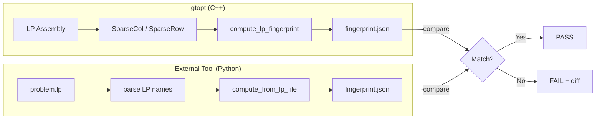
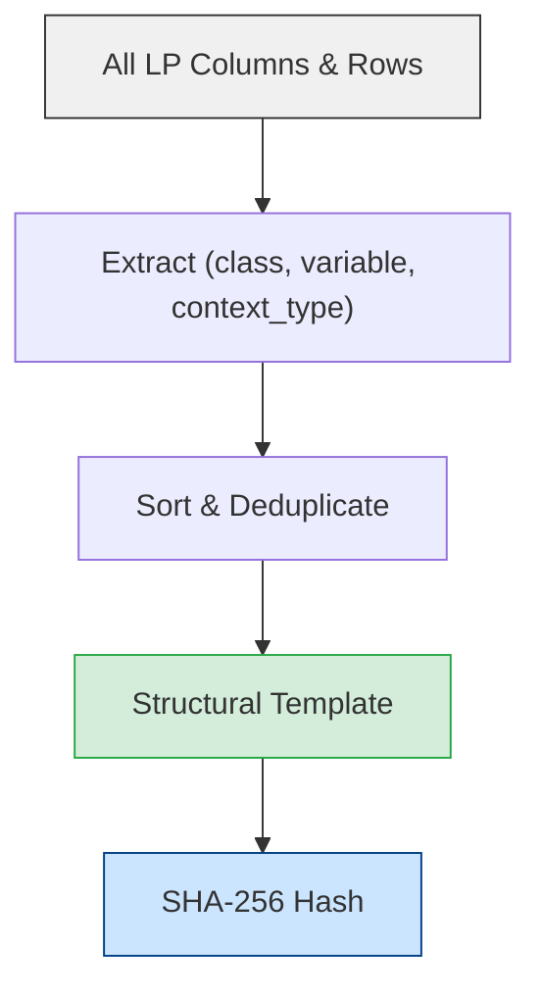
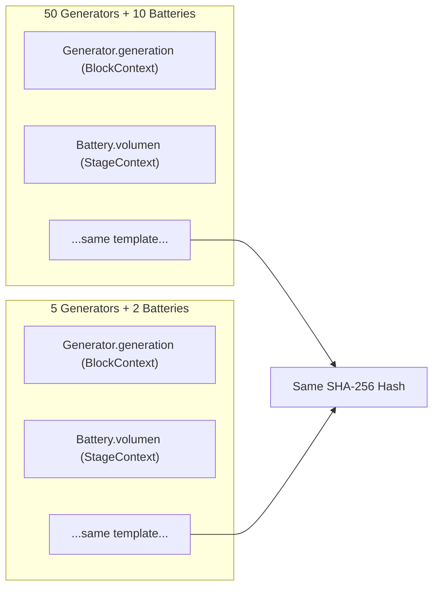
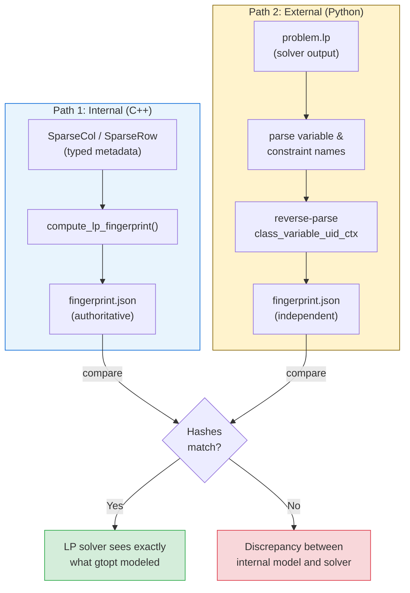
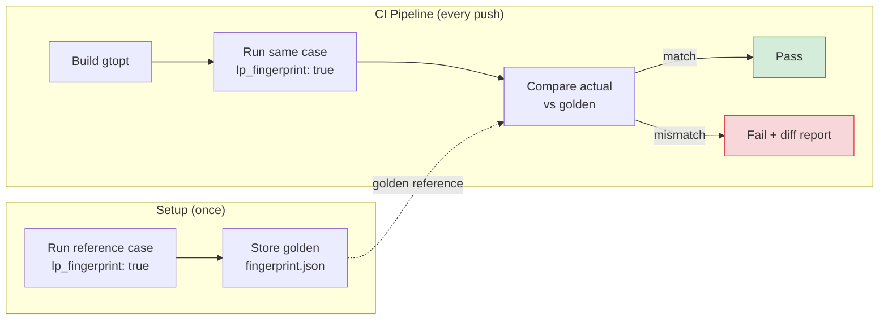
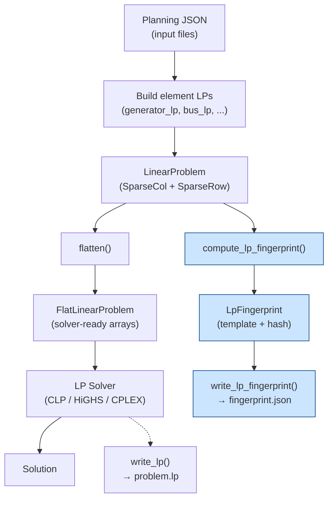
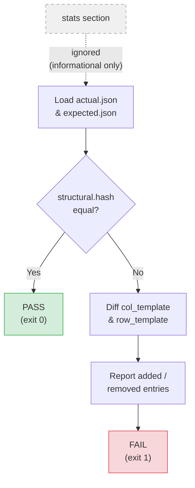

# LP Fingerprint — Formulation Integrity Verification

The **LP Fingerprint** is an audit feature that captures the structural identity
of an LP formulation — which types of variables and constraints exist — without
depending on element counts.  A system with 100 generators or 20 generators
produces the **same** structural fingerprint.

This enables:

- **Regression detection**: verify that code changes do not accidentally add,
  remove, or rename LP variables or constraints.
- **Solver verification**: confirm that what gtopt assembles internally matches
  what the LP solver actually sees in the generated LP file.
- **Golden reference comparison**: compare a new run against a known-good
  baseline to detect formulation drift.

---

## Quick Start

### Enable fingerprint output

```bash
gtopt system.json --set options.lp_fingerprint=true
```

Or in JSON:

```json
{
  "options": {
    "lp_fingerprint": true
  }
}
```

This writes a JSON file to the output directory:

```
output/lp_fingerprint_scene_0_phase_0.json
```

### Compare against a golden reference

```bash
python -m gtopt_lp_fingerprint compare \
  --actual output/lp_fingerprint_scene_0_phase_0.json \
  --expected golden/lp_fingerprint_scene_0_phase_0.json
```

Output:

```
PASS: structural fingerprints match (a1b2c3d4e5f6...)
```

or on mismatch:

```
FAIL: structural fingerprints differ
  Actual:   a1b2c3d4...
  Expected: f6e5d4c3...

  Added columns (1):
    + Battery.energy (StageContext)

  Removed rows (1):
    - Generator.ramp_up (BlockContext)
```

---

## Architecture Overview



---

## How It Works

### Structural Template

The fingerprint extracts a **sorted, deduplicated set** of
`(class_name, variable_name, context_type)` triples from all LP columns and
rows.  Each triple identifies one *type* of variable or constraint:

| Field | Example | Meaning |
|-------|---------|---------|
| `class_name` | `Generator` | The element class |
| `variable_name` | `generation` | The variable or constraint name |
| `context_type` | `BlockContext` | The LP hierarchy level |

Context types correspond to the LP granularity:

| Context Type | Fields | Typical Use |
|-------------|--------|-------------|
| `StageContext` | scenario, stage | State variables (eini, efin, volumen) |
| `BlockContext` | scenario, stage, block | Dispatch variables (generation, flow, theta) |
| `BlockExContext` | scenario, stage, block, extra | Piecewise segments |
| `ScenePhaseContext` | scene, phase | SDDP alpha variables |
| `IterationContext` | scene, phase, iteration, extra | SDDP cuts |
| `ApertureContext` | scene, phase, aperture, extra | SDDP aperture cuts |

The extraction pipeline works as follows:



For example, a system with 50 generators and 10 batteries produces the same
template as one with 5 generators and 2 batteries — only the *types* matter:



### Hash

A **SHA-256** hash is computed from the sorted template entries.  This single
64-character hex string is the primary comparison key.  Separate column-only
and row-only hashes allow targeted regression detection.

### Stats (Informational Only)

The fingerprint also includes per-class column/row counts as statistics.
These are **never used for comparison** — they provide context when reviewing
a fingerprint but do not affect the structural hash.

---

## JSON Output Format

```json
{
  "version": 1,
  "scene_uid": 0,
  "phase_uid": 0,
  "structural": {
    "columns": {
      "template": [
        {"class": "Battery", "variable": "volumen", "context_type": "StageContext"},
        {"class": "Bus", "variable": "theta", "context_type": "BlockContext"},
        {"class": "Generator", "variable": "generation", "context_type": "BlockContext"}
      ],
      "untracked_count": 0,
      "hash": "a1b2c3d4..."
    },
    "rows": {
      "template": [
        {"class": "Bus", "constraint": "balance", "context_type": "BlockContext"},
        {"class": "Generator", "constraint": "capacity", "context_type": "StageContext"}
      ],
      "untracked_count": 0,
      "hash": "f6e5d4c3..."
    },
    "hash": "0123456789abcdef..."
  },
  "stats": {
    "total_cols": 1234,
    "total_rows": 5678,
    "cols_by_class": {
      "Battery": 48,
      "Bus": 120,
      "Generator": 360
    },
    "rows_by_class": {
      "Bus": 120,
      "Generator": 480
    }
  }
}
```

### Key Fields

| Field | Section | Purpose |
|-------|---------|---------|
| `structural.hash` | structural | Primary comparison key (SHA-256) |
| `structural.columns.hash` | structural | Column-only hash |
| `structural.rows.hash` | structural | Row-only hash |
| `structural.*.untracked_count` | structural | Cols/rows without metadata (should be 0) |
| `stats.total_cols` | stats | Total column count (informational) |
| `stats.cols_by_class` | stats | Per-class breakdown (informational) |

---

## Two Verification Paths



### 1. Internal Fingerprint (inside gtopt)

Computed during LP assembly from the structured metadata in `SparseCol` and
`SparseRow` objects — before the LP is flattened for the solver.  This is the
authoritative fingerprint because it uses the typed context information
directly.

Enable with `--set options.lp_fingerprint=true`.

### 2. External Verification Tool (Python)

A standalone tool that reads an LP file written by the solver and independently
computes the same fingerprint by reverse-parsing column and row names.

```bash
# Compute fingerprint from an LP file
python -m gtopt_lp_fingerprint compute problem.lp -o fingerprint.json

# Verify LP file against a golden fingerprint
python -m gtopt_lp_fingerprint verify --lp-file problem.lp --golden golden.json

# Compare two fingerprint JSON files
python -m gtopt_lp_fingerprint compare --actual actual.json --expected golden.json
```

This verifies that what gtopt models is exactly what the LP solver sees.

---

## Integration with CI



1. Run the reference case with `lp_fingerprint: true`
2. Store the output JSON as a golden reference
3. In CI, run the same case and compare fingerprints:

```bash
python -m gtopt_lp_fingerprint compare \
  --actual output/lp_fingerprint_scene_0_phase_0.json \
  --expected golden/lp_fingerprint_scene_0_phase_0.json
```

Exit code 0 = match, 1 = mismatch.

---

## Where Fingerprinting Fits in the LP Pipeline



---

## Untracked Entries

An `untracked_count > 0` signals that some LP columns or rows were added
without proper metadata (`class_name` or `context`).  This is a code quality
signal — all LP entries should be traceable to the original formulation.

---

## Comparison Semantics



When comparing two fingerprints:

- **Only the `structural` section is compared** — the `stats` section is
  completely ignored
- Element counts can vary freely (100 generators vs 20) without affecting
  the comparison
- A change in context type (e.g., `BlockContext` → `StageContext`) for the
  same variable is detected as a structural change
- The comparison tool reports exactly which entries were added or removed
