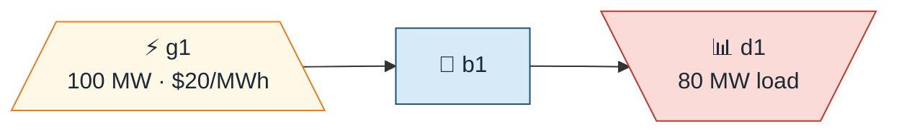
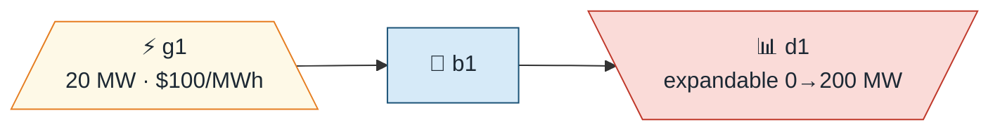
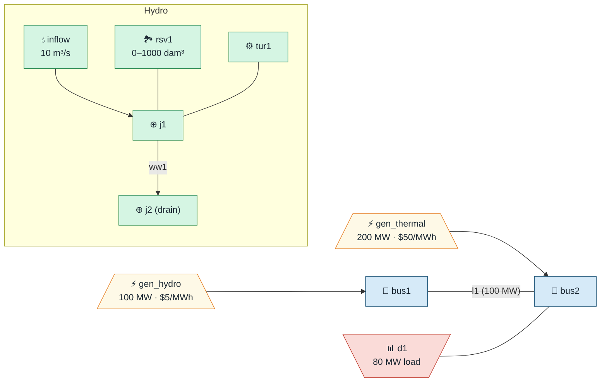

# gtopt Planning Guide

A step-by-step guide to building, running, and understanding gtopt optimization
cases. This guide walks through progressively more complex examples: from a
simple single-bus dispatch to a multi-bus DC power-flow case with batteries and
external time-series data.

---

## Table of Contents

1. [Concepts](#1-concepts)
   - [Time structure: Blocks, Stages, Scenarios](#11-time-structure-blocks-stages-scenarios)
   - [Phases and Scenes](#12-phases-and-scenes)
   - [System elements](#13-system-elements)
2. [Anatomy of a gtopt JSON file](#2-anatomy-of-a-gtopt-json-file)
3. [Example 1 – Single-bus dispatch (one block)](#3-example-1--single-bus-dispatch-one-block)
4. [Example 2 – Multi-bus DC power flow (IEEE 9-bus)](#4-example-2--multi-bus-dc-power-flow-ieee-9-bus)
5. [Example 3 – Multi-stage capacity expansion](#5-example-3--multi-stage-capacity-expansion)
6. [Example 4 – Battery storage (4-bus, 4 blocks)](#6-example-4--battery-storage-4-bus-4-blocks)
7. [Example 5 – Simple hydro cascade (2-bus, 2 stages)](#7-example-5--simple-hydro-cascade-2-bus-2-stages)
8. [Numerical Scaling for Large Systems](#8-numerical-scaling-for-large-systems)
   - [`scale_objective` and `scale_theta`](#81-scale_objective-and-scale_theta)
   - [`energy_scale` for Large Reservoirs](#82-energy_scale-for-large-reservoirs)
   - [Battery `energy_scale`](#83-battery-energy_scale)
9. [Working with time-series schedules](#9-working-with-time-series-schedules)
   - [Inline schedules in JSON](#91-inline-schedules-in-json)
   - [External CSV files](#92-external-csv-files)
   - [External Parquet files](#93-external-parquet-files)
   - [Directory layout and file-field naming convention](#94-directory-layout-and-file-field-naming-convention)
10. [Complete JSON element reference](#10-complete-json-element-reference)
    - [Options](#101-options-key-fields)
    - [Simulation (time structure)](#102-simulation-time-structure)
    - [System – Electrical network](#103-system--electrical-network)
    - [System – Profiles](#104-system--profiles)
    - [System – Energy storage](#105-system--energy-storage)
    - [System – Reserves](#106-system--reserves)
    - [System – Hydro cascade](#107-system--hydro-cascade)
11. [Field reference and auto-generated docs](#11-field-reference-and-auto-generated-docs)
12. [Output files](#12-output-files)
13. [Working with Stochastic Scenarios](#13-working-with-stochastic-scenarios)
    - [Scenario-dependent data](#131-scenario-dependent-data)
    - [Example: Solar plant with stochastic production](#132-example-solar-plant-with-stochastic-production)
    - [Pasada hydro mode](#133-pasada-hydro-mode)
    - [SDDP apertures](#134-sddp-apertures)
14. [Using the Cascade Solver](#14-using-the-cascade-solver)
    - [When to use cascade vs plain SDDP](#141-when-to-use-cascade-vs-plain-sddp)
    - [Example: 2-level cascade (uninodal warm-start)](#142-example-2-level-cascade-uninodal-warm-start)
    - [Example: 3-level progressive refinement](#143-example-3-level-progressive-refinement)
    - [Monitoring cascade progress](#144-monitoring-cascade-progress)

---

## 1. Concepts

### 1.1 Time structure: Blocks, Stages, Scenarios

The **planning data model** defines how time and uncertainty are represented:


> 💾 Regenerate: `python3 scripts/gtopt_diagram.py --diagram-type planning -o docs/diagrams/planning_structure.svg`

| Element | Role |
|---------|------|
| **Block** | Smallest time unit. `energy [MWh] = power [MW] × duration [h]`. |
| **Stage** | Investment period. Capacity built in a stage is available in all later stages. Costs are multiplied by `discount_factor` for present-value accounting. |
| **Scenario** | One realisation of uncertain inputs (e.g. dry/wet hydrology). All scenarios are solved simultaneously; their costs are weighted by `probability_factor`. |
| **Phase** | Groups consecutive stages into a higher-level period (e.g. seasons, construction vs. operation). Default: single phase covering all stages. See [Section 1.2](#12-phases-and-scenes). |
| **Scene** | Combines a subset of scenarios for LP solving. Default: single scene covering all scenarios. See [Section 1.2](#12-phases-and-scenes). |

A single-snapshot operational study uses **one block, one stage, one scenario**
(the defaults if you omit `simulation` entirely):

```json
{
  "simulation": {
    "block_array":    [{"uid": 1, "duration": 1}],
    "stage_array":    [{"uid": 1, "first_block": 0, "count_block": 1}],
    "scenario_array": [{"uid": 1, "probability_factor": 1}]
  }
}
```

A 24-hour operational study uses **24 blocks, one stage, one scenario**:

```json
{
  "simulation": {
    "block_array": [
      {"uid":  1, "duration": 1},
      {"uid":  2, "duration": 1},
      ...
      {"uid": 24, "duration": 1}
    ],
    "stage_array":    [{"uid": 1, "first_block": 0, "count_block": 24}],
    "scenario_array": [{"uid": 1, "probability_factor": 1}]
  }
}
```

A 5-year investment study with annual stages uses **five 1-block stages** (or
more blocks per stage for seasonal detail):

```json
{
  "simulation": {
    "block_array": [
      {"uid": 1, "duration": 8760},
      {"uid": 2, "duration": 8760},
      {"uid": 3, "duration": 8760},
      {"uid": 4, "duration": 8760},
      {"uid": 5, "duration": 8760}
    ],
    "stage_array": [
      {"uid": 1, "first_block": 0, "count_block": 1, "discount_factor": 1.0},
      {"uid": 2, "first_block": 1, "count_block": 1, "discount_factor": 0.909},
      {"uid": 3, "first_block": 2, "count_block": 1, "discount_factor": 0.826},
      {"uid": 4, "first_block": 3, "count_block": 1, "discount_factor": 0.751},
      {"uid": 5, "first_block": 4, "count_block": 1, "discount_factor": 0.683}
    ],
    "scenario_array": [{"uid": 1, "probability_factor": 1}]
  }
}
```

> **Tip**: set `annual_discount_rate` in `simulation` and let gtopt
> compute discount factors automatically instead of providing them
> explicitly.  For backward compatibility, `options` is also accepted.

### 1.2 Phases and Scenes

#### Phase – Grouping stages into higher-level periods

A **Phase** groups consecutive **stages** into a higher-level planning period.
Common use cases:

| Use case | Phases | Stages per phase |
|----------|--------|-----------------|
| **Seasonal analysis** | 4 phases (summer, autumn, winter, spring) | 3 monthly stages each |
| **Construction vs. operation** | 2 phases (build, operate) | Variable |
| **Single-period study** | 1 phase (default) | All stages |

When no `phase_array` is provided in the JSON, gtopt automatically creates a
single default phase that covers all stages.

**JSON example – 4 seasonal phases (12 monthly stages)**:

```json
{
  "simulation": {
    "phase_array": [
      {"uid": 1, "name": "summer",  "first_stage": 0, "count_stage": 3},
      {"uid": 2, "name": "autumn",  "first_stage": 3, "count_stage": 3},
      {"uid": 3, "name": "winter",  "first_stage": 6, "count_stage": 3},
      {"uid": 4, "name": "spring",  "first_stage": 9, "count_stage": 3}
    ],
    "stage_array": [
      {"uid": 1,  "first_block": 0,  "count_block": 3},
      {"uid": 2,  "first_block": 3,  "count_block": 3},
      {"uid": 3,  "first_block": 6,  "count_block": 3},
      {"uid": 4,  "first_block": 9,  "count_block": 3},
      {"uid": 5,  "first_block": 12, "count_block": 3},
      {"uid": 6,  "first_block": 15, "count_block": 3},
      {"uid": 7,  "first_block": 18, "count_block": 3},
      {"uid": 8,  "first_block": 21, "count_block": 3},
      {"uid": 9,  "first_block": 24, "count_block": 3},
      {"uid": 10, "first_block": 27, "count_block": 3},
      {"uid": 11, "first_block": 30, "count_block": 3},
      {"uid": 12, "first_block": 33, "count_block": 3}
    ],
    "block_array": [
      {"uid": 1,  "duration": 217, "name": "night"},
      {"uid": 2,  "duration": 372, "name": "solar"},
      {"uid": 3,  "duration": 155, "name": "evening"}
    ]
  }
}
```

**Phase fields**:

| Field | Type | Required | Description |
|-------|------|----------|-------------|
| `uid` | integer | **Yes** | Unique identifier |
| `name` | string | No | Human-readable label (e.g. `"summer"`) |
| `active` | boolean | No | Activation status (default: `true`) |
| `first_stage` | integer | No | 0-based index of the first stage (default: `0`) |
| `count_stage` | integer | No | Number of stages (default: all remaining) |

#### Scene – Cross-product of scenarios and phases

A **Scene** combines a set of **scenarios** with a **phase**.  In the LP
formulation, each scene defines which scenarios are solved together within
which phase.  This is an advanced feature used for complex multi-scenario,
multi-phase studies.

For most cases the default single scene (covering all scenarios across one
phase) is sufficient.  You only need explicit `scene_array` when combining
multiple scenarios with multiple phases to control which scenario groups
apply to which phase.

**JSON example – default (implicit)**:

```json
{
  "simulation": {
    "scene_array": [{"uid": 1, "first_scenario": 0, "count_scenario": 1}]
  }
}
```

**Scene fields**:

| Field | Type | Required | Description |
|-------|------|----------|-------------|
| `uid` | integer | **Yes** | Unique identifier |
| `name` | string | No | Human-readable label |
| `active` | boolean | No | Activation status (default: `true`) |
| `first_scenario` | integer | No | 0-based index of the first scenario (default: `0`) |
| `count_scenario` | integer | No | Number of scenarios (default: all remaining) |

#### Time hierarchy diagram

The complete time hierarchy in gtopt is:

```
Planning
 ├─ Scene (independent LP trajectory, one per scene)
 │    └─ Phase (Benders decomposition level; state variables propagate via cuts)
 │         └─ Stage (investment period within a single LP formulation)
 │              └─ Block (smallest operating time unit, duration in hours)
 └─ Scenario (stochastic realization, probability-weighted in objective)
```

Each **(scene, phase)** pair produces a separate LP subproblem.  Phases
within the same scene are linked by state variables (reservoir volumes,
installed capacity, etc.).  In the **monolithic** solver all LPs are solved
independently.  In the **SDDP** solver, Benders optimality and feasibility
cuts link consecutive phases, and cuts can optionally be shared across
scenes.

#### PLP equivalence

When there is **one stage per phase** and **one scenario per scene**, the
gtopt formulation is equivalent to the PLP formulation:

| gtopt concept | PLP equivalent | Role |
|---------------|---------------|------|
| **Block** | PLP block | Smallest operating time unit |
| **Stage** | — (within LP) | Generalized horizon time analysis within a single LP |
| **Phase** | PLP stage | Benders decomposition level; state variables propagate via cuts |
| **Scenario** | — (weighted in objective) | Stochastic realization with probability weight |
| **Scene** | PLP scenario | Independent LP trajectory |

For a typical seasonal study with 2 hydrological trajectories:

```
Scene 1 ("dry") → groups Scenario "dry year" (prob=0.3)
   Phase 1 ("summer") → LP₁: Stages 1-3 (Jan, Feb, Mar)
       ↓ state variables (reservoir vol, capacity)
   Phase 2 ("autumn") → LP₂: Stages 4-6 (Apr, May, Jun)
       ↓ state variables
   Phase 3 ("winter") → LP₃: Stages 7-9 (Jul, Aug, Sep)
       ↓ state variables
   Phase 4 ("spring") → LP₄: Stages 10-12 (Oct, Nov, Dec)

Scene 2 ("wet") → groups Scenario "wet year" (prob=0.7)
   Phase 1 ("summer") → LP₅: Stages 1-3 (Jan, Feb, Mar)
       ↓ state variables
   Phase 2 ("autumn") → LP₆: Stages 4-6 (Apr, May, Jun)
       ↓ state variables
   Phase 3 ("winter") → LP₇: Stages 7-9 (Jul, Aug, Sep)
       ↓ state variables
   Phase 4 ("spring") → LP₈: Stages 10-12 (Oct, Nov, Dec)
```

In SDDP mode, optimality cuts generated in one scene can be shared with
other scenes (see `cut_sharing_mode` option).  This is analogous to how
PLP shares cuts between its scenarios.

### 1.3 System elements

| Category | Elements | Description |
|----------|---------|-------------|
| Electrical network | Bus, Generator, Demand, Line | Core grid model |
| Time-varying profiles | GeneratorProfile, DemandProfile | Capacity-factor / load-shape scaling |
| Energy storage | Battery, Converter | BESS modelling |
| Reserve | ReserveZone, ReserveProvision | Spinning-reserve requirements |
| Hydro cascade | Junction, Waterway, Flow, Reservoir, Filtration, Turbine | Hydrothermal systems |

---

## 2. Anatomy of a gtopt JSON file

A gtopt case is defined by **one or more JSON files** passed on the command
line. Multiple files are merged in order, so you can split options, simulation,
and system across files.

```
gtopt base_options.json simulation.json system.json
```

The top-level structure is always:

```json
{
  "options":    { ... },
  "simulation": { ... },
  "system":     { ... }
}
```

All three sections are **optional** — omitted sections use defaults.

### Options (commonly used fields)

| Field | Units | Description |
|-------|-------|-------------|
| `demand_fail_cost` | $/MWh | Penalty for unserved load (value of lost load) |
| `use_kirchhoff` | — | Enable DC power-flow constraints (`true`/`false`) |
| `use_single_bus` | — | Collapse network to copper plate (`true`/`false`) |
| `scale_objective` | — | Divide objective by this value (improves solver numerics) |
| `input_directory` | — | Root directory for external time-series files |
| `input_format` | — | `"parquet"` (default) or `"csv"` |
| `output_directory` | — | Directory for result files (default: `"output"`) |
| `output_format` | — | `"parquet"` (default) or `"csv"` |

### Simulation (commonly used fields)

| Field | Units | Description |
|-------|-------|-------------|
| `annual_discount_rate` | p.u./year | Compute stage discount factors automatically |
| `boundary_cuts_file` | — | CSV file with boundary (future-cost) cuts |
| `boundary_cuts_valuation` | — | `"end_of_horizon"` (default) or `"present_value"` |

---

## 3. Example 1 – Single-bus dispatch (one block)

A minimal case: one bus, one cheap generator, one load, one hour.

### Network diagram



### JSON

```json
{
  "options": {
    "use_single_bus": true,
    "demand_fail_cost": 500,
    "scale_objective": 1000,
    "output_format": "csv"
  },
  "simulation": {
    "block_array":    [{"uid": 1, "duration": 1}],
    "stage_array":    [{"uid": 1, "first_block": 0, "count_block": 1}],
    "scenario_array": [{"uid": 1, "probability_factor": 1}]
  },
  "system": {
    "name": "example1",
    "bus_array": [
      {"uid": 1, "name": "b1"}
    ],
    "generator_array": [
      {"uid": 1, "name": "g1", "bus": "b1", "pmax": 100, "gcost": 20, "capacity": 100}
    ],
    "demand_array": [
      {"uid": 1, "name": "d1", "bus": "b1", "lmax": 80}
    ]
  }
}
```

### Expected result

- g1 dispatches 80 MW to serve d1 exactly.
- Objective = 80 MW × 1 h × $20/MWh / 1000 = **$1.60** (scaled).
- `output/solution.csv`: `status=0` (optimal).
- `output/Generator/generation_sol.csv`: `uid:1 = 80`.

---

## 4. Example 2 – Multi-bus DC power flow (IEEE 9-bus)

The classic Anderson–Fouad 9-bus benchmark. Three generators, three loads, nine
transmission lines. DC power flow (Kirchhoff's voltage law) is enabled.

### Network diagram


> 💾 Regenerate: `python3 scripts/gtopt_diagram.py cases/ieee_9b/ieee_9b.json --subsystem electrical -o docs/diagrams/ieee9b_electrical.svg`

### Run the bundled case

```bash
cd cases/ieee_9b_ori
gtopt ieee_9b_ori.json
cat output/solution.csv          # status=0, obj_value=5.0
cat output/Generator/generation_sol.csv
```

Expected: g1 dispatches ~250 MW (cheapest at $20/MWh), g3 serves the rest,
g2 (most expensive at $35/MWh) is at or near minimum.

### Key JSON excerpt

```json
{
  "options": {
    "use_single_bus": false,
    "use_kirchhoff": true,
    "demand_fail_cost": 1000,
    "scale_objective": 1000
  },
  "system": {
    "line_array": [
      {
        "uid": 1, "name": "l1_4",
        "bus_a": "b1", "bus_b": "b4",
        "reactance": 0.0576,
        "tmax_ab": 250, "tmax_ba": 250
      }
    ]
  }
}
```

> **Note on reactance units**: line reactance values in the bundled IEEE cases
> are in **per-unit (p.u.)** on a common system base (typically 100 MVA).
> When `use_kirchhoff = true`, gtopt uses the p.u. reactance to compute the
> voltage-angle difference: `flow [MW] = (θ_a − θ_b) / reactance [p.u.]`.

---

## 5. Example 3 – Multi-stage capacity expansion

The `cases/c0/` case demonstrates **demand-side capacity expansion** over five
years. The demand `d1` starts at zero installed capacity and the solver decides
how many 20 MW modules to build each year.

### Network diagram



### Planning time structure


> 💾 Regenerate: `python3 scripts/gtopt_diagram.py cases/c0/system_c0.json --diagram-type planning -o docs/diagrams/c0_planning.svg`

### Time structure

Five stages × one block each, annual durations (1/2/3/4/5 h in the simplified
case; full annual = 8 760 h in production cases).

```json
"stage_array": [
  {"uid": 1, "first_block": 0, "count_block": 1},
  {"uid": 2, "first_block": 1, "count_block": 1},
  {"uid": 3, "first_block": 2, "count_block": 1},
  {"uid": 4, "first_block": 3, "count_block": 1},
  {"uid": 5, "first_block": 4, "count_block": 1}
]
```

### Expandable demand definition

```json
{
  "uid": 1, "name": "d1", "bus": "b1",
  "lmax": "lmax",
  "capacity": 0,
  "expcap": 20,
  "expmod": 10,
  "annual_capcost": 8760
}
```

- `capacity = 0`: no initial capacity
- `expcap = 20 MW`: each module adds 20 MW
- `expmod = 10`: solver may build at most 10 modules
- `annual_capcost = 8760 $/MW-year`: annualised investment cost
- `lmax = "lmax"`: refers to `system_c0/Demand/lmax.parquet`

### Run

```bash
cd cases/c0
gtopt system_c0.json
cat output/Demand/capacost_sol.csv   # expansion cost per stage
```

---

## 6. Example 4 – Battery storage (4-bus, 4 blocks)

The `cases/bat_4b/` case adds a battery energy storage system (BESS) to a
4-bus network. The battery charges at low-cost periods and discharges during
high-demand periods.

### Network diagram


> 💾 Regenerate: `python3 scripts/gtopt_diagram.py cases/bat_4b/bat_4b.json --subsystem electrical -o docs/diagrams/bat4b_electrical.svg`

**Battery** (`bat1`) uses the **unified definition**: the `bus` field
connects it to b3 and `pmax_charge`/`pmax_discharge` set the charge/discharge
power rating.  The system auto-generates the discharge generator, charge
demand, and converter at LP construction time.

### Battery definition (unified)

```json
"battery_array": [
  {
    "uid": 1, "name": "bat1",
    "bus": "b3",
    "input_efficiency":  0.95,
    "output_efficiency": 0.95,
    "emin": 0, "emax": 200,
    "eini": 0,
    "pmax_charge": 60,
    "pmax_discharge": 60,
    "gcost": 0,
    "capacity": 200
  }
]
```

> **Note:** No `converter_array`, `g_bat_out` generator, or `d_bat_in`
> demand is needed — all three are auto-generated by `expand_batteries()`.

The BESS charges when solar is cheap (block 3) and discharges during the
high-demand block 4 (200 MW load).

### Run

```bash
cd cases/bat_4b
gtopt bat_4b.json
cat output/Generator/generation_sol.csv
cat output/Battery/storage_sol.csv
```

---

## 7. Example 5 – Simple hydro cascade (2-bus, 2 stages)

This example introduces **hydro generation** with a reservoir, junctions,
a waterway, a turbine, and an exogenous inflow. It models the dispatch of
a hydro plant alongside a thermal backup over two stages of four hourly
blocks each.

### Network diagram



### JSON

```json
{
  "options": {
    "use_single_bus": false,
    "use_kirchhoff": true,
    "demand_fail_cost": 1000,
    "scale_objective": 1000,
    "output_format": "csv",
    "output_compression": "uncompressed"
  },
  "simulation": {
    "block_array": [
      {"uid": 1, "duration": 1},
      {"uid": 2, "duration": 1},
      {"uid": 3, "duration": 1},
      {"uid": 4, "duration": 1},
      {"uid": 5, "duration": 1},
      {"uid": 6, "duration": 1},
      {"uid": 7, "duration": 1},
      {"uid": 8, "duration": 1}
    ],
    "stage_array": [
      {"uid": 1, "first_block": 0, "count_block": 4},
      {"uid": 2, "first_block": 4, "count_block": 4}
    ],
    "scenario_array": [
      {"uid": 1, "probability_factor": 1}
    ]
  },
  "system": {
    "name": "hydro_cascade",
    "bus_array": [
      {"uid": 1, "name": "bus1"},
      {"uid": 2, "name": "bus2"}
    ],
    "generator_array": [
      {
        "uid": 1, "name": "gen_hydro", "bus": "bus1",
        "pmax": 100, "gcost": 5, "capacity": 100
      },
      {
        "uid": 2, "name": "gen_thermal", "bus": "bus2",
        "pmax": 200, "gcost": 50, "capacity": 200
      }
    ],
    "demand_array": [
      {"uid": 1, "name": "d1", "bus": "bus2", "lmax": 80}
    ],
    "line_array": [
      {
        "uid": 1, "name": "l1",
        "bus_a": "bus1", "bus_b": "bus2",
        "reactance": 0.02,
        "tmax_ab": 100, "tmax_ba": 100
      }
    ],
    "junction_array": [
      {"uid": 1, "name": "j1"},
      {"uid": 2, "name": "j2", "drain": true}
    ],
    "waterway_array": [
      {
        "uid": 1, "name": "ww1",
        "junction_a": 1, "junction_b": 2,
        "fmin": 0, "fmax": 100
      }
    ],
    "reservoir_array": [
      {
        "uid": 1, "name": "rsv1",
        "junction": 1,
        "emin": 0, "emax": 1000,
        "eini": 500,
        "capacity": 1000
      }
    ],
    "flow_array": [
      {
        "uid": 1, "name": "inflow",
        "direction": 1,
        "junction": 1,
        "discharge": 10
      }
    ],
    "turbine_array": [
      {
        "uid": 1, "name": "tur1",
        "waterway": 1,
        "generator": 1,
        "conversion_rate": 1.0
      }
    ]
  }
}
```

### How the hydro cascade works

The **hydro cascade** elements interact as follows:

1. **Junctions** (`j1`, `j2`) are hydraulic nodes where water balance is
   enforced. Junction `j2` has `drain: true`, meaning water leaving it exits
   the system (e.g., flows to the sea).

2. **Waterway** (`ww1`) connects `j1` to `j2`. Water flows through it at a
   rate bounded by `[fmin, fmax]` in m3/s.

3. **Reservoir** (`rsv1`) is attached to junction `j1`. It stores water
   (volume in dam3) between `emin` and `emax`. The initial volume `eini` is
   500 dam3. The reservoir volume evolves over blocks according to the water
   balance: `volume[b] = volume[b-1] + (inflows - outflows) * duration`.

4. **Flow** (`inflow`) adds 10 m3/s of exogenous water to junction `j1` in
   every block (e.g., river inflow).

5. **Turbine** (`tur1`) converts water flowing through the waterway into
   electricity via `gen_hydro`. The `conversion_rate` (MW per m3/s)
   determines how much power is generated per unit of water flow.

### Expected dispatch

- Hydro generation (`gen_hydro`, $5/MWh) is much cheaper than thermal
  (`gen_thermal`, $50/MWh), so the optimizer dispatches hydro first.
- The 80 MW demand at `bus2` is served via the transmission line `l1`
  (100 MW capacity), which is sufficient.
- Thermal generation only activates if hydro capacity or reservoir volume
  is insufficient to meet demand.
- The reservoir volume decreases as water is turbined and increases with
  the 10 m3/s inflow.

### Checking results

```bash
# Generator dispatch — hydro should serve most/all load
cat output/Generator/generation_sol.csv

# Reservoir volume evolution over blocks
cat output/Reservoir/volume_sol.csv

# Waterway flow (turbine water usage)
cat output/Waterway/flow_sol.csv

# Verify no load shedding
cat output/Demand/fail_sol.csv
```

---

## 8. Numerical Scaling for Large Systems

LP solvers work best when the ratio of the largest to smallest non-zero
coefficient in the LP matrix is below $10^7$ (the "LP coefficient ratio").
Poor scaling causes numerical instability, slow convergence, or incorrect
solutions.

### 8.1 `scale_objective` and `scale_theta`

The global `scale_objective` (default 1000) divides all objective coefficients.
For a system where generation costs are ~\$100/MWh and 24-hour blocks are used,
the raw coefficient is $100 × 24 = 2400$.  With `scale_objective = 1000` this
becomes 2.4, which is well-conditioned.

Similarly, `scale_theta` (default 1000) normalises voltage-angle variables.

These defaults are adequate for most power systems.

### 8.2 `energy_scale` for Large Reservoirs

For large hydroelectric reservoirs, the default `energy_scale = 1.0` creates
LP variable bounds in the tens of millions (dam³), which produces a coefficient
ratio far exceeding $10^8$ when combined with generator costs in the range 0.01–1.

**Set `energy_scale ≈ emax / 1000`** to keep LP volume variables in the
$[0, 1000]$ range (matching the PLP `ScaleVol` convention):

```json
{
  "reservoir_array": [
    {"uid": 1, "name": "Laja",   "emax": 6000000,  "energy_scale": 6000},
    {"uid": 2, "name": "Colbun", "emax": 1500000,  "energy_scale": 1500},
    {"uid": 3, "name": "Rapel",  "emax":  200000,  "energy_scale":  200}
  ]
}
```

Or use a uniform `variable_scales` entry to apply a default to all reservoirs
(and then override individually for very small or very large ones):

```json
{
  "options": {
    "variable_scales": [
      {"class_name": "Reservoir", "variable": "energy", "uid": -1, "scale": 1000.0}
    ]
  }
}
```

**Diagnosing scaling issues**: run with `--stats` and look for the
`LP coefficient ratio` in the log output.  A ratio above $10^7$ indicates
that scaling should be reviewed.

```bash
gtopt my_case.json --stats 2>&1 | grep -i "coeff.*ratio\|coefficient.*ratio"
```

### 8.3 Battery `energy_scale`

For batteries, the same principle applies.  A battery with
`emax = 10000 MWh` should use `energy_scale = 10`:

```json
{"uid": 1, "name": "BESS1", "emax": 10000, "energy_scale": 10}
```

---

## 9. Working with time-series schedules

Many fields — `pmax`, `lmax`, `gcost`, `profile`, `discharge` — can hold:

| Value type | Meaning |
|------------|---------|
| `100` (scalar) | Constant value in every block |
| `[[80, 90, 100]]` (inline array) | Per-`[stage][block]` values |
| `[[[70, 80, 90], [60, 70, 80]]]` | Per-`[scenario][stage][block]` values |
| `"lmax"` (string) | Filename in `input_directory/<ClassName>/` |

### 9.1 Inline schedules in JSON

The array dimensions depend on the field type:

| C++ type | Dimensions | Example |
|----------|-----------|---------|
| `OptTRealFieldSched` | `[stage]` or scalar | `[100, 90, 80, 70, 60]` |
| `OptTBRealFieldSched` | `[stage][block]` or scalar | `[[100, 95], [90, 85]]` |
| `STBRealFieldSched` | `[scenario][stage][block]` | `[[[1.0, 0.8, 0.5]]]` |

**Example**: 24-hour solar generation profile for a generator with 270 MW capacity:

```json
{
  "uid": 1, "name": "gp_solar",
  "generator": "g_solar",
  "profile": [[[0, 0, 0, 0, 0, 0.05,
                0.2, 0.45, 0.7, 0.88, 0.97, 1.0,
                0.98, 0.95, 0.88, 0.72, 0.5, 0.25,
                0.08, 0.01, 0, 0, 0, 0]]]
}
```

> Inline arrays are fine for tens of blocks. For hundreds or thousands of
> time steps, use external files.

### 9.2 External CSV files

A CSV schedule file uses these columns:

| Column | Description |
|--------|-------------|
| `scenario` | Scenario UID |
| `stage` | Stage UID |
| `block` | Block UID |
| `uid:<N>` | Value for element with UID N |

Multiple elements can appear as additional `uid:<N>` columns in the same file.

**Example**: `input/Demand/lmax.csv` with per-block demand for `d1` (uid=1)
and `d2` (uid=2):

```csv
"scenario","stage","block","uid:1","uid:2"
1,1,1,125.0,100.0
1,1,2,130.0,105.0
1,1,3,120.0,95.0
```

Rows with missing (scenario, stage, block) combinations inherit the last value
or zero depending on context.

**Using a CSV schedule from JSON**:

```json
{
  "uid": 1, "name": "d1", "bus": "b5",
  "lmax": "lmax"
}
```

When `lmax = "lmax"`, gtopt reads
`<input_directory>/Demand/lmax.csv` (or `lmax.parquet`) and uses the
`uid:1` column for this demand.

**Convert existing CSV files to Parquet**:

```bash
# Using the bundled utility
cvs2parquet input/Demand/lmax.csv input/Demand/lmax.parquet
```

### 9.3 External Parquet files

Parquet is the preferred format (faster reading, smaller files, typed columns).
The schema is identical to CSV: columns `scenario`, `stage`, `block`, and
`uid:<N>` for each element.

**Create a Parquet file with Python**:

```python
import pandas as pd
import pyarrow as pa
import pyarrow.parquet as pq

# 24-hour demand profile for uid=1 and uid=2
records = [
    {"scenario": 1, "stage": 1, "block": b,
     "uid:1": 125.0 + 20 * (1 if 8 <= b <= 20 else 0),
     "uid:2":  80.0 + 15 * (1 if 7 <= b <= 21 else 0)}
    for b in range(1, 25)
]
df = pd.DataFrame(records)

# Cast index columns to int32, values to float64
for col in ("scenario", "stage", "block"):
    df[col] = df[col].astype("int32")

table = pa.Table.from_pandas(df)
pq.write_table(table, "input/Demand/lmax.parquet")
```

**Read a Parquet file with Python** (for validation):

```python
import pyarrow.parquet as pq
table = pq.read_table("input/Demand/lmax.parquet")
print(table.to_pandas().head())
```

**Use `cvs2parquet` for existing CSV files**:

```bash
# Single file
cvs2parquet input/Demand/lmax.csv input/Demand/lmax.parquet

# Batch conversion with optional schema enforcement
cvs2parquet --schema input/Generator/pmax.csv input/Generator/pmax.parquet
```

### 9.4 Directory layout and file-field naming convention

When a JSON field value is a **string** it is treated as a filename (without
extension).  The file is looked up in:

```
<input_directory>/<ClassName>/<field_name>.<format>
```

where:
- `<ClassName>` is the element's class name (e.g. `Generator`, `Demand`,
  `Battery`, `GeneratorProfile`)
- `<field_name>` is the string value from JSON (e.g. `"lmax"`, `"pmax"`,
  `"profile"`)
- `<format>` is `parquet` or `csv` depending on `input_format` option

**Full directory example**:

```
my_case/
├── my_case.json              # Main planning file
└── input/                    # input_directory = "input"
    ├── Demand/
    │   └── lmax.parquet      # lmax schedule for all demands
    ├── Generator/
    │   ├── pmax.parquet      # pmax schedule for all generators
    │   └── gcost.parquet     # time-varying generation cost
    ├── GeneratorProfile/
    │   └── profile.parquet   # capacity-factor profiles
    ├── Battery/
    │   ├── emin.parquet      # minimum SoC schedule
    │   └── emax.parquet      # maximum SoC schedule
    └── Reservoir/
        └── emax.parquet      # seasonal reservoir limits
```

**JSON linking a demand to an external file**:

```json
{
  "uid": 1, "name": "d1", "bus": "b5",
  "lmax": "lmax"
}
```

This tells gtopt: read `input/Demand/lmax.parquet`, column `uid:1`.

**JSON linking a generator to multiple external fields**:

```json
{
  "uid": 2, "name": "g_wind", "bus": "b3",
  "capacity": 500,
  "pmax": "pmax",
  "gcost": "gcost"
}
```

- `pmax` → column `uid:2` in `input/Generator/pmax.parquet`
- `gcost` → column `uid:2` in `input/Generator/gcost.parquet`

**Profile files** use the `GeneratorProfile` class name:

```json
{
  "uid": 1, "name": "wind_profile",
  "generator": "g_wind",
  "profile": "profile"
}
```

→ `input/GeneratorProfile/profile.parquet`, column `uid:1`.

> **Tip**: When `input_format = "parquet"`, gtopt first looks for the
> `.parquet` file.  If it is absent it falls back to the `.csv` file.

---

## 10. Complete JSON element reference

> **Full reference**: See **[Input Data Reference](input-data.md)** for the complete
> field-by-field documentation of every JSON element. This section provides a
> concise summary of the most commonly used fields.

Values can be specified as:

| JSON representation | Description |
|---------------------|-------------|
| `100` (number) | Constant scalar in every block/stage |
| `[80, 90]` | Per-stage values |
| `[[80, 90], [70, 85]]` | Per-stage, per-block values |
| `"filename"` (string) | External Parquet/CSV file in `input_directory/<Class>/` |

In summary tables below, ✱ marks required fields.

### 10.1 Options (key fields)

> **C++ class**: `PlanningOptions` (header: `planning_options.hpp`).
> The JSON key remains `"options"`.  See [Planning Options
> Reference](planning-options.md) for the full option hierarchy.

| Field | Default | Description |
|-------|---------|-------------|
| `demand_fail_cost` | — | Penalty $/MWh for unserved load (value of lost load) |
| `reserve_fail_cost` | — | Penalty $/MWh for unserved spinning reserve |
| `use_kirchhoff` | `true` | Enable DC power-flow constraints |
| `use_single_bus` | `false` | Copper-plate mode (no network constraints) |
| `scale_objective` | `1000` | Divide objective coefficients (improves solver numerics) |
| `input_directory` | `"input"` | Root directory for external schedule files |
| `input_format` | `"parquet"` | Preferred input format (`"parquet"` or `"csv"`) |
| `output_directory` | `"output"` | Root directory for result files |
| `output_format` | `"parquet"` | Output file format (`"parquet"` or `"csv"`) |
| `output_compression` | `"zstd"` | Parquet/CSV compression codec |

> **Note**: `annual_discount_rate` has moved to the `simulation`
> section.  For backward compatibility, it is still accepted in
> `options`.

### 10.2 Simulation (time structure)

| Element | Key fields | Description |
|---------|-----------|-------------|
| **Block** | `uid`✱, `duration`✱ (h) | Smallest time unit; `energy = power × duration` |
| **Stage** | `uid`✱, `first_block`, `count_block`, `discount_factor` | Investment period grouping consecutive blocks |
| **Scenario** | `uid`✱, `probability_factor` | One realisation of uncertain inputs |
| **Phase** | `uid`✱, `first_stage`, `count_stage` | Groups consecutive stages (advanced) |
| **Scene** | `uid`✱, `first_scenario`, `count_scenario` | Cross-products scenarios with phases |

### 10.3 System – Electrical network

| Element | Key fields | Description |
|---------|-----------|-------------|
| **Bus** | `uid`✱, `name`✱, `voltage` (kV), `reference_theta` | Electrical node |
| **Generator** | `uid`✱, `name`✱, `bus`✱, `pmax`, `gcost` ($/MWh), `capacity`, `expcap`, `expmod`, `annual_capcost` | Generation unit |
| **Demand** | `uid`✱, `name`✱, `bus`✱, `lmax`, `capacity`, `expcap`, `expmod`, `annual_capcost` | Electrical load |
| **Line** | `uid`✱, `name`✱, `bus_a`✱, `bus_b`✱, `reactance`, `tmax_ab`, `tmax_ba`, `expcap`, `expmod` | Transmission branch |

### 10.4 System – Profiles

| Element | Key fields | Description |
|---------|-----------|-------------|
| **GeneratorProfile** | `uid`✱, `name`✱, `generator`✱, `profile`✱ (p.u.) | Time-varying capacity factor (solar/wind) |
| **DemandProfile** | `uid`✱, `name`✱, `demand`✱, `profile`✱ (p.u.) | Time-varying load scaling |

### 10.5 System – Energy storage

**Battery** (unified recommended): set `bus` to auto-generate discharge Generator,
charge Demand, and Converter automatically.

| Field | Description |
|-------|-------------|
| `uid`✱, `name`✱, `bus` | Identity and bus connection (enables unified definition) |
| `input_efficiency`, `output_efficiency` | Charge/discharge efficiencies (p.u.) |
| `emin`, `emax` (MWh) | State-of-charge bounds |
| `pmax_charge`, `pmax_discharge` (MW) | Power rating (unified definition) |
| `capacity`, `expcap`, `expmod`, `annual_capcost` | Expansion fields |

**Converter** (traditional definition only): links `battery`, `generator`, `demand`.

### 10.6 System – Reserves

| Element | Key fields | Description |
|---------|-----------|-------------|
| **ReserveZone** | `uid`✱, `name`✱, `urreq`, `drreq` (MW) | Spinning-reserve requirement |
| **ReserveProvision** | `uid`✱, `name`✱, `generator`✱, `reserve_zones`✱, `urmax`, `drmax` | Links generator to reserve zone |

### 10.7 System – Hydro cascade

| Element | Key fields | Description |
|---------|-----------|-------------|
| **Junction** | `uid`✱, `name`✱, `drain` | Hydraulic node |
| **Waterway** | `uid`✱, `name`✱, `junction_a`✱, `junction_b`✱, `fmin`, `fmax` (m³/s) | Water channel |
| **Flow** | `uid`✱, `name`✱, `junction`✱, `discharge`✱ (m³/s) | Exogenous inflow/outflow |
| **Reservoir** | `uid`✱, `name`✱, `junction`✱, `emin`, `emax` (dam³), `eini`, `efin` | Water storage |
| **Filtration** | `uid`✱, `name`✱, `waterway`✱, `reservoir`✱, `slope`, `constant` | Seepage model |
| **Turbine** | `uid`✱, `name`✱, `waterway`✱, `generator`✱, `conversion_rate`, `main_reservoir` | Hydro turbine |
| **ReservoirEfficiency** | `uid`✱, `name`✱, `turbine`✱, `reservoir`✱, `mean_efficiency`, `segments` | Volume-dependent efficiency |

> See **[Input Data Reference](input-data.md)** for full field descriptions, units, and all optional fields.

**Volume-dependent turbine efficiency**: when a `ReservoirEfficiency`
element is defined, the turbine's conversion rate is updated during SDDP
iterations based on the current reservoir volume.  The efficiency curve
is a concave piecewise-linear function (analogous to PLP's "rendimiento"
tables).  For monolithic solves, the static `conversion_rate` is used.
See the [Mathematical Formulation](formulation/mathematical-formulation.md)
for the efficiency formula and the [SDDP Solver](methods/sddp.md)
for the update mechanism.

---

## 11. Field reference and auto-generated docs

The `scripts/gtopt_field_extractor.py` utility parses the C++ header files and
generates documentation tables directly from the source code. This ensures the
documentation stays in sync with the implementation.

### Generate a Markdown field reference

```bash
# All elements (printed to stdout)
python3 scripts/gtopt_field_extractor.py

# Specific elements
python3 scripts/gtopt_field_extractor.py --elements Generator Demand Line Battery

# Write to a file
python3 scripts/gtopt_field_extractor.py --output docs/field_reference.md
```

### Generate an HTML field reference

```bash
python3 scripts/gtopt_field_extractor.py --format html --output docs/field_reference.html
```

The generated HTML includes:
- A hyperlinked table of contents
- Per-element tables with Field / C++ Type / JSON Type / Units / Required / Description
- Internal anchor links (e.g. `#generator`, `#battery`)

### Example output (Generator)

| Field | C++ Type | JSON Type | Units | Required | Description |
|-------|----------|-----------|-------|----------|-------------|
| `uid` | `Uid` | integer | — | **Yes** | Unique identifier |
| `name` | `Name` | string | — | **Yes** | Generator name |
| `bus` | `SingleId` | integer\|string | — | **Yes** | Bus ID where the generator is connected |
| `pmin` | `OptTBRealFieldSched` | number\|array\|string | `MW` | No | Minimum active power output |
| `pmax` | `OptTBRealFieldSched` | number\|array\|string | `MW` | No | Maximum active power output |
| `gcost` | `OptTRealFieldSched` | number\|array\|string | `$/MWh` | No | Variable generation cost |
| `capacity` | `OptTRealFieldSched` | number\|array\|string | `MW` | No | Installed generation capacity |
| `expcap` | `OptTRealFieldSched` | number\|array\|string | `MW` | No | Capacity added per expansion module |
| `expmod` | `OptTRealFieldSched` | number\|array\|string | — | No | Maximum number of expansion modules |
| `annual_capcost` | `OptTRealFieldSched` | number\|array\|string | `$/MW-year` | No | Annualized investment cost |

---

## 12. Output files

After a successful run, gtopt writes result files in `output_directory`
(default: `output/`) using the same tabular format as input files.

```
output/
├── solution.csv                    # Objective, status, iterations
├── Bus/
│   ├── balance_dual.csv            # LMP (Locational Marginal Price) [$/MWh]
│   └── theta_sol.csv               # Voltage angle θ [rad]
├── Generator/
│   ├── generation_sol.csv          # Dispatch [MW]
│   └── generation_cost.csv         # Dispatch cost contribution [$/h]
├── Demand/
│   ├── load_sol.csv                # Served load [MW]
│   ├── fail_sol.csv                # Unserved demand [MW]
│   ├── fail_cost.csv               # Curtailment cost [$/h]
│   └── capacity_dual.csv           # Shadow price of capacity constraint [$/MW]
├── Line/
│   ├── flowp_sol.csv               # Active power flow [MW]
│   └── theta_dual.csv              # Dual of Kirchhoff constraint
├── Battery/
│   └── storage_sol.csv             # State of charge [MWh]
└── Reservoir/
    └── volume_sol.csv              # Reservoir volume [dam³]
```

### solution.csv

| Column | Description |
|--------|-------------|
| `obj_value` | Scaled total cost (divide by `scale_objective` for $/h) |
| `kappa` | Solver iterations |
| `status` | 0 = optimal; 1 = infeasible; 2 = unbounded; 5 = not solved |

### Interpreting results

```bash
# Check status
grep status output/solution.csv

# Locational Marginal Prices
cat output/Bus/balance_dual.csv

# Verify no load shedding
grep -v "^scenario" output/Demand/fail_sol.csv | awk -F, '{print $NF}' | sort -n | tail -5
```

---

## Quickstart: Your First Solve

Run the simplest bundled case (`ieee_4b_ori`) end-to-end in three steps.

### 1. Get the binary

Build from source (see [Building Guide](../BUILDING.md)) or download a CI
artifact:

```bash
# Option A: build from source (requires dependencies)
cmake -S all -B build -DCMAKE_BUILD_TYPE=Release
cmake --build build -j$(nproc)
export PATH=$PWD/build/standalone:$PATH

# Option B: download CI artifact via helper script
export GTOPT_BIN=$(python tools/get_gtopt_binary.py)
```

### 2. Run

```bash
cd cases/ieee_4b_ori
gtopt ieee_4b_ori.json
```

Expected log output:

```
[info] starting gtopt ...
[info] parsing input file ieee_4b_ori.json
[info] creating lp ...
[info] planning ...
[info] writing output ...
```

### 3. Check and interpret results

```bash
# Solver status: status=0 means optimal
cat output/solution.csv

# Generator dispatch (MW) — g1 ($20) serves most load
cat output/Generator/generation_sol.csv

# Locational Marginal Prices ($/MWh) at each bus
cat output/Bus/balance_dual.csv

# Verify no load shedding (all values should be zero)
cat output/Demand/fail_sol.csv
```

**What to expect**: generator g1 ($20/MWh, 300 MW) is cheaper than g2
($35/MWh, 200 MW), so g1 dispatches most of the 250 MW total load.
The LMP at each bus reflects the marginal cost of serving one additional
MW there, accounting for transmission constraints.

---

## Quick-start checklist

1. ☐ Define `options` (at minimum: `demand_fail_cost`, `output_format`)
2. ☐ Define `simulation` (blocks, stages, scenarios)
3. ☐ Define `system` (buses, generators, demands)
4. ☐ Set `input_directory` and create input files if using external schedules
5. ☐ Run: `gtopt my_case.json`
6. ☐ Check `output/solution.csv` for `status=0`
7. ☐ Inspect `output/Generator/generation_sol.csv` and
   `output/Demand/fail_sol.csv`

---

## 13. Working with Stochastic Scenarios

gtopt supports **stochastic optimization** where uncertain inputs vary across
scenarios. Each scenario represents one realization of the uncertainty (e.g., a
hydrological year, a weather pattern, or a demand forecast). The solver
minimizes expected cost across all scenarios, weighted by their
`probability_factor`.

### 13.1 Scenario-dependent data

Three element types support scenario-dependent schedules:

| Element | Field | Typical use case |
|---------|-------|------------------|
| **Flow** | `discharge` | River inflows that differ per hydrology year |
| **GeneratorProfile** | `profile` | Solar/wind capacity factors per weather scenario |
| **DemandProfile** | `profile` | Load forecast uncertainty per scenario |

When a field references an **external file** (Parquet or CSV), the file
contains rows for every `(scenario, stage, block)` combination. The column
layout is:

| Column | Type | Description |
|--------|------|-------------|
| `scenario` | int32 | Scenario UID |
| `stage` | int32 | Stage UID |
| `block` | int32 | Block UID |
| `uid:N` | float64 | Value for element with UID = N |

When a field uses an **inline JSON array**, the outermost dimension is the
scenario index:

```json
"profile": [
  [[0.0, 0.85, 0.40]],
  [[0.0, 0.55, 0.20]],
  [[0.0, 0.25, 0.10]]
]
```

Here, the three outer arrays correspond to scenarios 1, 2, and 3 respectively.
Each inner `[[...]]` contains the `[stage][block]` values.

> **Tip**: For large cases (hundreds of blocks, many scenarios), always use
> external Parquet files instead of inline arrays. See
> [Section 9](#9-working-with-time-series-schedules) for file format details.

### 13.2 Example: Solar plant with stochastic production

This example models a 100 MW solar generator with three weather scenarios over
24 hourly blocks. The scenarios represent:

| Scenario | Description | Probability | Peak capacity factor |
|----------|-------------|-------------|---------------------|
| 1 | Clear sky | 0.40 | 0.85 |
| 2 | Partly cloudy | 0.35 | 0.55 |
| 3 | Overcast | 0.25 | 0.25 |

**Step 1 -- Define the simulation with three scenarios:**

```json
{
  "simulation": {
    "block_array": [
      {"uid":  1, "duration": 1}, {"uid":  2, "duration": 1},
      {"uid":  3, "duration": 1}, {"uid":  4, "duration": 1},
      {"uid":  5, "duration": 1}, {"uid":  6, "duration": 1},
      {"uid":  7, "duration": 1}, {"uid":  8, "duration": 1},
      {"uid":  9, "duration": 1}, {"uid": 10, "duration": 1},
      {"uid": 11, "duration": 1}, {"uid": 12, "duration": 1},
      {"uid": 13, "duration": 1}, {"uid": 14, "duration": 1},
      {"uid": 15, "duration": 1}, {"uid": 16, "duration": 1},
      {"uid": 17, "duration": 1}, {"uid": 18, "duration": 1},
      {"uid": 19, "duration": 1}, {"uid": 20, "duration": 1},
      {"uid": 21, "duration": 1}, {"uid": 22, "duration": 1},
      {"uid": 23, "duration": 1}, {"uid": 24, "duration": 1}
    ],
    "stage_array":    [{"uid": 1, "first_block": 0, "count_block": 24}],
    "scenario_array": [
      {"uid": 1, "probability_factor": 0.40},
      {"uid": 2, "probability_factor": 0.35},
      {"uid": 3, "probability_factor": 0.25}
    ]
  }
}
```

**Step 2 -- Define the generator and its profile:**

```json
{
  "system": {
    "generator_array": [
      {
        "uid": 1, "name": "g_solar", "bus": "b1",
        "pmax": 100, "gcost": 0, "capacity": 100
      }
    ],
    "generator_profile_array": [
      {
        "uid": 1, "name": "gp_solar",
        "generator": "g_solar",
        "profile": "solar_profile"
      }
    ]
  }
}
```

The `"solar_profile"` string tells gtopt to read
`input/GeneratorProfile/solar_profile.parquet` (or `.csv`).

**Step 3 -- Create the profile data file:**

The Parquet file `input/GeneratorProfile/solar_profile.parquet` has the
following structure (72 rows = 3 scenarios x 1 stage x 24 blocks):

| scenario | stage | block | uid:1 |
|----------|-------|-------|-------|
| 1 | 1 | 1 | 0.00 |
| 1 | 1 | 2 | 0.00 |
| 1 | 1 | 3 | 0.00 |
| 1 | 1 | 4 | 0.00 |
| 1 | 1 | 5 | 0.00 |
| 1 | 1 | 6 | 0.00 |
| 1 | 1 | 7 | 0.10 |
| 1 | 1 | 8 | 0.35 |
| 1 | 1 | 9 | 0.60 |
| 1 | 1 | 10 | 0.78 |
| 1 | 1 | 11 | 0.83 |
| 1 | 1 | 12 | 0.85 |
| 1 | 1 | 13 | 0.83 |
| 1 | 1 | 14 | 0.78 |
| 1 | 1 | 15 | 0.65 |
| 1 | 1 | 16 | 0.45 |
| 1 | 1 | 17 | 0.20 |
| 1 | 1 | 18 | 0.05 |
| 1 | 1 | 19 | 0.00 |
| ... | ... | ... | ... |
| 2 | 1 | 7 | 0.05 |
| 2 | 1 | 8 | 0.20 |
| 2 | 1 | 9 | 0.38 |
| 2 | 1 | 10 | 0.48 |
| 2 | 1 | 11 | 0.53 |
| 2 | 1 | 12 | 0.55 |
| 2 | 1 | 13 | 0.52 |
| 2 | 1 | 14 | 0.45 |
| 2 | 1 | 15 | 0.35 |
| 2 | 1 | 16 | 0.22 |
| 2 | 1 | 17 | 0.10 |
| 2 | 1 | 18 | 0.02 |
| ... | ... | ... | ... |
| 3 | 1 | 7 | 0.02 |
| 3 | 1 | 8 | 0.08 |
| 3 | 1 | 9 | 0.15 |
| 3 | 1 | 10 | 0.20 |
| 3 | 1 | 11 | 0.23 |
| 3 | 1 | 12 | 0.25 |
| 3 | 1 | 13 | 0.23 |
| 3 | 1 | 14 | 0.20 |
| 3 | 1 | 15 | 0.15 |
| 3 | 1 | 16 | 0.08 |
| 3 | 1 | 17 | 0.03 |
| 3 | 1 | 18 | 0.00 |
| ... | ... | ... | ... |

Night hours (blocks 1--6 and 19--24) are 0.00 for all three scenarios.

**Create the file with Python:**

```python
import pandas as pd
import pyarrow as pa
import pyarrow.parquet as pq

# Hourly capacity factors [blocks 1..24] for each scenario
clear_sky = [
    0.00, 0.00, 0.00, 0.00, 0.00, 0.00,  # blocks 1-6 (night)
    0.10, 0.35, 0.60, 0.78, 0.83, 0.85,  # blocks 7-12 (morning)
    0.83, 0.78, 0.65, 0.45, 0.20, 0.05,  # blocks 13-18 (afternoon)
    0.00, 0.00, 0.00, 0.00, 0.00, 0.00,  # blocks 19-24 (night)
]
partly_cloudy = [
    0.00, 0.00, 0.00, 0.00, 0.00, 0.00,
    0.05, 0.20, 0.38, 0.48, 0.53, 0.55,
    0.52, 0.45, 0.35, 0.22, 0.10, 0.02,
    0.00, 0.00, 0.00, 0.00, 0.00, 0.00,
]
overcast = [
    0.00, 0.00, 0.00, 0.00, 0.00, 0.00,
    0.02, 0.08, 0.15, 0.20, 0.23, 0.25,
    0.23, 0.20, 0.15, 0.08, 0.03, 0.00,
    0.00, 0.00, 0.00, 0.00, 0.00, 0.00,
]

rows = []
for scen_uid, factors in [(1, clear_sky), (2, partly_cloudy), (3, overcast)]:
    for blk in range(1, 25):
        rows.append({
            "scenario": scen_uid, "stage": 1, "block": blk,
            "uid:1": factors[blk - 1],
        })

df = pd.DataFrame(rows)
for col in ("scenario", "stage", "block"):
    df[col] = df[col].astype("int32")

pq.write_table(pa.Table.from_pandas(df),
               "input/GeneratorProfile/solar_profile.parquet")
```

**Step 4 -- Understand the dispatch:**

The effective power output of the solar generator in each scenario and block is:

```
power_output[scenario][block] = pmax * profile[scenario][block]
```

For example, at block 12 (solar noon):
- Scenario 1 (clear sky): `100 MW * 0.85 = 85 MW`
- Scenario 2 (partly cloudy): `100 MW * 0.55 = 55 MW`
- Scenario 3 (overcast): `100 MW * 0.25 = 25 MW`

The optimizer dispatches thermal backup (if present) to cover the remaining
demand in each scenario. The total objective is the probability-weighted sum
of all scenario costs.

### 13.3 Pasada hydro mode

Run-of-river (pasada) hydro plants can be modelled in two ways:

1. **Generator profiles** -- Use a `GeneratorProfile` with normalized capacity
   factors (0.0 to 1.0), just like a solar or wind plant. The effective output
   is `pmax * profile[scenario][block]`. This is the simpler approach and works
   well when the hydro plant has no upstream reservoir or complex water balance.

2. **Full hydro topology** -- Use the hydro cascade elements (`Junction`,
   `Waterway`, `Flow`, `Turbine`) with raw discharge values in m3/s. The
   `plp2gtopt` converter supports `--pasada-hydro` mode, which creates the
   full hydraulic topology from PLP pasada central definitions. This approach
   models physical water balance and is required when the plant participates
   in a cascade with reservoirs upstream or downstream.

> See [Example 5](#7-example-5--simple-hydro-cascade-2-bus-2-stages) for the
> hydro cascade data model. See [Scripts Guide](scripts-guide.md) for `plp2gtopt`
> usage.

### 13.4 SDDP apertures

In **SDDP** (Stochastic Dual Dynamic Programming) mode, gtopt uses
**apertures** to sample additional hydrology and scenario combinations during
the backward pass. Apertures provide a richer sampling of uncertainty when
building Benders optimality cuts, improving the quality of the value function
approximation.

The `aperture_array` in the simulation block maps each aperture UID to a
source scenario:

```json
{
  "simulation": {
    "scenario_array": [
      {"uid": 1, "probability_factor": 0.5},
      {"uid": 2, "probability_factor": 0.5}
    ],
    "aperture_array": [
      {"uid": 1, "scenario": 1},
      {"uid": 2, "scenario": 2},
      {"uid": 3, "scenario": 1},
      {"uid": 4, "scenario": 2}
    ]
  }
}
```

When the SDDP solver switches to an aperture during the backward pass, all
scenario-dependent data -- `Flow.discharge`, `GeneratorProfile.profile`, and
`DemandProfile.profile` -- is updated to use the values from the aperture's
source scenario. This allows the backward pass to evaluate costs under
different realizations of uncertainty without increasing the number of forward
scenarios.

> **Key distinction**: Scenarios define the forward-pass trajectories and
> contribute to the expected-cost objective. Apertures are used only in the
> backward pass to improve cut quality. A typical configuration uses 2--5
> forward scenarios with 10--50 apertures sampling from those scenarios.

---

## 14. Using the Cascade Solver

The **cascade solver** (`method = "cascade"`) runs multiple SDDP levels
in sequence, each with its own LP formulation and solver parameters.  It
accelerates convergence by starting from a simplified model and progressively
refining towards the full network.

> **Full reference**: [Cascade Method](methods/cascade.md) —
> configuration fields, transfer mechanisms, implementation details.

### 14.1 When to use cascade vs plain SDDP

| Criterion | Plain SDDP | Cascade |
|-----------|-----------|---------|
| Network complexity | Single formulation | Graduated: uninodal → transport → full |
| Convergence speed | All iterations on full LP | Faster via warm-start from simpler models |
| LP rebuild cost | One LP build | Multiple LP builds (amortized by fewer iterations) |
| Configuration effort | Minimal | Per-level settings required |

Use the cascade solver when:

- The full network model (Kirchhoff + line losses) takes many iterations to
  converge.
- A simplified model (single-bus) converges quickly and provides a good
  starting point.
- The problem has many phases (stages), increasing the cut convergence time.

### 14.2 Example: 2-level cascade (uninodal warm-start)

This example uses the `sddp_hydro_3phase` test case — a single-bus system with
a hydro generator, a thermal generator, and a reservoir, decomposed into
3 phases (one stage each with 24 blocks).

**Level 0 (uninodal Benders)**: solves a copper-plate model quickly, producing
a rough solution trajectory for reservoir volumes.

**Level 1 (full SDDP with targets)**: builds the full LP and inherits elastic
target constraints from the Level 0 reservoir volumes, guiding the forward pass.

```json
{
  "options": {
    "method": "cascade",
    "use_single_bus": true,
    "scale_objective": 1.0,
    "demand_fail_cost": 1000,
    "sddp_options": {
      "max_iterations": 30,
      "convergence_tol": 0.001
    },
    "cascade_options": {
      "level_array": [
        {
          "name": "uninodal_benders",
          "model_options": {
            "use_single_bus": true
          },
          "sddp_options": {
            "max_iterations": 10,
            "apertures": []
          }
        },
        {
          "name": "full_sddp",
          "model_options": {
            "use_single_bus": true
          },
          "sddp_options": {
            "max_iterations": 20,
            "convergence_tol": 0.001
          },
          "transition": {
            "inherit_targets": true,
            "target_rtol": 0.05,
            "target_min_atol": 1.0,
            "target_penalty": 500
          }
        }
      ]
    }
  }
}
```

**How it works:**

```
┌─────────────────────────────────────────────────────┐
│  Level 0: uninodal_benders                          │
│  ┌──────────┐  ┌──────────┐       ┌──────────┐     │
│  │ Phase 1   │→ │ Phase 2   │→ … → │ Phase T   │    │
│  │ (forward) │  │ (forward) │      │ (forward) │    │
│  └────┬─────┘  └────┬─────┘       └────┬─────┘    │
│       ↑ cuts        ↑ cuts              ↑ cuts     │
│  ┌────┴─────┐  ┌────┴─────┐       ┌────┴─────┐    │
│  │ Phase 1   │← │ Phase 2   │← … ← │ Phase T   │   │
│  │ (backward)│  │ (backward)│      │ (backward)│    │
│  └──────────┘  └──────────┘       └──────────┘     │
│                                                     │
│  → Converges quickly (single bus, no Kirchhoff)     │
│  → Extracts reservoir/battery state trajectories    │
└──────────────────────┬──────────────────────────────┘
                       │ targets (elastic constraints)
                       ↓
┌─────────────────────────────────────────────────────┐
│  Level 1: full_sddp                                 │
│  ┌──────────┐  ┌──────────┐       ┌──────────┐     │
│  │ Phase 1   │→ │ Phase 2   │→ … → │ Phase T   │    │
│  │ + targets │  │ + targets │      │ + targets │    │
│  └──────────┘  └──────────┘       └──────────┘     │
│                                                     │
│  → Guided by Level 0 state trajectory               │
│  → Converges in fewer iterations than from scratch  │
└─────────────────────────────────────────────────────┘
```

**Running the cascade**:

```bash
gtopt sddp_hydro_3phase.json
```

The solver logs per-level statistics (including `gap_change` when the
stationary-gap criterion is enabled):

```
[info] ═══ Cascade level 0: uninodal_benders ═══
[info] SDDP iter 1: gap=0.782000 gap_change=1.000000 cuts=3
[info] SDDP iter 2: gap=0.321000 gap_change=1.000000 cuts=6
...
[info] SDDP iter 8: gap=0.002000 gap_change=0.800000 cuts=24 [CONVERGED]
[info] ═══ Cascade level 1: full_sddp ═══
[info] Injecting 9 elastic targets from previous level
[info] SDDP iter 1: gap=0.016000 gap_change=1.000000 cuts=3
...
[info] SDDP iter 5: gap=0.000300 gap_change=0.005000 cuts=15 [CONVERGED]
```

> **Tip**: When the gap plateaus at a non-zero value (common in stochastic
> problems with many scenarios), enable the stationary-gap criterion by
> adding `"stationary_tol": 0.01` to `sddp_options`.  The solver will
> declare convergence when `gap_change` falls below `stationary_tol`,
> logging `"stationary gap convergence"` instead of the standard
> `"[CONVERGED]"` message.

### 14.3 Example: 3-level progressive refinement

A more advanced cascade that progressively refines both the LP formulation and
the solver strategy:

```json
{
  "options": {
    "method": "cascade",
    "sddp_options": {
      "max_iterations": 50,
      "convergence_tol": 0.001
    },
    "cascade_options": {
      "level_array": [
        {
          "name": "benders_uninodal",
          "model_options": {
            "use_single_bus": true
          },
          "sddp_options": {
            "max_iterations": 15,
            "apertures": []
          }
        },
        {
          "name": "guided_full_network",
          "model_options": {
            "use_single_bus": false,
            "use_kirchhoff": true
          },
          "sddp_options": {
            "max_iterations": 20,
            "apertures": []
          },
          "transition": {
            "inherit_targets": true,
            "target_rtol": 0.05,
            "target_min_atol": 1.0,
            "target_penalty": 500
          }
        },
        {
          "name": "refined_with_cuts",
          "sddp_options": {
            "max_iterations": 20
          },
          "transition": {
            "inherit_optimality_cuts": true,
            "inherit_feasibility_cuts": true
          }
        }
      ]
    }
  }
}
```

**How the 3 levels work:**

```
Level 0 (benders_uninodal)           Level 1 (guided_full_network)     Level 2 (refined_with_cuts)
┌──────────────────────┐             ┌──────────────────────┐          ┌──────────────────────┐
│ Single-bus Benders    │   targets   │ Full network SDDP    │  cuts    │ Same LP, inherits    │
│ • Fast convergence    │───────────→ │ • Kirchhoff enabled  │────────→ │ • Warm-started LB    │
│ • Rough trajectory    │             │ • Guided by L0 state │          │ • Fewer iterations   │
│ • Generates base cuts │             │ • Better cuts        │          │ • Final convergence  │
└──────────────────────┘             └──────────────────────┘          └──────────────────────┘
```

Note that Level 2 omits `model_options`, so it **reuses the Level 1 LP**.  Only
the solver parameters change (cuts inherited, possibly different apertures).

### 14.4 Monitoring cascade progress

Use `sddp_monitor` to watch convergence in real time:

```bash
# In one terminal: run the solver
gtopt case.json

# In another terminal: monitor convergence
sddp_monitor --status-file output/sddp_status.json
```

The monitoring dashboard shows per-scene upper/lower bounds and gap across all
cascade levels.  Level transitions appear as step changes in the bound
trajectories.

Alternatively, use `gtopt --stats` to get a summary of per-level statistics
after the solve completes.

> **See also**: [SDDP Method](methods/sddp.md) — convergence theory,
> cut sharing, elastic filter, and monitoring API.
> [Cascade Method](methods/cascade.md) — full configuration reference.

---

## See also

- **[Mathematical Formulation](formulation/mathematical-formulation.md)**
  — Full LP/MIP optimization formulation with LaTeX notation, JSON-to-symbol
  mapping, and academic references
- **[Input Data Reference](input-data.md)** — Complete field reference for all JSON
  elements
- **[Usage Guide](usage.md)** — Command-line options and advanced usage
- **[Scripts Guide](scripts-guide.md)** — `plp2gtopt`, `igtopt`, `cvs2parquet`
  conversion utilities
- **[Building Guide](../BUILDING.md)** — Build and installation instructions
- **[Diagram Tool](tools/diagram.md)** — `gtopt_diagram` network and
  planning diagram tool: aggregation, voltage reduction, large-case workflows
- **[SDDP Method](methods/sddp.md)** — SDDP solver: convergence
  theory, cut sharing, elastic filter, monitoring API
- **[Cascade Method](methods/cascade.md)** — Cascade solver:
  multi-level hybrid SDDP with cut and target inheritance
- **[Monolithic Method](methods/monolithic.md)** — Default monolithic
  solver, boundary cuts, and sequential mode
- `scripts/gtopt_field_extractor.py` — Auto-generate field-reference tables
  from C++ headers
