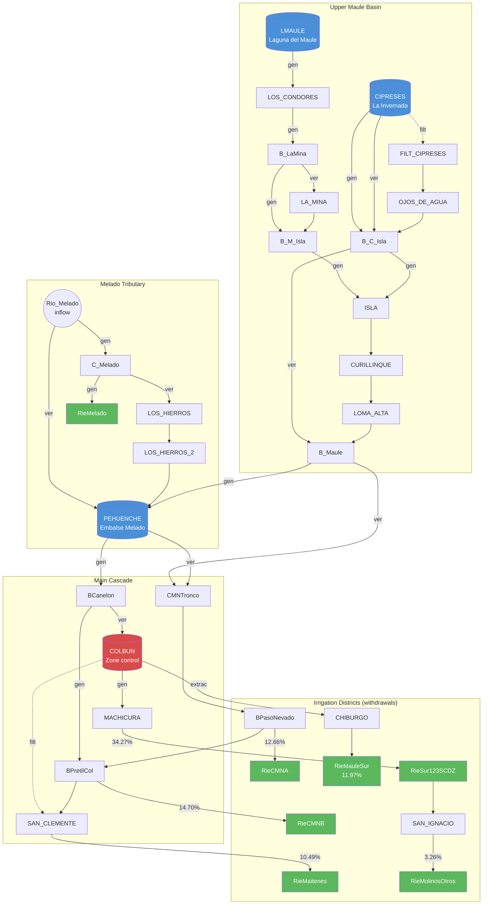
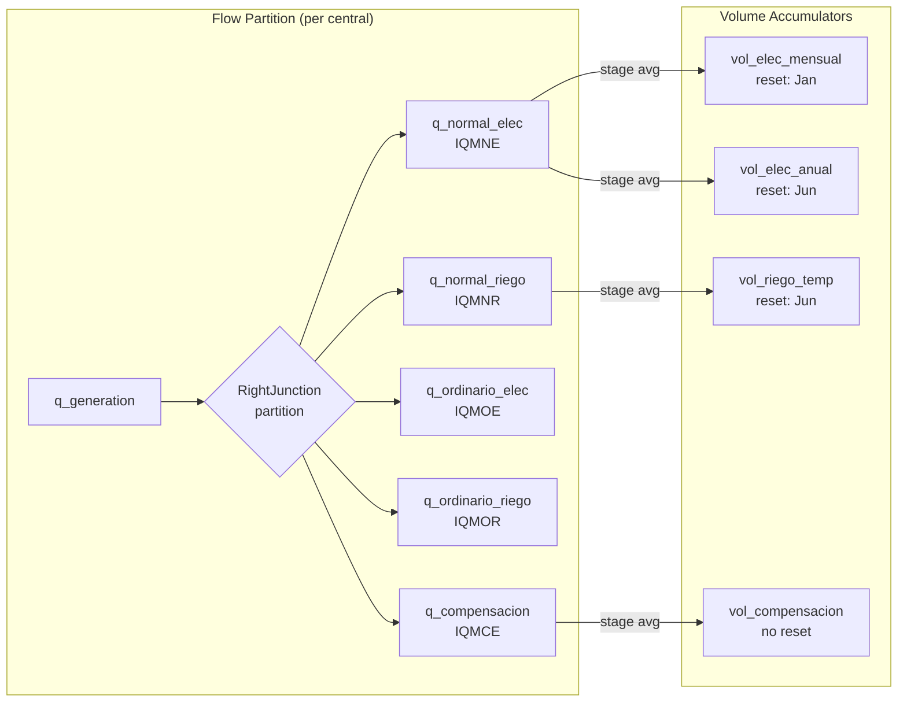
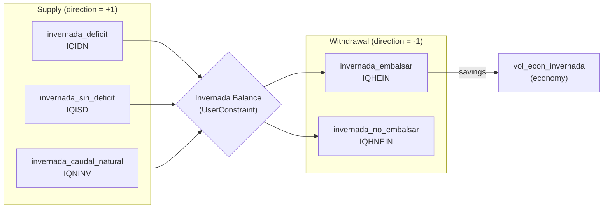
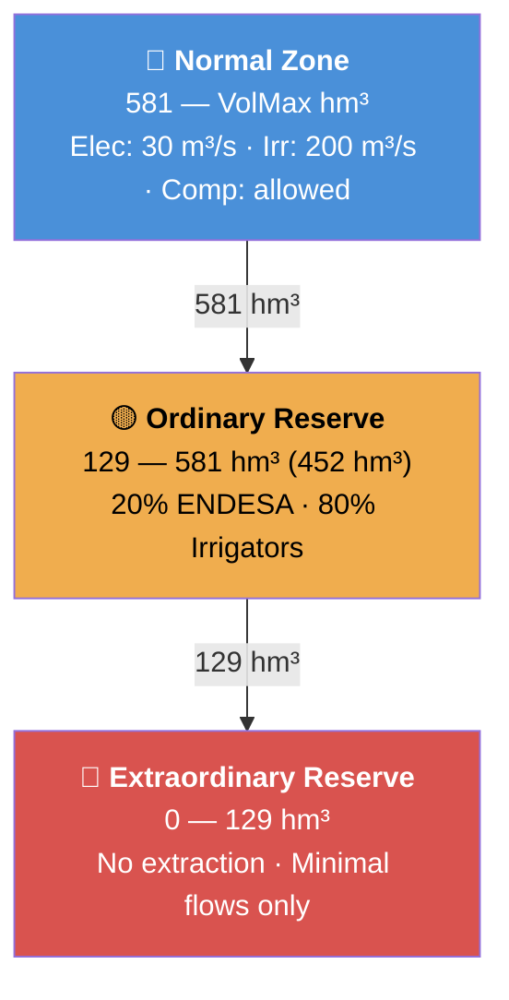

# Maule Irrigation Agreement (Convenio del Maule, 1947/1983)

> **Macro template file** for `plp2gtopt`.  This document describes the Maule
> irrigation agreement and contains embedded template code blocks that are
> extracted during processing:
>
> - **`maule.tson`** blocks (language: `json`) — JSON entity definitions
>   for FlowRight, VolumeRight, and UserConstraint arrays.
> - **`maule_agreement.tampl`** blocks (language: `pampl`) — AMPL-style
>   parameter declarations and constraint definitions.
>
> Code blocks are tagged with `{language} {filename} [section]` in the
> fenced-block info string.  The parser concatenates blocks by filename
> and assembles them into the target template files.
>
> ### Template Syntax
>
> All embedded code blocks use **Jinja2** templating:
>
> | Syntax | Meaning | Example |
> |--------|---------|---------|
> | `{{ var }}` | Substitute a scalar value | `param vol_max = {{ vol_max }};` |
> | `{{ list \| join(', ') }}` | Expand a Python list into a comma-separated string | `[{{ costs \| join(', ') }}]` → `[1.0, 2.0, 3.0]` |
> | `{{ var \| default(0.0) }}` | Substitute with a fallback if the variable is undefined | `{{ ini_econ \| default(0.0) }}` → `0.0` |
> | ` ... ` | Loop over a list, emitting one block per element | Zone parameter declarations |
> | ` ... ` | Conditional inclusion | Omit `use_value` when not set |
>
> Both `.tampl` (PAMPL) and `.tson` (JSON) blocks use the same
> standard Jinja2 delimiters (`{{ }}`, ``, `{# #}`).
> In `.tson` blocks, all printed values are auto-serialized as JSON
> via the `_json_finalize` callback (strings quoted, numbers bare, etc.).

## Overview

The **Convenio del Maule** governs water allocation from the Colbun reservoir
system between:

- **ENDESA/Colbun** (electric generation): ~800 MW total
  (Colbun + Machicura + Cipreses/Pehuenche cascade)
- **Agricultural irrigation**: ~90,000+ ha in the Maule region

Originally signed in 1947 and updated in 1983, the agreement divides the
Colbun reservoir volume into three operational zones, each with different
rights allocation between the electric company and irrigators.

Additional features include Resolution 105 (mandatory ecological flow),
La Invernada seasonal storage, Bocatoma Canelon canal intake, and
proportional allocation among 7 irrigation districts.

### Related Documentation

- [Irrigation Agreements — Modeling Guide](../../../docs/irrigation-agreements.md) —
  Architecture overview, LP formulation, and PLP comparison
- [Maule Agreement Research](../../../docs/analysis/irrigation_agreements/maule_agreement_research.md) —
  Historical and legal context
- [Right Junctions Analysis](../../../docs/analysis/irrigation_agreements/right_junctions_analysis.md) —
  Armerillo balance point and district allocation details
- [Seepage and Colchones Analysis](../../../docs/analysis/irrigation_agreements/seepage_and_colchones_analysis.md) —
  Volume zone model and filtration curves

### PLP Fortran Sources (authoritative)

| File             | Purpose                                    |
|------------------|--------------------------------------------|
| `parmaule.f`     | PAR_MAULE parameter structure              |
| `plp-maule0.f`   | Initialization, config parsing             |
| `genpdmaule.f`   | LP constraint matrix assembly, FijaMaule   |
| `plp-maule1.f`   | Per-stage constraints, conditional bounds   |
| `plp-maule2.f`   | Post-solve state update (economics)        |

### Key Design Difference: PLP vs gtopt

PLP uses a monolithic Fortran callback (`FijaMaule`) with if/else logic to
activate one zone at a time based on Colbun reservoir volume.  gtopt uses
overlapping `bound_rule` segments with step functions that achieve zone
exclusivity — same result, data-driven rather than procedural.

```pampl maule_agreement.tampl
# -*- mode: ampl; -*-
# =============================================================================
# Maule Irrigation Agreement (Convenio del Maule)
# =============================================================================
#
# Generated by plp2gtopt from plpmaulen.dat
# =============================================================================
```


## Basin Topology

### Physical Water System

The Maule basin has four reservoirs feeding a hydroelectric cascade.
The actual topology (from the gtopt JSON model) shows the generation
waterways (`gen`) and spill/bypass waterways (`ver`) connecting junctions:



**Legend**: Blue = reservoirs, Red = zone-control reservoir (COLBUN),
Green = irrigation withdrawal points, `gen` = generation waterway,
`ver` = spill/bypass waterway, `filt` = seepage/filtration.

### Rights Domain — Flow Partition

At each central, a **RightJunction** enforces the flow partition identity.
All turbined water is split into five rights categories:

$$-q_{g,j} + q_{\text{NE},j} + q_{\text{NR},j} + q_{\text{OE},j} + q_{\text{OR},j} + q_{\text{CE},j} = 0$$

where $j$ indexes blocks, and the suffixes correspond to Normal Electric
(NE), Normal Riego (NR), Ordinary Electric (OE), Ordinary Riego (OR), and
Compensacion Electric (CE).



The **Armerillo** balance (a RightJunction with `drain=true`) ensures
downstream water availability:

$$Q_{\text{inter}} + Q_{\text{inv}} + Q_{\text{maule}} - Q_{\text{elec}} - Q_{\text{irr}} + \text{drain} \geq 0$$

### La Invernada Winter Storage Balance

La Invernada is a seasonal reservoir at CIPRESES.  Five flow variables form
a balance enforced by a UserConstraint:

$$q_{\text{deficit}} + q_{\text{sin-deficit}} + q_{\text{natural}} = q_{\text{embalsar}} + q_{\text{no-embalsar}}$$



Objective function costs on the Invernada flows:

$$\text{cost}_{\text{emb}} = F_{\text{cau}} \cdot C_{\text{embalsar}} \cdot q_{\text{embalsar}}, \quad \text{cost}_{\text{bypass}} = F_{\text{cau}} \cdot C_{\text{no-embalsar}} \cdot q_{\text{no-embalsar}}$$


## PLP-to-gtopt Variable Mapping

### Flow Variables (per block)

| PLP Variable | PLP Name                | gtopt FlowRight              |
|-------------|-------------------------|-------------------------------|
| IQMNE       | Gasto Normal Electrico  | `maule_gasto_normal_elec`     |
| IQMNR       | Gasto Normal Riego      | `maule_gasto_normal_riego`    |
| IQMOE       | Gasto Ordinario Elec.   | `maule_gasto_ordinario_elec`  |
| IQMOR       | Gasto Ordinario Riego   | `maule_gasto_ordinario_riego` |
| IQMCE       | Compensacion Electrica  | `maule_compensacion_elec`     |
| IQA105      | Resolucion 105          | `maule_resolucion_105`        |
| IQIDN       | Deficit Invernada       | `invernada_deficit`           |
| IQISD       | Sin Deficit Invernada   | `invernada_sin_deficit`       |
| IQNINV      | Caudal Natural Invernada| `invernada_caudal_natural`    |
| IQHEIN      | Embalsar Invernada      | `invernada_embalsar`          |
| IQHNEIN     | No Embalsar Invernada   | `invernada_no_embalsar`       |

### Volume State Variables (per stage)

| PLP Variable | PLP Name           | gtopt VolumeRight                  |
|-------------|--------------------|------------------------------------|
| IVMGEMF     | Vol Elec Mensual   | `maule_vol_gasto_elec_mensual`     |
| IVMGEAF     | Vol Elec Anual     | `maule_vol_gasto_elec_anual`       |
| IVMGRTF     | Vol Riego Temporada| `maule_vol_gasto_riego_temp`       |
| VolCompEND  | Compensacion ENDESA| `maule_vol_compensacion_elec`      |
| (new)       | Reserva Ord. Elec. | `maule_vol_reserva_ord_elec`       |
| (new)       | Reserva Ord. Riego | `maule_vol_reserva_ord_riego`      |
| IVMDEIF     | Economia Invernada | `maule_vol_econ_invernada`         |

### Constraint Mapping

| Constraint           | PLP origin        | gtopt UserConstraint             |
|----------------------|-------------------|----------------------------------|
| Balance Invernada    | genpdmaulen.f     | `invernada_balance`              |
| % Ordinario Elec     | genpdmaulen.f     | `maule_pct_ordinario_elec`       |
| % Ordinario Riego    | genpdmaulen.f     | `maule_pct_ordinario_riego`      |
| Dist. retiro_*       | genpdmaulen.f     | `dist_retiro_*` (per district)   |

### PLP Constraint Structure (genpdmaule.f)

**Block-level** (per block j):
- R1: Flow partition (per central): `-qg_i_j + m_qmne_j + m_qmnr_j + m_qmoe_j + m_qmor_j + m_qmce_j = 0` → RightJunction
- R2: Armerillo balance: `Q_inter + Q_inv + Q_maule - Q_elec - Q_irr + drain >= 0` → RightJunction "armerillo" (drain=true)
- R3: Invernada balance: `m_qidn + m_qisd + m_qninv - m_qhein - m_qhnein = QAflInv` → UserConstraint

**Stage-level**:
- R4-R8: Averaging (per rights category) → FlowRight qavg row (auto by `use_average=true`)
- R9-R11: Volume accumulation → VolumeRight energy balance (StorageLP pattern)
- R14-R15: Percentage allocation → UserConstraint
- R16+: District proportional allocation → UserConstraint


## Three-Zone Reservoir Operation

The Colbun reservoir is divided into three zones with different extraction
rules.  Unlike Laja (piecewise-linear), Maule uses a simpler step-function
model:

| Zone | Volume Range | Extraction Rights | bound\_rule Segments |
|------|-------------|-------------------|---------------------|
| **Normal** | 581 — VolMax hm³ | Elec: 30 m³/s daily | seg\[0\]: V≥0 → const=0 (OFF) |
| | | Irr: 200 m³/s | seg\[1\]: V≥581 → const=30/200 (ON) |
| | | Comp: allowed | |
| **Ordinary Reserve** | 129 — 581 hm³ (452 hm³) | 20% → ENDESA | seg\[0\]: V≥0 → const=0 (OFF) |
| | | 80% → Irrigators | seg\[1\]: V≥129 → const=30/200 (ON) |
| | | UserConstraint: elec ≤ 20% | seg\[2\]: V≥581 → const=0 (OFF) |
| **Extraordinary Reserve** | 0 — 129 hm³ | No extraction allowed | All rights: const=0 (OFF) |
| | | Minimal flows only | |



The 3-segment pattern for ordinary reserve achieves zone exclusivity:
- $V < V_{\text{ext}}$: $\text{const}=0$ (extraordinary zone, no extraction)
- $V_{\text{ext}} \leq V < V_{\text{norm}}$: $\text{const}=q_{\max}$ (ordinary zone, active)
- $V \geq V_{\text{norm}}$: $\text{const}=0$ (normal zone takes over)

The effective flow upper bound for any FlowRight is:

$$\bar{q}_j = \min\bigl(f_{\max}(m),\ \text{bound-rule}(V_{\text{Colbun}})\bigr)$$

where $f_{\max}(m)$ is the monthly-modulated cap and $V_{\text{Colbun}}$ is the
current Colbun reservoir volume.

### update_lp() Behavior

PLP's `FijaMaule` callback reads Colbun reservoir volume each stage and
sets column bounds.  In gtopt, each FlowRight with a `bound_rule` has
`HasUpdateLP`.  During `SystemLP::update_lp()`, the bound_rule step function
is evaluated using Colbun reservoir volume:

- `V < 129`: all segments evaluate to 0 → no extraction
- `129 <= V < 581`: ordinary segments active, normal OFF
- `V >= 581`: normal segments active, ordinary OFF

The `fmax` schedule (monthly modulation) provides the second dimension of
variability: `fmax = pct_riego(month)/100 * 200`.  The effective upper bound
is `min(fmax, bound_rule_value)`.

VolumeRight reset behavior:
- `reset_month=january`: monthly electric (IVMGEMF) resets
- `reset_month=june`: annual electric (IVMGEAF) and seasonal irrigation
  (IVMGRTF) reset — June starts the "year" for the Maule convention
- No reset: compensation and Invernada economy carry forward

**Conditional bound flipping** (La Invernada, `plp-maule1.f`): PLP flips
`IQIDN`/`IQISD` upper bounds based on whether current irrigation demand
exceeds available surface inflow.  This is a simulation-level conditional,
NOT a pure LP constraint.  gtopt: NOT YET MODELED — would need a custom
`update_lp` rule or a `bound_rule` referencing the demand-inflow gap.

### Zone Thresholds

```pampl maule_agreement.tampl
# ---------------------------------------------------------------------------
# Volume zone thresholds [hm3]
# ---------------------------------------------------------------------------

# Extraordinary reserve volume (bottom zone, no extraction) [hm3]
param v_reserva_extraord = {{ v_reserva_extraord }};

# Ordinary reserve volume (middle zone, proportional allocation) [hm3]
param v_reserva_ordinaria = {{ v_reserva_ordinaria }};

# Cumulative threshold: ordinary -> normal zone [hm3]
param v_zone_normal = {{ v_reserva_extraord + v_reserva_ordinaria }};
```

### Reserve Allocation Percentages

In the ordinary reserve zone, the total flow is split proportionally
between electric and irrigation parties:

```pampl maule_agreement.tampl
# ---------------------------------------------------------------------------
# Reserve allocation percentages
# ---------------------------------------------------------------------------

# In the ordinary reserve zone, electric gets this fraction of total flow [%]
param pct_elec_reserva = {{ pct_elec_reserva }};

# In the ordinary reserve zone, irrigation gets this fraction of total flow [%]
param pct_riego_reserva = {{ pct_riego_reserva }};
```


## Flow Limits and Schedules

```pampl maule_agreement.tampl
# ---------------------------------------------------------------------------
# Flow limits [m3/s]
# ---------------------------------------------------------------------------

# Maximum electric daily extraction [m3/s]
param gasto_elec_dia_max = {{ gasto_elec_dia_max }};

# Maximum electric monthly extraction [hm3]
param gasto_elec_men_max = {{ gasto_elec_men_max }};

# Maximum irrigation extraction [m3/s]
param gasto_riego_max = {{ gasto_riego_max }};
```

### Monthly Modulation

The irrigation flow varies seasonally (e.g., Jan:100%, Jun:0%), and the
electric reserve has an activation schedule:

```pampl maule_agreement.tampl
# ---------------------------------------------------------------------------
# Monthly modulation (calendar year: Jan=1..Dec=12)
# ---------------------------------------------------------------------------

# Electric reserve modulation [%]: 100 = active, 0 = inactive
param mod_elec_reserva[month] = [{{ mod_elec_reserva | join(', ') }}];

# Irrigation monthly percentage of seasonal allocation [%]
param pct_riego_mensual[month] = [{{ pct_riego_mensual | join(', ') }}];
```


## Volume Right Capacities

```pampl maule_agreement.tampl
# ---------------------------------------------------------------------------
# Volume right capacities [hm3]
# ---------------------------------------------------------------------------

# Maximum annual electric volume right [hm3]
param v_der_elect_anu_max = {{ v_der_elect_anu_max }};

# Maximum seasonal irrigation volume right [hm3]
param v_der_riego_temp_max = {{ v_der_riego_temp_max }};

# Maximum electric compensation volume [hm3]
param v_comp_elec_max = {{ v_comp_elec_max }};
```


## Normal Zone Flow Rights

When the Colbun reservoir volume is above the normal threshold (`v_zone_normal`,
typically 581 hm3), both electric and irrigation parties have full extraction
rights, subject to daily/monthly caps and seasonal modulation.

### Normal Electric Rights (maule_gasto_normal_elec)

Active only when Colbun volume is in the normal zone.  PLP creates `m_qmne_j`
per block; `FijaMaule` sets upper bound to `gasto_elec_dia_max` (30 m3/s) when
in normal zone, 0 otherwise.

The `bound_rule` is a 2-segment step function:
- `seg[0]`: `V >= 0`, `const = 0` (OFF below normal zone)
- `seg[1]`: `V >= 581`, `const = 30` (ON in normal zone)

`fail_cost` = PLP Penalizador_1 (1500 $/m3/s), applied when the optimizer
cannot deliver the full electric entitlement.

```json maule.tson flow_right
{
  "name": "maule_gasto_normal_elec",
  "purpose": "generation",
  "direction": -1,
  "discharge": 0,
  "fmax": {{ elec_day_max }},
  "use_average": true,
  "fail_cost": {{ penalizador_1 }},
  "bound_rule": {
    "reservoir": {{ res_colbun }},
    "segments": [
      {"volume": 0, "slope": 0, "constant": 0},
      {"volume": {{ v_zone_normal }}, "slope": 0, "constant": {{ elec_day_max }}}
    ]
  }
}
```

### Normal Irrigation Rights (maule_gasto_normal_riego)

Active only in the normal zone.  The `fmax` is modulated by a monthly
irrigation percentage schedule:

    fmax = pct_riego_mensual[month] / 100 * gasto_riego_max

PLP monthly percentages (`PRiegoMaule`):
Jan:100, Feb:80, Mar:55, Apr:30, May:20, Jun:0,
Jul:0, Aug:0, Sep:30, Oct:70, Nov:90, Dec:100.

The `bound_rule` uses the same 2-segment pattern as normal electric.  The
effective bound is `min(fmax_schedule, bound_rule_value)`.  During
`update_lp()`, if V drops below 581, the bound_rule evaluates to 0,
disabling normal irrigation regardless of the seasonal fmax.

`use_value` is the benefit of irrigation delivery (`valor_riego`); only
emitted when > 0.

```json maule.tson flow_right
{
  "name": "maule_gasto_normal_riego",
  "purpose": "irrigation",
  "direction": -1,
  "discharge": 0,
  "fmax": {{ irr_fmax_schedule }},
  "use_average": true,
  "fail_cost": {{ costo_riego_ns_maule }},
  "bound_rule": {
    "reservoir": {{ res_colbun }},
    "segments": [
      {"volume": 0, "slope": 0, "constant": 0},
      {"volume": {{ v_zone_normal }}, "slope": 0, "constant": {{ riego_max }}}
    ]
  }
  
  ,"use_value": {{ valor_riego }}
  
}
```


## Ordinary Reserve Flow Rights

When the Colbun reservoir volume is in the ordinary reserve zone
(`v_reserva_extraord` to `v_zone_normal`, typically 129–581 hm3), extraction
rights are split proportionally: 20% electric / 80% irrigation, enforced by
UserConstraints (not by the bound_rule itself).

### Ordinary Electric Rights (maule_gasto_ordinario_elec)

Active only in the ordinary zone (129 ≤ V < 581 hm3).  The `bound_rule` uses
a 3-segment step function for zone exclusivity:

- `seg[0]`: `V >= 0`, `const = 0` (OFF — extraordinary zone)
- `seg[1]`: `V >= 129`, `const = 30` (ON — ordinary zone)
- `seg[2]`: `V >= 581`, `const = 0` (OFF — normal zone takes over)

The `fmax` is modulated by `mod_elec_reserva` monthly schedule:
100% (Jan–Jun), 0% (Jul–Dec) in typical PLP config.

```json maule.tson flow_right
{
  "name": "maule_gasto_ordinario_elec",
  "purpose": "generation",
  "direction": -1,
  "discharge": 0,
  "fmax": {{ elec_ord_fmax }},
  "use_average": true,
  "bound_rule": {
    "reservoir": {{ res_colbun }},
    "segments": [
      {"volume": 0, "slope": 0, "constant": 0},
      {"volume": {{ v_zone_extraord }}, "slope": 0, "constant": {{ elec_day_max }}},
      {"volume": {{ v_zone_normal }}, "slope": 0, "constant": 0}
    ]
  }
}
```

### Ordinary Irrigation Rights (maule_gasto_ordinario_riego)

Same 3-segment bound_rule as ordinary electric but with the irrigation base
flow (`riego_max`).  The 80% cap is enforced by the UserConstraint, not the
bound_rule.  Uses the same seasonal `fmax` schedule as normal irrigation.

```json maule.tson flow_right
{
  "name": "maule_gasto_ordinario_riego",
  "purpose": "irrigation",
  "direction": -1,
  "discharge": 0,
  "fmax": {{ irr_fmax_schedule }},
  "use_average": true,
  "bound_rule": {
    "reservoir": {{ res_colbun }},
    "segments": [
      {"volume": 0, "slope": 0, "constant": 0},
      {"volume": {{ v_zone_extraord }}, "slope": 0, "constant": {{ riego_max }}},
      {"volume": {{ v_zone_normal }}, "slope": 0, "constant": 0}
    ]
  }
  
  ,"use_value": {{ valor_riego }}
  
}
```


## ENDESA Compensation (maule_compensacion_elec)

Compensates ENDESA for irrigation priority in the ordinary reserve zone.
No `bound_rule` — this flow is available regardless of zone.  The cumulative
compensation volume is tracked by `maule_vol_compensacion_elec`.

PLP: `IQMCEH` hourly aggregate, volume tracked by `VolCompEND`.

```json maule.tson flow_right
{
  "name": "maule_compensacion_elec",
  "purpose": "generation",
  "direction": -1,
  "discharge": 0,
  "fmax": {{ elec_day_max }},
  "use_average": true
}
```


## Resolution 105 — Ecological Flow (maule_resolucion_105)

**Resolution 105** (DGA, 1983) mandates a minimum ecological flow at the
Melado river junction, year-round.  This is a **fixed discharge** (not
variable) — the optimizer MUST deliver this flow.  Failure incurs a
`fail_cost` penalty.

PLP: variable index 31 in `genpdmaule.f`.  The discharge follows a monthly
schedule (`QRiego105`):

    Apr:80  May:40  Jun-Aug:40  Sep:60  Oct:140  Nov:180  Dec:200
    Jan:200 Feb:180 Mar:120

In gtopt, the FlowRight is in fixed mode (`discharge > 0`, `fmax = 0`).
The discharge is an `STBRealFieldSched` (3D: scenario × stage × block)
with monthly values replicated across blocks.

```pampl maule_agreement.tampl
# ---------------------------------------------------------------------------
# Resolution 105 minimum ecological flows [m3/s]
# (monthly values, calendar year)
# ---------------------------------------------------------------------------

param caudal_res105[month] = [{{ caudal_res105 | join(', ') }}];
```

```json maule.tson flow_right
{
  "name": "maule_resolucion_105",
  "purpose": "environmental",
  "direction": -1,
  "discharge": {{ res105_discharge }},
  "fail_cost": {{ costo_riego_ns_res105 }}
  
  ,"use_value": {{ valor_riego_res105 }}
  
}
```


## La Invernada Winter Storage

La Invernada is a seasonal reservoir used for winter water banking.  PLP
models it with 5 block-level flow variables forming a balance
(`genpdmaule.f` R3):

    inflows = outflows
    m_qidn + m_qisd + m_qninv = m_qhein + m_qhnein

### Supply Side (direction = +1)

- **invernada_deficit**: deficit-mode discharge (must release when irrigators
  need more than inflow provides)
- **invernada_sin_deficit**: no-deficit storage flow (can store when
  irrigators are satisfied)
- **invernada_caudal_natural**: natural inflow to La Invernada

PLP conditional bound flipping (`plp-maule1.f`):
- If `irr_demand > inflow`: `IQIDN = inf`, `IQISD = 0` (must release)
- If `irr_demand < inflow`: `IQIDN = 0`, `IQISD = inf` (may store)

gtopt: NOT YET MODELED — both are free variables.

```json maule.tson flow_right
{
  "name": "invernada_deficit",
  "purpose": "irrigation",
  "direction": 1,
  "discharge": 0,
  "use_average": true
}
```

```json maule.tson flow_right
{
  "name": "invernada_sin_deficit",
  "purpose": "irrigation",
  "direction": 1,
  "discharge": 0,
  "use_average": true
}
```

```json maule.tson flow_right
{
  "name": "invernada_caudal_natural",
  "purpose": "irrigation",
  "direction": 1,
  "discharge": 0,
  "use_average": true
}
```

### Withdrawal Side (direction = -1)

- **invernada_embalsar**: storage into reservoir (banking).
  `use_value` = `CostoEmbalsar` (PLP: 1500 $/m3).
- **invernada_no_embalsar**: bypass (not stored, passes through).
  `use_value` = `CostoNoEmbalsar` (PLP: 1000 $/m3).

Objective terms (PLP):
- `+FCau * CostoEmbalsar * IQHEIN` (storage cost)
- `+FCau * CostoNoEmbalsar * IQHNEIN` (bypass penalty)

```json maule.tson flow_right
{
  "name": "invernada_embalsar",
  "purpose": "economy",
  "direction": -1,
  "discharge": 0,
  "use_average": true
  
  ,"use_value": {{ costo_embalsar }}
  
}
```

```json maule.tson flow_right
{
  "name": "invernada_no_embalsar",
  "purpose": "economy",
  "direction": -1,
  "discharge": 0,
  "use_average": true
  
  ,"use_value": {{ costo_no_embalsar }}
  
}
```

### Invernada Costs

```pampl maule_agreement.tampl
# ---------------------------------------------------------------------------
# Invernada storage/bypass costs
# ---------------------------------------------------------------------------
#
# PLP: "Penalizadores Convenio" in plpmaulen.dat
# These are objective function costs on the Invernada storage and bypass
# FlowRights, NOT general penalty costs.

# Cost for storing water in La Invernada [$/m3/s*h]
param costo_embalsar = {{ costo_embalsar | default(1500.0) }};

# Cost for bypassing La Invernada (not storing) [$/m3/s*h]
param costo_no_embalsar = {{ costo_no_embalsar | default(1000.0) }};

# Penalty for unserved irrigation demand [$/hm3]
param costo_riego_ns_maule = {{ costo_riego_ns_maule | default(1000.0) }};

# Penalty for unserved Resolution 105 ecological flow [$/hm3]
param costo_riego_ns_res105 = {{ costo_riego_ns_res105 | default(1000.0) }};
```

### Invernada Economy

PLP variable `IVMDEIF`.  La Invernada winter economy is modeled as a
`VolumeRight` with `purpose="economy"`:

- `saving` variable: inflow (unused winter storage rights deposited)
- `extraction` variable: outflow (economy spending)
- Balance: `economy_vol = prev + saving - extraction`

> **SIMPLIFICATION**: Economy reset/cap rules NOT implemented.
> La Invernada economy is modeled as a simple accumulator with no
> conditional reset or overflow cap.  PLP's more complex Invernada
> rules (seasonal usage windows, acumulable flag) are not yet
> represented in the gtopt constraint structure.
>
> To implement later, consider UserConstraints with monthly
> activation schedules and StorageLP drain for overflow.

```pampl maule_agreement.tampl
# ---------------------------------------------------------------------------
# La Invernada winter economy parameters
# ---------------------------------------------------------------------------

# La Invernada winter economy usage cost [$/hm3]
param econ_inver_costo = {{ econ_inver_costo | default(0.0) }};
```


## Bocatoma Canelon

Canal intake infrastructure cost.  Penalizes use of the Canelon irrigation
intake when water is diverted through it.

PLP: `CostoCanelon * BloDur/FPhi` in objective function.  Only emitted when
`costo_canelon > 0`.

```pampl maule_agreement.tampl
# ---------------------------------------------------------------------------
# Bocatoma Canelon
# ---------------------------------------------------------------------------

# Canelon intake usage cost [$/hm3]
param costo_canelon = {{ costo_canelon }};
```

```json maule.tson flow_right

{
  "name": "maule_bocatoma_canelon",
  "purpose": "irrigation",
  "direction": -1,
  "discharge": 0,
  "use_value": {{ costo_canelon }}
}

```


## Irrigation Districts

Seven irrigation districts each receive a fixed percentage of the total normal
irrigation flow (`maule_gasto_normal_riego`).  Districts with `has_slack=True`
use `<=` constraints (allowing under-extraction); those without use `=` (exact
proportional allocation).

| District          | Percentage | Constraint |
|-------------------|-----------|------------|
| RieCMNA           | 12.66%    | `=`        |
| RieCMNB           | 14.70%    | `=`        |
| RieMaitenes       | 10.49%    | `=`        |
| RieMauleSur       | 11.97%    | `=`        |
| RieMelado         | 12.65%    | `<=`       |
| RieSur123SCDZ     | 34.27%    | `=`        |
| RieMolinosOtros   |  3.26%    | `=`        |
| **Total**         |**100.00%**|            |

Name transform: `Rie` prefix → `retiro_` prefix in gtopt
(e.g., `RieCMNA` → `retiro_CMNA`).

District flow rights are pre-computed in
`maule_writer._compute_district_entities()` because `fmax` depends on the
irrigation schedule.

```pampl maule_agreement.tampl
# ---------------------------------------------------------------------------
# Withdrawal districts
# ---------------------------------------------------------------------------

# District: {{ district.name }}
#   percentage: {{ district.percentage }}%
#   has_slack: {{ district.has_slack }}

```

```json maule.tson flow_right

{{ fr }}

```


## Volume Rights

Volume rights are `VolumeRight` entities that track cumulative extraction
against annual/seasonal caps using the StorageLP energy balance pattern:

$$E_{\text{fin}} = E_{\text{ini}} - f_{\text{cr}} \cdot \frac{\sum_{b} \text{dur}(b) \cdot q(b)}{E_{\text{scale}}}$$

where $f_{\text{cr}} = 0.0036 \;\text{hm}^3/(\text{m}^3/\text{s} \cdot \text{h})$ is the
flow-to-volume conversion rate, $\text{dur}(b)$ is the block duration in hours,
$q(b)$ is the extraction flow in block $b$, and $E_{\text{scale}}$ is
the energy scaling factor.

### Monthly Electric Volume (maule_vol_gasto_elec_mensual)

Tracks accumulated electric extraction within the current **month**.  Resets
every January.

PLP balance (`genpdmaule.f` R9):
`IVMGEMF = Prev + (etadur/ScaleVol) * IQMNEH`.

- `emax` = `gasto_elec_men_max` (25 hm3): monthly electric cap
- `reset_month` = `january`: resets to 0 at each January stage

```json maule.tson volume_right
{
  "name": "maule_vol_gasto_elec_mensual",
  "purpose": "generation",
  "reservoir": {{ res_colbun }},
  "eini": {{ v_gasto_elec_men_ini }},
  "emax": {{ gasto_elec_men_max }},
  "use_state_variable": true,
  "reset_month": "january"
}
```

### Annual Electric Volume (maule_vol_gasto_elec_anual)

Tracks accumulated electric extraction within the current **year**
(June–May cycle).

PLP balance (`genpdmaule.f` R10):
`IVMGEAF = Prev + IVMGEMF`.

PLP couples this to the monthly accumulator.  In gtopt, the coupling is via
the FlowRight's `qeh` column appearing in both VolumeRight balance rows.

- `emax` = `v_der_elect_anu_max` (250 hm3): annual electric cap
- `reset_month` = `june`: resets at the Maule convention year start

```json maule.tson volume_right
{
  "name": "maule_vol_gasto_elec_anual",
  "purpose": "generation",
  "reservoir": {{ res_colbun }},
  "eini": {{ v_gasto_elec_anu_ini }},
  "emax": {{ v_der_elect_anu_max }},
  "use_state_variable": true,
  "reset_month": "june"
}
```

### Seasonal Irrigation Volume (maule_vol_gasto_riego_temp)

Tracks accumulated irrigation extraction within the current irrigation
season.

PLP balance (`genpdmaule.f` R11):
`IVMGRTF = Prev + (etadur/ScaleVol) * IQMNRH`.

- `emax` = `v_der_riego_temp_max` (800 hm3): seasonal irrigation cap
- `reset_month` = `june`: same annual cycle as electric

```json maule.tson volume_right
{
  "name": "maule_vol_gasto_riego_temp",
  "purpose": "irrigation",
  "reservoir": {{ res_colbun }},
  "eini": {{ v_gasto_riego_ini }},
  "emax": {{ v_der_riego_temp_max }},
  "use_state_variable": true,
  "reset_month": "june"
}
```

### ENDESA Compensation Volume (maule_vol_compensacion_elec)

Tracks cumulative ENDESA compensation volume.  No reset — carries forward
indefinitely.

PLP: `VolCompEND` tracks how much ENDESA has been compensated for irrigation
priority in the ordinary reserve zone.

- `emax` = `v_comp_elec_max` (350 hm3): maximum compensation

```json maule.tson volume_right
{
  "name": "maule_vol_compensacion_elec",
  "purpose": "generation",
  "reservoir": {{ res_colbun }},
  "eini": {{ v_comp_elec_ini }},
  "emax": {{ v_comp_elec_max }},
  "use_state_variable": true
}
```

### Extraordinary Reserve Electric Volume (maule_vol_reserva_ord_elec)

Tracks accumulated electric extraction from the extraordinary reserve zone
(bottom zone, `0..v_reserva_extraord` hm3).

This is a gtopt addition beyond the base PLP model.  PLP tracks this
implicitly via zone-transition flags (`FPasoPorResOrd`, `FVieneDeResOrd`)
which are boolean state flags, not LP variables.  gtopt makes this explicit
as a VolumeRight.

```json maule.tson volume_right
{
  "name": "maule_vol_reserva_ord_elec",
  "purpose": "generation",
  "reservoir": {{ res_colbun }},
  "eini": {{ v_gasto_rext_elec_ini }},
  "emax": {{ v_reserva_extraord }},
  "use_state_variable": true
}
```

### Extraordinary Reserve Irrigation Volume (maule_vol_reserva_ord_riego)

Same as above but for irrigation extraction from the extraordinary reserve
zone.

```json maule.tson volume_right
{
  "name": "maule_vol_reserva_ord_riego",
  "purpose": "irrigation",
  "reservoir": {{ res_colbun }},
  "eini": {{ v_gasto_rext_riego_ini }},
  "emax": {{ v_reserva_extraord }},
  "use_state_variable": true
}
```

### La Invernada Economy Volume (maule_vol_econ_invernada)

Tracks unused winter storage rights.  Not coupled to Colbun but to the
**CIPRESES** reservoir (La Invernada physical reservoir).

PLP (`plp-maule2.f`):
- `saving` = unused winter storage rights deposited
- `extraction` = economy spending
- Balance: `economy_vol = prev + saving - extraction`

No `reset_month`: economy carries across years.
`saving_rate`: max economy deposit rate (`qmax_invernada`).

```json maule.tson volume_right
{
  "name": "maule_vol_econ_invernada",
  "purpose": "economy",
  "reservoir": {{ central_invernada }},
  "eini": {{ v_econ_inver_ini }},
  "saving_rate": {{ qmax_invernada }},
  "use_state_variable": true
}
```


## Initial State Parameters

Run-specific values read from `plpmaulen.dat`.  Each value represents the
accumulated volume already extracted/accumulated in the current tracking
period at the start of the planning horizon.  These are **NOT** structural
constants — they change between runs depending on the simulation start date
and preceding operational history.

```pampl maule_agreement.tampl
# ---------------------------------------------------------------------------
# Initial-state parameters [hm3]
# ---------------------------------------------------------------------------

# Accumulated electric extraction in the current month [hm3]
param v_gasto_elec_men_ini = {{ v_gasto_elec_men_ini }};

# Accumulated electric extraction in the current year [hm3]
param v_gasto_elec_anu_ini = {{ v_gasto_elec_anu_ini }};

# Accumulated irrigation extraction in the current season [hm3]
param v_gasto_riego_ini = {{ v_gasto_riego_ini }};

# Accumulated electric extraction from extraordinary reserve in current period [hm3]
param v_gasto_rext_elec_ini = {{ v_gasto_rext_elec_ini | default(0.0) }};

# Accumulated irrigation extraction from extraordinary reserve in current period [hm3]
param v_gasto_rext_riego_ini = {{ v_gasto_rext_riego_ini | default(0.0) }};

# Remaining electric rights in extraordinary reserve zone [hm3]
param v_der_rext_elec_ini = {{ v_der_rext_elec_ini | default(0.0) }};

# Remaining irrigation rights in extraordinary reserve zone [hm3]
param v_der_rext_riego_ini = {{ v_der_rext_riego_ini | default(0.0) }};

# Accumulated ENDESA compensation volume in current period [hm3]
param v_comp_elec_ini = {{ v_comp_elec_ini }};

# Accumulated La Invernada winter economy volume in current period [hm3]
param v_econ_inver_ini = {{ v_econ_inver_ini }};
```


## User Constraints

### La Invernada Flow Balance (invernada_balance)

Inflows (deficit + no-deficit + natural) must equal outflows (storage +
bypass) at the Invernada balance node.

PLP constraint R3 (`genpdmaule.f`):
`m_qidn + m_qisd + m_qninv - m_qhein - m_qhnein = QAflInv`.

In PLP, the RHS is `QAflInvern` (natural inflow).  In gtopt, the natural
inflow is the `invernada_caudal_natural` FlowRight on the supply side,
making both sides of the equation visible in the LP.

```json maule.tson user_constraint
{
  "name": "invernada_balance",
  "expression": {{ expression_invernada }},
  "description": {{ description_invernada }},
  "penalty": {{ penalty_invernada }},
  "penalty_class": "hydro_flow"
}
```

> **Soft balance.** `penalty` is the cost (in $/m³) the LP pays for each
> unit of slack absorbed into the balance when the PLP-style conditional
> bound flipping would otherwise have pinned the deficit variable and
> made the constraint infeasible.  `penalty_class = "hydro_flow"`
> multiplies the raw penalty by `block_duration[h] × 3600` so the slack
> column's LP cost is in $/(m³/s), matching the unit of the flow
> variables.  Defaults to `hydro_fail_cost` from the surrounding
> `model_options`.

```pampl maule_agreement.tampl
# =============================================================================
# User Constraints
# =============================================================================

# ---------------------------------------------------------------------------
# La Invernada winter flow balance
# ---------------------------------------------------------------------------

constraint invernada_balance "La Invernada: inflows = outflows":
  flow_right('invernada_deficit').flow + flow_right('invernada_sin_deficit').flow + flow_right('invernada_caudal_natural').flow = flow_right('invernada_embalsar').flow + flow_right('invernada_no_embalsar').flow;
```

### Ordinary Reserve Percentage Allocation

In the ordinary reserve zone, the total flow is split proportionally.
Let $\alpha_e$ and $\alpha_r$ be the electric and irrigation fractions
(typically $\alpha_e = 0.20$, $\alpha_r = 0.80$, with $\alpha_e + \alpha_r = 1$).

The constraints are:

$$q_{\text{OE}} \leq \alpha_e \cdot (q_{\text{OE}} + q_{\text{OR}})$$

$$q_{\text{OR}} \leq \alpha_r \cdot (q_{\text{OE}} + q_{\text{OR}})$$

When the reservoir is NOT in the ordinary zone, the `bound_rule` on the
FlowRights sets them to 0, making these constraints trivially satisfied
($0 \leq 0$).

For district $i$ with percentage $p_i$, the proportional allocation is:

$$q_{\text{dist}_i} \;[\leq | =]\; \frac{p_i}{100} \cdot q_{\text{normal-riego}}$$

where districts with `has_slack=True` use $\leq$ and others use $=$.

```json maule.tson user_constraint
{
  "name": "maule_pct_ordinario_elec",
  "expression": {{ expression_pct_elec }},
  "description": {{ description_pct_elec }}
}
```

```json maule.tson user_constraint
{
  "name": "maule_pct_ordinario_riego",
  "expression": {{ expression_pct_riego }},
  "description": {{ description_pct_riego }}
}
```

```pampl maule_agreement.tampl
# ---------------------------------------------------------------------------
# Ordinary reserve percentage allocation constraints
# ---------------------------------------------------------------------------

# Electric capped at {{ pct_elec_reserva }}% of total ordinary reserve flow
constraint maule_pct_ordinario_elec "Electric capped at {{ pct_elec_reserva }}% of total ordinary reserve flow":
  flow_right('maule_gasto_ordinario_elec').flow <= {{ pct_elec_reserva / 100.0 }} * flow_right('maule_gasto_ordinario_elec').flow + {{ pct_elec_reserva / 100.0 }} * flow_right('maule_gasto_ordinario_riego').flow;

# Irrigation capped at {{ pct_riego_reserva }}% of total ordinary reserve flow
constraint maule_pct_ordinario_riego "Irrigation capped at {{ pct_riego_reserva }}% of total ordinary reserve flow":
  flow_right('maule_gasto_ordinario_riego').flow <= {{ pct_riego_reserva / 100.0 }} * flow_right('maule_gasto_ordinario_elec').flow + {{ pct_riego_reserva / 100.0 }} * flow_right('maule_gasto_ordinario_riego').flow;
```

### District Proportional Allocation

Each district receives a fixed percentage of the total normal irrigation
flow.  Districts with `has_slack=True` use `<=` (allowing under-extraction);
those without use `=` (exact proportional allocation).

The district constraint expressions are pre-computed in
`maule_writer._compute_district_entities()`.

```json maule.tson user_constraint

{{ uc }}

```

```pampl maule_agreement.tampl
# ---------------------------------------------------------------------------
# District proportional allocation constraints
# ---------------------------------------------------------------------------

# {{ district.name }}: {{ district.percentage }}% of total irrigation
constraint dist_{{ district.name }} "{{ district.name }}: {{ district.percentage }}% of total irrigation":
  flow_right('{{ district.name }}').flow {{ '<=' if district.has_slack else '=' }} {{ district.percentage / 100.0 }} * flow_right('maule_gasto_normal_riego').flow;


# =============================================================================
# End of Maule Agreement
# =============================================================================
```


## Central / Reservoir References

```pampl maule_agreement.tampl
# ---------------------------------------------------------------------------
# Central / reservoir references
# ---------------------------------------------------------------------------

# Reservoir used for volume zone thresholds (bound_rule): {{ central_colbun }}
# Bocatoma Canelon intake point: {{ bocatoma_canelon }}
```
