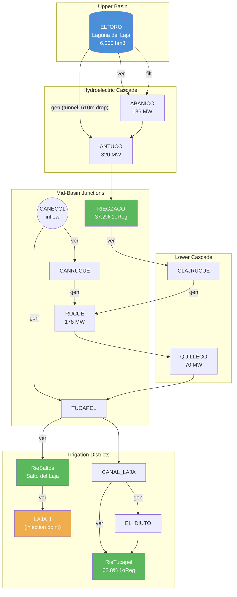
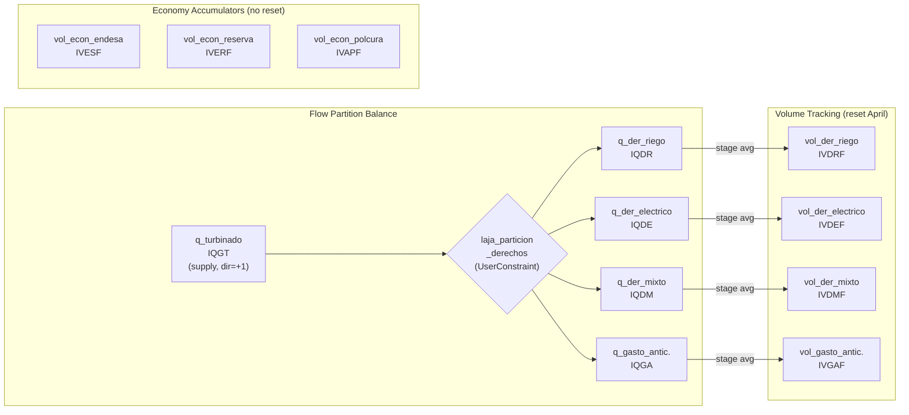

# Laja Irrigation Agreement (Convenio del Laja, 1958/2017)

> **Macro template file** for `plp2gtopt`.  This document describes the Laja
> irrigation agreement and contains embedded template code blocks that are
> extracted during processing:
>
> - **`laja.tson`** blocks (language: `json`) — JSON entity definitions
>   for FlowRight, VolumeRight, and UserConstraint arrays.
> - **`laja_agreement.tampl`** blocks (language: `pampl`) — AMPL-style
>   parameter declarations and constraint definitions.
>
> Code blocks are tagged with `{language} {filename} [section]` in the
> fenced-block info string.  The parser concatenates blocks by filename
> and assembles them into the target template files.

## Overview

The **Convenio del Laja** governs allocation of water from **Laguna del Laja**
(~6,000 hm3, Chile's largest reservoir with multi-annual regulation) between:

- **Hydroelectric generation**: El Toro (450 MW) + 4-plant cascade
  (Abanico, Antuco, El Toro, Ralco) totaling ~1,150 MW
- **Agricultural irrigation**: ~117,000 ha in the Biobio region

Originally signed in 1958 and updated in 2017, the agreement defines four
volume zones with different allocation factors for three rights categories
(irrigation, electric, mixed).  Rights are a **piecewise-linear function**
of reservoir volume:

$$R(V) = R_{\text{base}} + \sum_{i=1}^{N} f_i \cdot \min(V_i,\; W_i)$$

where $R_{\text{base}}$ is the base right at dead volume, $f_i$ is the
allocation factor for zone $i$, $V_i$ is the volume in zone $i$, and
$W_i$ is the zone width.

The hydrological year runs **April–March**.  At April 1st, volume rights
(`IVDRF`, `IVDEF`, `IVDMF`, `IVGAF`) are re-provisioned based on
current reservoir volume via the `bound_rule`.

### Related Documentation

- [Irrigation Agreements — Modeling Guide](../../../docs/irrigation-agreements.md) —
  Architecture overview, LP formulation, and PLP comparison
- [Laja Agreement Research](../../../docs/analysis/irrigation_agreements/laja_agreement_research.md) —
  Historical and legal context
- [Right Junctions Analysis](../../../docs/analysis/irrigation_agreements/right_junctions_analysis.md) —
  Flow partition and district allocation details
- [Seepage and Colchones Analysis](../../../docs/analysis/irrigation_agreements/seepage_and_colchones_analysis.md) —
  Volume zone model and filtration curves

### PLP Fortran Sources (authoritative)

| File             | Purpose                                    |
|------------------|--------------------------------------------|
| `parlajam.f`     | PAR_LAJAM parameter structure              |
| `leelajam.f`     | plplajam.dat reader                        |
| `genpdlajam.f`   | LP constraint matrix assembly              |
| `plp-laja1.f`    | Per-stage bound modification (FijaLajaMBloA)|
| `plp-laja2.f`    | Post-solve state update (economics tracking)|

### Key Design Difference: PLP vs gtopt

PLP uses a monolithic Fortran module with procedural bound setting
(`FijaLajaMBloA`) that modifies LP column bounds each stage.  gtopt uses
declarative `bound_rule` segments on VolumeRight entities evaluated during
`update_lp()` — mathematically equivalent but data-driven rather than
procedural.

```pampl laja_agreement.tampl
# -*- mode: ampl; -*-
# =============================================================================
# Laja Irrigation Agreement (Convenio del Laja)
# =============================================================================
#
# Generated by plp2gtopt from plplajam.dat
# =============================================================================
```


## Basin Topology

### Physical Water System

The Laja basin centers on **Laguna del Laja** (~6,000 hm3), Chile's largest
reservoir.  El Toro (450 MW) takes water via an 8 km tunnel with 610 m drop.
The downstream cascade feeds through Abanico, Antuco, and eventually reaches
three irrigation districts and the Salto del Laja waterfall.



**Legend**: Blue = reservoir, Green = irrigation withdrawal, Orange = injection
point (consumptive withdrawal from river), `gen` = generation waterway,
`ver` = spill/bypass, `filt` = seepage.

### Rights Domain — Flow Partition

All water turbined through El Toro must be accounted for by one of the four
rights categories.  The flow partition constraint
(`laja_particion_derechos`) enforces the identity:

$$q_{\text{gt}} = q_{\text{dr}} + q_{\text{de}} + q_{\text{dm}} + q_{\text{ga}}$$

where $q_{\text{gt}}$ is total turbined flow, $q_{\text{dr}}$ irrigation rights,
$q_{\text{de}}$ electrical rights, $q_{\text{dm}}$ mixed rights, and
$q_{\text{ga}}$ anticipated discharge.



### Downstream Irrigation Districts

Three districts withdraw water, each with up to 4 demand categories
(1o Regante, 2o Regante, Emergencia, Saltos):

```mermaid
graph TD
    CASCADE["Hydroelectric cascade<br/>(ANTUCO downstream)"] --> RIEGZACO
    CASCADE --> TUCAPEL["TUCAPEL junction"]
    TUCAPEL --> CANAL_LAJA --> RieTucapel
    TUCAPEL --> RieSaltos

    subgraph "RIEGZACO (Zanartu-Collao)"
        RIEGZACO["RIEGZACO<br/>cost_factor=1.5"]
        RZ1["1o_reg: 37.2%"]
        RZ3["emergencia: 37.2%"]
    end

    subgraph "RieTucapel"
        RieTucapel["RieTucapel<br/>cost_factor=1.0"]
        RT1["1o_reg: 62.8%"]
        RT2["2o_reg: 100%"]
        RT3["emergencia: 62.8%"]
    end

    subgraph "RieSaltos (Waterfall)"
        RieSaltos["RieSaltos<br/>cost_factor=0.2"]
        RS4["saltos: 100%"]
        RieSaltos -->|"injection"| LAJA_I["LAJA_I"]
    end
```


## PLP-to-gtopt Variable Mapping

### Flow Variables (per block)

| PLP Variable | PLP Name              | gtopt FlowRight           |
|-------------|------------------------|----------------------------|
| IQGT        | Gasto Turbinado        | `laja_q_turbinado`         |
| IQDR        | Derecho de Riego       | `laja_der_riego`           |
| IQDE        | Derecho Electrico      | `laja_der_electrico`       |
| IQDM        | Derecho Mixto          | `laja_der_mixto`           |
| IQGA        | Gasto Anticipado       | `laja_gasto_anticipado`    |

### Volume State Variables (per stage)

| PLP Variable | PLP Name              | gtopt VolumeRight              |
|-------------|------------------------|--------------------------------|
| IVDRF       | Vol. Der. Riego        | `laja_vol_der_riego`           |
| IVDEF       | Vol. Der. Electrico    | `laja_vol_der_electrico`       |
| IVDMF       | Vol. Der. Mixto        | `laja_vol_der_mixto`           |
| IVGAF       | Vol. Gasto Antic.      | `laja_vol_gasto_anticipado`    |
| IVESF       | Vol. Econ. ENDESA      | `laja_vol_econ_endesa`         |
| IVERF       | Vol. Econ. Reserva     | `laja_vol_econ_reserva`        |
| IVAPF       | Vol. Econ. Polcura     | `laja_vol_econ_polcura`        |

### Stage-Level Hourly Aggregates

PLP "H"-suffix variables (`IQDRH`, `IQDEH`, `IQDMH`, `IQGAH`, `IQGTH`)
correspond to gtopt's FlowRight `qeh` column, created by `use_average=true`.
This generates a stage-average hourly rate via an averaging constraint:

$$\bar{q}_{\text{eh}} - \sum_{b} \frac{\text{dur}(b)}{\sum_{b'} \text{dur}(b')} \cdot q(b) = 0$$

### PLP Constraint Structure (genpdlajam.f)

**Block-level** (per block j):
- R1: Flow partition: `-qgt_j + qdr_j + qde_j + qdm_j + qga_j = 0`
  → UserConstraint `laja_particion_derechos`

**Stage-level**:
- R4-R8: Averaging constraints (one per rights category):
  `IQDRH - sum_j[dur_ratio_j * qdr_j] = 0`
  → FlowRight `qavg` row (auto-created by `use_average=true`)
- R9-R12: Volume accumulation (annual rights tracking):
  PLP: `IVDRF = Prev_IVDRF - (etadur/ScaleVol) * IQDRH`
  gtopt: `efin = eini - fcr * sum_b[dur(b) * finp(b)] / escale`
  → VolumeRight energy balance row (StorageLP pattern)
  `fcr = 0.0036 hm3/(m3/s*h)` is the flow conversion rate

### update_lp() Behavior

PLP: `plp-laja1.f` / `FijaLajaMBloA` — called each stage before LP solve.
Reads current reservoir volume, evaluates the zone formula, and sets column
upper bounds for `qdr`/`qde`/`qdm`/`qga`.

gtopt: Each VolumeRight with a `bound_rule` has the `HasUpdateLP` concept.
During `SystemLP::update_lp()`, the `bound_rule` is re-evaluated using the
current reservoir volume (`physical_eini` or `physical_efin`), and the
VolumeRight's `emax` is updated via `set_col_upp`.

**Reset behavior** (`reset_month=april`): When the stage month matches
"april", the VolumeRight is re-provisioned — `eini` is recomputed from the
`bound_rule` evaluated at current reservoir volume.  This mirrors PLP's
April 1st re-initialization of `IVDRF`/`IVDEF`/`IVDMF`/`IVGAF`.


## Volume Zone Model

The reservoir volume is divided into 4 zones (PLP "Colchones") from dead
volume upward, each with different allocation factors for irrigation,
electric, and mixed rights.

```
  VolMax = 5,582 hm3
  +---------------------------+
  |  Zone 4  (3,682 hm3)     |  segment[3]: V >= 1900
  |  Irr +0.25/hm3           |  slope=0.25, const=375
  |  Elec +0.65/hm3          |
  +-- 1,900 hm3 -------------+
  |  Zone 3  (530 hm3)       |  segment[2]: V >= 1370
  |  Irr +0.40/hm3           |  slope=0.40, const=90
  |  Elec +0.40/hm3          |
  +-- 1,370 hm3 -------------+
  |  Zone 2  (170 hm3)       |  segment[1]: V >= 1200
  |  Irr +0.40/hm3           |  slope=0.40, const=90
  |  Elec +0.05/hm3          |
  +-- 1,200 hm3 -------------+
  |  Zone 1  (1,200 hm3)     |  segment[0]: V >= 0
  |  Irr +0.00/hm3 (flat)    |  slope=0.00, const=570
  |  Elec +0.05/hm3          |  (Irr = 570 regardless of V)
  |  Mixed +1.00/hm3         |
  +-- VolMuerto = 0 ---------+
  Base: Irr=570, Elec=0, Mixed=30
  Caps: Irr=5000, Elec=1200, Mixed=30
```

The converter (`_zones_to_bound_rule_segments`) transforms the PLP zone
formula into `bound_rule` segments where:

$$R(V) = c_k + s_k \cdot V \quad \text{for } V \geq V_k$$

with each segment $k$ defined by a volume breakpoint $V_k$, slope $s_k$,
and constant $c_k$.  The segment with the highest $V_k \leq V$ is active.

**Derivation example (irrigation):**

For segment 2 at $V = 1200$: slope changes from $0.00$ to $0.40$.

$$c_2 = R(1200) - 0.40 \times 1200 = 570 - 480 = 90$$

For segment 3 at $V = 1900$: slope changes from $0.40$ to $0.25$.

$$c_3 = (570 + 0 + 68 + 212) - 0.25 \times 1900 = 850 - 475 = 375$$

The full piecewise-linear irrigation rights function:

$$R_{\text{irr}}(V) = \begin{cases}
570 & 0 \leq V < 1200 \\
90 + 0.40\,V & 1200 \leq V < 1900 \\
375 + 0.25\,V & V \geq 1900
\end{cases}$$

capped at $R_{\max} = 5000$ hm3/year.

### Zone Parameters

```pampl laja_agreement.tampl
# ---------------------------------------------------------------------------
# Flow partition balance: qgt = qdr + qde + qdm + qga
# ---------------------------------------------------------------------------

constraint laja_particion_derechos "Flow partition: total generation = sum of extractions":
  flow_right('laja_q_turbinado').flow = flow_right('laja_der_riego').flow + flow_right('laja_der_electrico').flow + flow_right('laja_der_mixto').flow + flow_right('laja_gasto_anticipado').flow;

# ---------------------------------------------------------------------------
# Volume zone parameters
# ---------------------------------------------------------------------------

# Dead volume below which no extraction is permitted [hm3]
param vol_muerto = {{ vol_muerto }};

# Maximum reservoir volume [hm3]
param vol_max = {{ vol_max }};

# Volume zone widths [hm3] -- {{ zone_widths | length }} zones from dead volume upward

# Zone {{ loop.index }}: width = {{ w }} hm3

```


## Flow Rights

### Total Turbine Flow (laja_q_turbinado)

Total turbine flow at El Toro.  `direction=+1` means this is a **supply**
into the partition balance (UserConstraint).

In the flow partition: `qgt = qdr + qde + qdm + qga`.  This variable
represents the LEFT side (total supply).

`fmax = vol_max` (effectively unbounded — the real caps come from the
individual rights categories on the withdrawal side).

```json laja.tson flow_right
{
  "name": "laja_q_turbinado",
  "purpose": "generation",
  "direction": 1,
  "discharge": 0,
  "fmax": @vol_max@,
  "use_average": true
}
```

### Irrigation Rights (laja_der_riego)

Irrigation rights flow.  `direction=-1` means withdrawal from the partition
balance.  The flow cap ($f_{\max}$) is pre-computed:

$$f_{\max}(m) = q_{\max}^{\text{irr}} \cdot u_{\text{irr}}(m)$$

where $u_{\text{irr}}(m) = 1.0$ during irrigation season (Sep–Mar) and
$u_{\text{irr}}(m) = 0.0$ during winter (May–Aug).

The volume-dependent annual rights quota is on the **VolumeRight**
(`laja_vol_der_riego`) via `bound_rule`, not on the FlowRight.

- `fail_cost`: penalty for unserved irrigation demand.
  PLP: `CRiegoNS` (1100 $/m3/s) modulated by `FactMenCQVar`.
- `use_value`: benefit of irrigation usage (`cost_irr_uso`).
  Conditional — only emitted when `cost_irr_uso > 0`.

```pampl laja_agreement.tampl
# ---------------------------------------------------------------------------
# Irrigation rights parameters (PLP: DerRiego)
# ---------------------------------------------------------------------------

# Base irrigation right at dead volume [hm3/year]
param irr_base = {{ irr_base }};

# Irrigation factors per volume zone
# Rights(V) = irr_base + sum(irr_factor_i * zone_volume_i)
# PLP: FacDerR(1..N)

param irr_factor_{{ loop.index }} = {{ f }};


# Maximum annual irrigation right [hm3]
param max_irr = {{ max_irr }};

# Maximum instantaneous irrigation flow [m3/s]
param qmax_irr = {{ qmax_irr }};

# Irrigation non-served cost [$/hm3]
param cost_irr_ns = {{ cost_irr_ns }};

# Irrigation usage cost [$/hm3]
param cost_irr_uso = {{ cost_irr_uso }};

# Monthly irrigation usage activation [p.u.] (hydrological year: Apr=1..Mar=12)
# 1.0 = active, 0.0 = inactive
# Irrigation season: typically Sep-Mar (hydrological months 6-12 and 1)
param irr_usage[month] = [{{ monthly_usage_irr | join(', ') }}];
```

```json laja.tson flow_right
{
  "name": "laja_der_riego",
  "purpose": "irrigation",
  "direction": -1,
  "discharge": 0,
  "fmax": @fmax_irr@,
  "use_average": true,
  "fail_cost": @fail_cost_irr@
  @% if use_value_irr is not none %@
  ,"use_value": @use_value_irr@
  @% endif %@
}
```

### Electrical Rights (laja_der_electrico)

Electrical rights flow.  Active year-round (`monthly_usage=1`).

- `fail_cost`: PLP `CElectNS` (1150 $/m3/s) × monthly modulation.
- `use_value`: benefit of electrical usage (`cost_elec_uso=0.1`).
  The small positive `use_value` acts as a tie-breaker in the optimizer,
  encouraging electrical extraction when other costs are equal
  (PLP: `CUsoElect` steering cost).

```pampl laja_agreement.tampl
# ---------------------------------------------------------------------------
# Electrical rights parameters (PLP: DerElec)
# ---------------------------------------------------------------------------

# Base electrical right at dead volume [hm3/year]
param elec_base = {{ elec_base }};

# Electrical factors per volume zone
# PLP: FacDerE(1..N)

param elec_factor_{{ loop.index }} = {{ f }};


# Maximum annual electrical right [hm3]
param max_elec = {{ max_elec }};

# Maximum instantaneous electrical flow [m3/s]
param qmax_elec = {{ qmax_elec }};

# Electrical non-served cost [$/hm3]
param cost_elec_ns = {{ cost_elec_ns }};

# Electrical usage cost [$/hm3]
param cost_elec_uso = {{ cost_elec_uso }};

# Monthly electrical usage activation [p.u.]
param elec_usage[month] = [{{ monthly_usage_elec | join(', ') }}];
```

```json laja.tson flow_right
{
  "name": "laja_der_electrico",
  "purpose": "generation",
  "direction": -1,
  "discharge": 0,
  "fmax": @fmax_elec@,
  "use_average": true,
  "fail_cost": @fail_cost_elec@
  @% if use_value_elec is not none %@
  ,"use_value": @use_value_elec@
  @% endif %@
}
```

### Mixed Rights (laja_der_mixto)

Shared allocation with season-dependent usage.  Active year-round.

No `fail_cost` (mixed rights are not penalized for non-use).
`use_value`: mixed usage cost (`cost_mixed=1.0`).  PLP: `CMixto` steering
cost in objective function.

```pampl laja_agreement.tampl
# ---------------------------------------------------------------------------
# Mixed rights parameters (PLP: DerMixto)
# ---------------------------------------------------------------------------

# Base mixed right at dead volume [hm3/year]
param mixed_base = {{ mixed_base }};

# Mixed factors per volume zone

param mixed_factor_{{ loop.index }} = {{ f }};


# Maximum annual mixed right [hm3]
param max_mixed = {{ max_mixed }};

# Maximum instantaneous mixed flow [m3/s]
param qmax_mixed = {{ qmax_mixed }};

# Mixed rights cost [$/hm3]
param cost_mixed = {{ cost_mixed }};

# Monthly mixed usage activation [p.u.]
param mixed_usage[month] = [{{ monthly_usage_mixed | join(', ') }}];
```

```json laja.tson flow_right
{
  "name": "laja_der_mixto",
  "purpose": "mixed",
  "direction": -1,
  "discharge": 0,
  "fmax": @fmax_mixed@,
  "use_average": true
  @% if use_value_mixed is not none %@
  ,"use_value": @use_value_mixed@
  @% endif %@
}
```

### Anticipated Discharge (laja_gasto_anticipado)

Allows early extraction of future irrigation rights under certain conditions.
Active only **Sep–Nov** (hydrological months 6–8).

`fail_cost` uses the irrigation non-served cost base (`cost_irr_ns`)
modulated by `monthly_cost_anticipated` factors.

```pampl laja_agreement.tampl
# ---------------------------------------------------------------------------
# Anticipated discharge parameters (PLP: GastoAnticipado)
# ---------------------------------------------------------------------------

# Maximum annual anticipated right [hm3]
param max_anticipated = {{ max_anticipated }};

# Maximum instantaneous anticipated flow [m3/s]
param qmax_anticipated = {{ qmax_anticipated }};

# Monthly anticipated usage activation [p.u.]
# Typically active Sep-Nov (hydrological months 6-8)
param antic_usage[month] = [{{ monthly_usage_anticipated | join(', ') }}];
```

```json laja.tson flow_right
{
  "name": "laja_gasto_anticipado",
  "purpose": "anticipated",
  "direction": -1,
  "discharge": 0,
  "fmax": @fmax_antic@,
  "use_average": true,
  "fail_cost": @fail_cost_antic@
}
```

### District Withdrawals

PLP models 3 districts × 4 demand categories = up to 12 withdrawal
variables (zero-allocation combinations skipped):

| District     | 1oReg% | 2oReg% | Emerg% | Saltos% | CostFactor |
|-------------|--------|--------|--------|---------|------------|
| RIEGZACO    | 37.2   | 0.0    | 37.2   | 0.0     | 1.500      |
| RieTucapel  | 62.8   | 100.0  | 62.8   | 0.0     | 1.000      |
| RieSaltos   | 0.0    | 0.0    | 0.0    | 100.0   | 0.200      |

Each generates a FlowRight named `{district}_{category}` with:

    discharge = base_demand * percentage * seasonal_factor
    fail_cost = cost_irr_ns * cost_factor

`RieSaltos` has `injection="LAJA_I"` (physical junction coupling), meaning
its withdrawal is subtracted from the `LAJA_I` junction balance row in the
LP (consumptive withdrawal).

**Seasonal demand factors** (hydrological year Apr=1..Mar=12):
- 1oReg: `1.0, 0,0,0,0, 1.0,1.0,1.0, 1.0,1.0,1.0,1.0`
- 2oReg: `0.2, 0,0,0,0, 0.3,0.65,0.85, 1.0,0.8,0.5, 0.2`
- Saltos: `0, 0,0,0,0, 0,0,0, 0.5,1.0,1.0, 0`

These are pre-computed in `laja_writer._compute_district_flow_rights()`
because they involve schedule conversion (hydro year → stage mapping) that
depends on the `stage_parser`.

```pampl laja_agreement.tampl
# ---------------------------------------------------------------------------
# Downstream withdrawal districts
# ---------------------------------------------------------------------------

# District: {{ district.name }}
#   1o reg: {{ district.pct_1o_reg | default(0) }}
#   2o reg: {{ district.pct_2o_reg | default(0) }}
#   emergencia: {{ district.pct_emergencia | default(0) }}
#   saltos: {{ district.pct_saltos | default(0) }}
#   cost_factor: {{ district.cost_factor | default(1.0) }}


# ---------------------------------------------------------------------------
# Seasonal demand curves (hydrological year: Apr=1..Mar=12)
# ---------------------------------------------------------------------------

# Base demands [m3/s]
param demand_1o_reg = {{ demand_1o_reg }};
param demand_2o_reg = {{ demand_2o_reg }};
param demand_emergencia = {{ demand_emergencia }};
param demand_saltos = {{ demand_saltos }};

# Seasonal modulation curves for each demand category [p.u.]
param seasonal_1o_reg[month] = [{{ seasonal_1o_reg | join(', ') }}];
param seasonal_2o_reg[month] = [{{ seasonal_2o_reg | join(', ') }}];
param seasonal_emergencia[month] = [{{ seasonal_emergencia | join(', ') }}];
param seasonal_saltos[month] = [{{ seasonal_saltos | join(', ') }}];
```

```json laja.tson flow_right
@% for fr in district_flow_rights %@
@fr@
@% endfor %@
```


## Volume Rights

Volume rights track cumulative extraction against annual rights quotas using
the StorageLP energy balance pattern:

$$E_{\text{fin}} = E_{\text{ini}} - f_{\text{cr}} \cdot \frac{\sum_{b} \text{dur}(b) \cdot q(b)}{E_{\text{scale}}}$$

where $f_{\text{cr}} = 0.0036\;\text{hm}^3/(\text{m}^3/\text{s} \cdot \text{h})$
is the flow-to-volume conversion rate.

At `reset_month=april`, the VolumeRight is re-provisioned from the
`bound_rule`:

$$E_{\text{ini}}^{\text{new}} = R(V_{\text{reservoir}})$$

where $R(V)$ is the piecewise-linear rights function evaluated at the
current physical reservoir volume.

### Irrigation Volume (laja_vol_der_riego)

Tracks cumulative irrigation extraction since April 1st (hydrological year
start).

PLP balance equation (`genpdlajam.f` R9):
`IVDRF = Prev_IVDRF - (etadur/ScaleVol) * IQDRH`.

The `bound_rule` maps reservoir volume to maximum annual irrigation rights
(`emax`) via the piecewise-linear zone formula.  Evaluated during
`update_lp()` each stage; at `reset_month=april` the volume is
re-provisioned from the `bound_rule` evaluated at the current physical
reservoir volume.

PLP equivalent: `FijaLajaMBloA` computes `DerRiego(V)` using
`Base=570 + Sum_i(FacDerR(i) * min(Vi, AnchCol(i)))`.

- `cap`: maximum annual irrigation right (`max_irr`, typically 5000 hm3)
- `use_state_variable=true`: SDDP state coupling (backward cuts capture
  irrigation opportunity cost)

```json laja.tson volume_right
{
  "name": "laja_vol_der_riego",
  "purpose": "irrigation",
  "reservoir": @central@,
  "eini": @ini_irr@,
  "emax": @max_irr@,
  "use_state_variable": true,
  "reset_month": "april",
  "bound_rule": {
    "reservoir": @central@,
    "segments": @irr_segments@,
    "cap": @max_irr@
  }
}
```

### Electrical Volume (laja_vol_der_electrico)

Same pattern as irrigation but with electrical zone factors:
`Base=0`, `Factors=[0.05, 0.05, 0.40, 0.65]`, `Cap=1200`.

PLP balance (R10):
`IVDEF = Prev_IVDEF - (etadur/ScaleVol) * IQDEH`.

The `bound_rule` evaluates:
`DerElec(V) = 0 + 0.05*V1 + 0.05*V2 + 0.40*V3 + 0.65*V4`,
capped at 1200 hm3/year.

```json laja.tson volume_right
{
  "name": "laja_vol_der_electrico",
  "purpose": "generation",
  "reservoir": @central@,
  "eini": @ini_elec@,
  "emax": @max_elec@,
  "use_state_variable": true,
  "reset_month": "april",
  "bound_rule": {
    "reservoir": @central@,
    "segments": @elec_segments@,
    "cap": @max_elec@
  }
}
```

### Mixed Volume (laja_vol_der_mixto)

Mixed rights use zone factors: `Base=30`, `Factors=[1.00, 0.00, 0.00, 0.00]`,
`Cap=30`.  Only Zone 1 contributes (1.00/hm3), and the base IS the cap
(30 hm3).  So mixed rights are always exactly **30 hm3/year** for any
non-zero reservoir volume.

PLP balance (R11):
`IVDMF = Prev_IVDMF - (etadur/ScaleVol) * IQDMH`.

```json laja.tson volume_right
{
  "name": "laja_vol_der_mixto",
  "purpose": "mixed",
  "reservoir": @central@,
  "eini": @ini_mixed@,
  "emax": @max_mixed@,
  "use_state_variable": true,
  "reset_month": "april",
  "bound_rule": {
    "reservoir": @central@,
    "segments": @mixed_segments@,
    "cap": @max_mixed@
  }
}
```

### Anticipated Discharge Volume (laja_vol_gasto_anticipado)

Tracks early extraction of future irrigation rights (Sep–Nov only).
Uses the **same** `bound_rule` segments as irrigation rights (`irr_segments`)
because anticipated rights draw from the same volume zone formula.

PLP balance (R12):
`IVGAF = Prev_IVGAF + (etadur/ScaleVol) * IQGAH`.

Note: PLP accumulates POSITIVELY (adds extraction), while gtopt VolumeRight
tracks remaining rights (subtracts).  The sign convention is handled
internally by StorageLP.

```json laja.tson volume_right
{
  "name": "laja_vol_gasto_anticipado",
  "purpose": "anticipated",
  "reservoir": @central@,
  "eini": @ini_anticipated@,
  "emax": @max_anticipated@,
  "use_state_variable": true,
  "reset_month": "april",
  "bound_rule": {
    "reservoir": @central@,
    "segments": @irr_segments@,
    "cap": @max_anticipated@
  }
}
```


## Economy Accumulators

Economy accumulators track surplus rights not exercised, carried forward
across hydrological years.  Each economy is modeled as a VolumeRight with
`purpose="economy"`:

$$E_{\text{econ}} = E_{\text{econ}}^{\text{prev}} + \Delta_{\text{saving}} - \Delta_{\text{extraction}}$$

where $\Delta_{\text{saving}}$ is the inflow of new savings from unused
rights and $\Delta_{\text{extraction}}$ is the outflow of spent savings.

ELTORO/Laguna del Laja has no economy drain (spillage) because there is
no physical overflow path for the rights ledger — the reservoir's own drain
handles physical spill separately.

> **SIMPLIFICATION**: Economy reset/cap rules NOT implemented.
>
> 1. **IVERF** (reserve) — PLP resets to zero when the reservoir exits the
>    lower cushion zone (`ColchonInferiorActivo=FALSE`).  gtopt: modeled as
>    simple accumulator (no conditional reset).  Impact: reserve economies
>    may over-accumulate in normal operation; in practice, reserve economies
>    are only generated during emergency (lower cushion), which is rare.
>
> 2. **IVESF** (ENDESA) — PLP caps new provisions when the reservoir
>    overflows (`IVRB > 0`) via `IVRBES` spillage variable.  gtopt: no
>    economy overflow cap.
>
> 3. **IVAPF** (Alto Polcura) — no reset in PLP either; OK as-is.
>
> To implement later:
> - IVERF: a volume-conditional `reset_rule` (like `bound_rule` but for
>   zeroing state when reservoir > threshold)
> - IVESF: StorageLP `drain_cost`/`drain_capacity` (already supported by
>   StorageLP infrastructure, just not exposed in VolumeRight)

### ENDESA Economy (laja_vol_econ_endesa)

Tracks unused ENDESA extraction rights carried forward.

PLP (`genpdlajam.f` / `plp-laja2.f`):
`IVESN = max(GastoAnuMax - actual_extraction, 0) * duration`.
Unused annual rights become savings; extraction spends them.
Zero savings in lower cushion zone.

No `reset_month`: economy carries across April boundary.
No `bound_rule`: economy is not volume-dependent.
`saving_rate`: maximum saving deposit rate (`qmax_elec`).

```json laja.tson volume_right
{
  "name": "laja_vol_econ_endesa",
  "purpose": "economy",
  "reservoir": @central@,
  "eini": @ini_econ_endesa@,
  "saving_rate": @saving_rate_econ@,
  "use_state_variable": true
}
```

### Reserve Economy (laja_vol_econ_reserva)

Generated only in lower cushion zone from irrigation deficit.

PLP: `IVERF` generated when `ColchonInferiorActivo=TRUE`.
Reset to zero when reservoir exits lower cushion.

gtopt: modeled as a simple accumulator with no conditional reset.

```json laja.tson volume_right
{
  "name": "laja_vol_econ_reserva",
  "purpose": "economy",
  "reservoir": @central@,
  "eini": @ini_econ_reserve@,
  "saving_rate": @saving_rate_econ@,
  "use_state_variable": true
}
```

### Alto Polcura Economy (laja_vol_econ_polcura)

Direct Alto Polcura river inflows, always accumulated regardless of zone.
No conditional logic — always accumulated.
No reset in PLP either — accumulates indefinitely.

```json laja.tson volume_right
{
  "name": "laja_vol_econ_polcura",
  "purpose": "economy",
  "reservoir": @central@,
  "eini": @ini_econ_polcura@,
  "saving_rate": @saving_rate_econ@,
  "use_state_variable": true
}
```


## Initial State Parameters

Run-specific values read from `plplajam.dat`.  Each value represents the
accumulated volume already extracted in the current hydrological year
(Apr–Mar) at the start of the planning horizon.  These are **NOT** structural
constants — they change between runs depending on the simulation start date
and preceding operational history.

```pampl laja_agreement.tampl
# ---------------------------------------------------------------------------
# Initial-state parameters [hm3]
# ---------------------------------------------------------------------------

# Accumulated irrigation extraction since April 1st [hm3]
param ini_irr = {{ ini_irr }};

# Accumulated electrical extraction since April 1st [hm3]
param ini_elec = {{ ini_elec }};

# Accumulated mixed-rights extraction since April 1st [hm3]
param ini_mixed = {{ ini_mixed }};

# Accumulated anticipated-discharge extraction since April 1st [hm3]
param ini_anticipated = {{ ini_anticipated }};

# Economy accumulators (carry-forward of unused extraction rights) [hm3]
param ini_econ_endesa = {{ ini_econ_endesa | default(0.0) }};
param ini_econ_reserve = {{ ini_econ_reserve | default(0.0) }};
param ini_econ_polcura = {{ ini_econ_polcura | default(0.0) }};
```


## User Constraints

### Flow Partition Balance (laja_particion_derechos)

Total generation flow must equal the sum of all extraction rights categories.
This is the core identity of the Laja convention — ALL water turbined through
El Toro must be accounted for by one of the four rights categories.

In PLP, this is the block-level constraint created by `genpdlajam.f` that
ties the generation variable to the rights variables.  In gtopt, it would
normally be a `RightJunction` (`drain=false`) but is expressed here as a
`UserConstraint` for flexibility with the PAMPL file format.

The expression uses `flow_right().flow` which references the per-block
extraction flow columns (not the `qeh` hourly averages).  The balance is
enforced per-block.

```json laja.tson user_constraint
{
  "name": "laja_particion_derechos",
  "expression": @expression_partition@,
  "description": @description_partition@
}
```


## Cost Arrays

Monthly cost modulation arrays for fail_cost and use_value on the various
rights categories.

```pampl laja_agreement.tampl
# ---------------------------------------------------------------------------
# Monthly cost arrays [$/hm3] (hydrological year)
# ---------------------------------------------------------------------------

param monthly_cost_irr_ns[month] = [{{ monthly_cost_irr_ns | join(', ') }}];
param monthly_cost_irr[month] = [{{ monthly_cost_irr | join(', ') }}];
param monthly_cost_elec[month] = [{{ monthly_cost_elec | join(', ') }}];
param monthly_cost_mixed[month] = [{{ monthly_cost_mixed | join(', ') }}];
param monthly_cost_anticipated[month] = [{{ monthly_cost_anticipated | join(', ') }}];
```


## Filtration

Natural seepage from the reservoir, a constant loss term.

```pampl laja_agreement.tampl
# ---------------------------------------------------------------------------
# Filtration (natural seepage from reservoir) [m3/s]
# ---------------------------------------------------------------------------

param filtration = {{ filtration }};

# =============================================================================
# End of Laja Agreement Parameters
# =============================================================================
```
